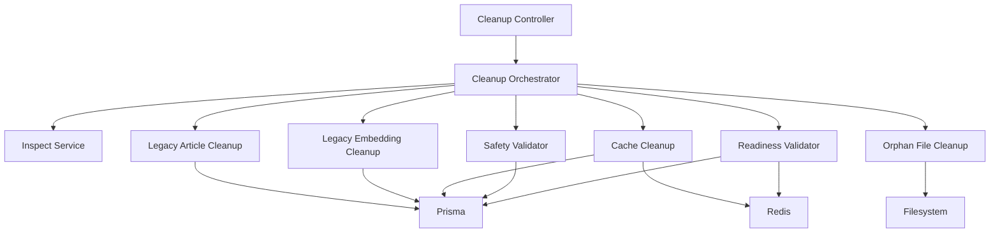

# Design Document: AI Pipeline Pre-Reimport Cleanup

## Overview

This design describes a focused pre-reimport cleanup workflow for the RAG system.

It is intentionally narrow:

- inspect the current legacy state
- clean legacy records that can pollute the new RAG revision
- validate that the system is ready for a fresh import

This is not a generalized cleanup platform. It is a controlled operational tool for RAG reset preparation.

## Design Goals

1. Keep the implementation small and operationally safe.
2. Prefer inspect-first behavior over destructive automation.
3. Reuse the existing backend architecture, Prisma models, Redis cache surface, and current AI observability endpoints.
4. Provide a clear readiness answer before re-import begins.

## Scope

### In Scope
- legacy article inspection and cleanup
- legacy embedding inspection and cleanup
- semantic cache cleanup
- orphan dataset file inspection and quarantine
- relation and cascade safety verification
- post-cleanup readiness validation

### Out of Scope
- scheduler
- job queue platform for cleanup
- rollback engine
- generic cleanup history product
- storage savings dashboards

## Architecture

## Operational Flow

### Phase A: Inspect

The system gathers a read-only snapshot of the current legacy state:

- legacy knowledge articles
- legacy embeddings
- stale semantic cache
- orphaned files
- relation safety warnings

Output:
- summary counts
- sample records
- high-risk notes

### Phase B: Execute

The system performs approved cleanup actions:

- delete legacy articles
- delete legacy embeddings in batches
- clear semantic cache
- quarantine orphan files

Output:
- execution log
- per-category counts
- batch progress

### Phase C: Validate

The system verifies the final state:

- remaining legacy article count
- remaining legacy embedding count
- remaining stale cache count
- remaining orphan file count

Output:
- final readiness report
- `READY` or `NOT_READY`

## Components

### 1. Cleanup Controller

Suggested location:
- `apps/backend/src/cleanup/cleanup.controller.ts`

Suggested endpoints:

- `GET /cleanup/inspect`
- `POST /cleanup/execute`
- `GET /cleanup/validate`

These endpoints should stay admin-only.

### 2. Cleanup Orchestrator

Suggested location:
- `apps/backend/src/cleanup/cleanup.service.ts`

Responsibilities:
- coordinate inspect, execute, and validate flows
- aggregate results into one report shape
- enforce conservative ordering

Suggested execution order:
1. inspect
2. safety validation
3. cache cleanup
4. legacy embedding cleanup
5. legacy article cleanup
6. orphan file quarantine
7. readiness validation

### 3. Inspect Service

Responsibilities:
- gather dry-run counts and examples
- classify findings by cleanup category
- produce a single structured report

Suggested output sections:
- `legacyArticles`
- `legacyEmbeddings`
- `staleCache`
- `orphanFiles`
- `relationWarnings`

### 4. Legacy Article Cleanup Service

Responsibilities:
- query `knowledge_articles` by:
  - `isAutoImported = true`
  - `source = 'notebooklm'`
- delete matching article records in controlled fashion
- verify downstream effect on related versions and embeddings

Important note:
- if soft-delete expectations matter operationally, this service should explicitly document whether it uses update-based retirement or hard deletion

### 5. Legacy Embedding Cleanup Service

Responsibilities:
- query legacy records from:
  - `knowledge_embeddings`
  - `knowledge_pool_embeddings`
- remove them in batches
- report progress

Legacy match rule:
- `embedding_version = 'v1'`
- or `embedding_dim = 1536`

### 6. Cache Cleanup Service

Responsibilities:
- scan Redis for `ai:query:cache:v6:*`
- remove stale `ai_response_cache` records
- report cache cleanup counts

### 7. Orphan File Cleanup Service

Responsibilities:
- scan `dataset/`
- compare with `knowledge_sources.filePath`
- identify files without valid DB linkage
- move them to quarantine

Suggested quarantine structure:
- `dataset/.quarantine/<timestamp>/`

Suggested artifacts:
- manifest JSON or Markdown file listing moved files

### 8. Safety Validator

Responsibilities:
- inspect cleanup-sensitive relations
- highlight non-obvious cascade behavior
- warn before destructive execution

This is a reporting and safety layer, not a full transaction test harness unless later needed.

### 9. Readiness Validator

Responsibilities:
- run final counts after cleanup
- determine whether re-import can begin

Suggested readiness rule:
- `READY` only when all targeted legacy categories are zero or explicitly accepted

## Data Model Strategy

This design avoids introducing new product-level persistence models like:

- `CleanupJob`
- `CleanupRecovery`
- `CleanupSchedule`

Reason:
- the cleanup is operational and bounded
- introducing persistent workflow entities would add product complexity without helping the immediate RAG reset goal

## Safety Strategy

1. Inspect-first by default
2. Batch destructive actions
3. Quarantine files instead of hard-deleting them
4. Produce a final validation report before re-import

## Success Criteria

The design succeeds when:

- the team can inspect the exact legacy footprint
- the team can remove old RAG state safely
- the system can prove whether it is clean before re-import
