# Design Document — AI Pipeline Optimization

## Overview

Bu tasarım, `aluplan-support-desk-V02` projesinin AI pipeline'ında tespit edilen altı kritik eksikliği giderir:

1. **VertexAI kaldırma** — gereksiz bulut maliyetini ortadan kaldırır, provider yönetimini sadeleştirir
2. **`ai_shift_detections` tablosu** — problem shift olaylarını kalıcı olarak loglar
3. **History temizleme** — shift sonrası bağlam kirliliğini önler
4. **`GET /ai/status/:jobId`** — async job durumunu sorgulanabilir kılar
5. **BullMQ rate limiter** — OpenAI 429 hatalarını önler
6. **`LangfuseService.addEvent()`** — shift event'lerini observability'ye taşır

Tüm değişiklikler izole, geriye dönük uyumlu ve TypeScript strict-mode uyumludur. Mevcut çalışan pipeline kırılmaz.

---

## Architecture

```mermaid
graph TD
    subgraph "AI Pipeline (queryInternal)"
        A[User Query] --> B[AiDiagnosisService.analyze]
        B --> C{isProblemShift?}
        C -- true --> D[try: DB log → ai_shift_detections]
        C -- true --> E[try: LangfuseService.addEvent problem-shift]
        C -- true --> F[options.history = empty]
        C -- false --> G[history preserved]
        D --> H[promptContextBuilder.buildContext]
        E --> H
        F --> H
        G --> H
        H --> I[AiService.reformat]
        I --> J[AiQueryResult]
    end

    subgraph "Provider Layer (AiService)"
        K[getProviderByName] --> L{provider name}
        L -- openai --> M[OpenAiService]
        L -- custom/xai/deepseek/groq --> N[GenericOpenAiService]
        L -- llmapi --> O[LlmApiService]
        L -- ollama --> P[OllamaService]
        L -- vertex --> Q[null + warn log]
    end

    subgraph "Async Job Layer"
        R[POST /ai/query?wait=false] --> S[BullMQ Queue]
        S --> T[Rate Limiter: max/duration]
        T --> U[AiQueryProcessor]
        U --> V[queryInternal]
        W[GET /ai/status/:jobId] --> X[Queue.getJob]
        X --> Y[state mapping → PENDING/PROCESSING/COMPLETED/FAILED]
    end
```



---

## Components and Interfaces

### 1. AiService — VertexAI Kaldırma

**Kaldırılacak satırlar (exact):**

```typescript
// ai.service.ts — constructor'dan kaldır:
private readonly vertex: VertexAiService,

// ai.service.ts — import'tan kaldır:
import { VertexAiService } from './vertex-ai.service';

// getProviderByName() içinden kaldır:
if (providerName === 'vertex') return this.vertex;

// testProvider() switch'inden kaldır:
case 'vertex': return await this.vertex.testConnection();

// getActiveModelName() içinden değiştir:
// ÖNCE: if (providerName === 'llmapi' || providerName === 'vertex')
// SONRA: if (providerName === 'llmapi')
```

**Eklenecek fallback mantığı — `getProviderByName()` içine:**

```typescript
// vertex → openai fallback (getProviderByName içinde, null dönmeden önce)
if (providerName === 'vertex') {
    this.logger.warn('⚠️ Provider "vertex" is deprecated. Falling back to "openai".');
    return this.openai;
}
```

**`getHealthStatus()` providers listesi:**

```typescript
// ÖNCE:
const providers = ['ollama', 'openai', 'llmapi', 'xai', 'deepseek', 'groq', 'custom'];
// SONRA: aynı kalır — vertex zaten bu listede yok, değişiklik gerekmez
```

**`vertex-ai.service.ts` dosyası:** Tamamen silinecek.

---

### 2. AiModule — VertexAI ve Rate Limiter

**Kaldırılacak satırlar:**

```typescript
// ai.module.ts — import'tan kaldır:
import { VertexAiService } from './vertex-ai.service';

// providers listesinden kaldır:
VertexAiService,

// exports listesinden kaldır:
VertexAiService,
```

**BullMQ rate limiter ekleme:**

```typescript
BullModule.registerQueue(
    {
        name: 'document-parsing',
        defaultJobOptions: {
            attempts: 3,
            backoff: { type: 'exponential', delay: 5000 },
            removeOnComplete: 100,
            removeOnFail: false
        }
    },
    {
        name: 'ai-query-processing',
        defaultJobOptions: {
            attempts: 3,
            backoff: { type: 'exponential', delay: 1000 },
            removeOnComplete: 100,
            removeOnFail: false
        },
        limiter: {
            max: parseInt(process.env.AI_QUEUE_RATE_MAX ?? '10', 10),
            duration: parseInt(process.env.AI_QUEUE_RATE_DURATION_MS ?? '1000', 10),
        }
    }
),
```

---

### 3. LangfuseService — `addEvent()` Metodu

Mevcut `trace()` metodu **değiştirilmeyecek**. Yeni metot eklenir:

```typescript
async addEvent(
    traceId: string,
    eventName: string,
    payload: Record<string, unknown>
): Promise<void> {
    if (!this.langfuse) return;
    try {
        const trace = this.langfuse.trace({ id: traceId });
        trace.event({
            name: eventName,
            input: payload,
        });
        await this.langfuse.flushAsync();
    } catch (error) {
        this.logger.error(`Langfuse addEvent error [${eventName}]`, (error as Error).stack);
    }
}
```

---

### 4. AiQueryService — History Temizleme ve Shift Logging

`queryInternal()` içinde, `diagnosisForThreshold` hesaplandıktan sonra, `promptContextBuilder.buildContext()` çağrısından **önce** aşağıdaki blok eklenir:

```typescript
// --- SHIFT DETECTION: DB log + history clear + Langfuse event ---
if (diagnosisForThreshold.isProblemShift) {
    // 1. DB log (non-blocking)
    try {
        await this.prisma.aiShiftDetection.create({
            data: {
                userId: userId ?? null,
                previousKeywords: options.history?.flatMap(h =>
                    diagnosisForThreshold.matchedKeywords.filter(k =>
                        h.content.toLowerCase().includes(k.toLowerCase())
                    )
                ) ?? [],
                newKeywords: diagnosisForThreshold.matchedKeywords,
                historyLength: options.history?.length ?? 0,
                confirmed: false,
            }
        });
    } catch (shiftLogErr) {
        this.logger.error('⚠️ Failed to log shift detection to DB', (shiftLogErr as Error).message);
    }

    // 2. History temizleme
    if (options.history && options.history.length > 0) {
        this.logger.warn('🔄 Problem shift detected — history cleared for clean context');
        options.history = [];
    }

    // 3. Langfuse event (non-blocking)
    try {
        const traceId = `shift-${Date.now()}-${userId ?? 'guest'}`;
        await this.langfuse.addEvent(traceId, 'problem-shift', {
            previousKeywords: diagnosisForThreshold.matchedKeywords,
            newKeywords: diagnosisForThreshold.matchedKeywords,
            historyLength: options.history?.length ?? 0,
            userId: userId ?? null,
        });
    } catch (langfuseErr) {
        this.logger.error('⚠️ Failed to write shift event to Langfuse', (langfuseErr as Error).message);
    }
}
// --- END SHIFT DETECTION ---
```

**Tam konum:** `diagnosisForThreshold` hesaplandıktan hemen sonra, `expandedQuery` synonym expansion'dan önce.

---

### 5. AiController — `GET /ai/status/:jobId`

Mevcut controller'da `@Public()` decorator'lı bir `getJobStatus` metodu zaten var. Gereksinim, bunu `JwtAuthGuard` ile korumayı ve response formatını standartlaştırmayı içeriyor:

```typescript
@Get('status/:jobId')
@UseGuards(JwtAuthGuard)
@ApiOperation({ summary: 'Check the status of a background AI job' })
@ApiParam({ name: 'jobId', description: 'The unique ID of the AI query job' })
@ApiResponse({ status: 200, description: 'Job status retrieved.' })
@ApiResponse({ status: 404, description: 'Job not found.' })
async getJobStatus(@Param('jobId') jobId: string) {
    const job = await this.aiQueue.getJob(jobId);
    if (!job) {
        throw new NotFoundException({ message: 'Job not found' });
    }

    const state = await job.getState();

    const statusMap: Record<string, string> = {
        waiting: 'PENDING',
        delayed: 'PENDING',
        active: 'PROCESSING',
        completed: 'COMPLETED',
        failed: 'FAILED',
        unknown: 'PENDING',
    };

    const status = statusMap[state] ?? 'PENDING';

    return {
        jobId: job.id,
        status,
        ...(status === 'COMPLETED' && { result: job.returnvalue }),
        ...(status === 'FAILED' && { error: job.failedReason }),
    };
}
```

**Not:** Mevcut `@Public()` decorator kaldırılacak, `JwtAuthGuard` eklenecek. `NotFoundException` import'u `@nestjs/common`'dan eklenmeli.

---

### 6. AiCopilotService — Shift Sonrası Messages Kırpma

`generateDraft()` içinde, `isShift` flag'i kullanılıyor ama messages kırpılmıyor. Requirement 3.5 gereği:

```typescript
// generateDraft() içinde, messages array oluşturulduktan sonra:
const messages = ticket.messages
    .slice()
    .reverse()
    .map(m => ({ /* ... mevcut mapping ... */ }));

// Shift tespit edildiğinde sadece son mesajı tut
if (diagnosis.isProblemShift && messages.length > 1) {
    this.logger.warn('🔄 Copilot: Problem shift detected — messages trimmed to last message only');
    messages.splice(0, messages.length - 1);
}
```

---

## Data Models

### Prisma Schema — Yeni Model

```prisma
model AiShiftDetection {
  id               String         @id @default(uuid())
  interactionId    String?        @map("interaction_id")
  interaction      AiInteraction? @relation(fields: [interactionId], references: [id])
  userId           String?        @map("user_id")
  detectedAt       DateTime       @default(now()) @map("detected_at")
  previousKeywords String[]       @map("previous_keywords")
  newKeywords      String[]       @map("new_keywords")
  historyLength    Int            @map("history_length")
  confirmed        Boolean        @default(false)

  @@map("ai_shift_detections")
}
```

### AiInteraction Modeline Ekleme

```prisma
model AiInteraction {
  // ... mevcut alanlar değişmez ...
  shiftDetections  AiShiftDetection[]  // yeni relation
}
```

### Migration Stratejisi

- `prisma migrate dev --name add_ai_shift_detections` ile yeni migration oluşturulur
- Mevcut `ai_interactions` tablosuna yalnızca `shiftDetections` relation eklenir (DB'de yeni kolon yok, sadece FK tarafı yeni tabloda)
- `prisma migrate deploy` ile production'a uygulanır
- Mevcut tablolarda veri kaybı olmaz

### .env.example Değişkenleri

```env
# BullMQ AI Queue Rate Limiter
AI_QUEUE_RATE_MAX=10
AI_QUEUE_RATE_DURATION_MS=1000
```

---

## Correctness Properties

*A property is a characteristic or behavior that should hold true across all valid executions of a system — essentially, a formal statement about what the system should do. Properties serve as the bridge between human-readable specifications and machine-verifiable correctness guarantees.*

### Property 1: Provider Whitelist — Vertex Excluded

*For any* provider name in the set `{openai, custom, xai, deepseek, groq, llmapi, ollama}`, `AiService.getProviderByName()` should return a non-null `AiProvider`. For the name `"vertex"`, it should return the `openai` provider (fallback) and emit a warning log.

**Validates: Requirements 1.2, 1.4**

---

### Property 2: Shift Detection DB Persistence

*For any* `(userQuery, history)` pair where `AiDiagnosisService.analyze()` returns `isProblemShift = true`, `queryInternal()` should create exactly one record in `ai_shift_detections` containing the detected `newKeywords` and the correct `historyLength` matching `options.history.length` at the time of detection.

**Validates: Requirements 2.2**

---

### Property 3: History Mutation iff isProblemShift

*For any* non-empty `history` array passed to `queryInternal()`:
- When `isProblemShift = true`, the `history` passed to `promptContextBuilder.buildContext()` must be `[]` (empty)
- When `isProblemShift = false`, the `history` passed to `promptContextBuilder.buildContext()` must be identical to the original input

**Validates: Requirements 3.1, 3.3**

---

### Property 4: Job State → Status Enum Mapping

*For any* BullMQ job state value in `{waiting, delayed, active, completed, failed}`, the `GET /ai/status/:jobId` endpoint should return a `status` field containing exactly one value from `{PENDING, PROCESSING, COMPLETED, FAILED}`, with no unmapped states producing an error.

**Validates: Requirements 4.2, 4.3**

---

### Property 5: Shift Event Langfuse Payload Completeness

*For any* `(userQuery, history, userId)` combination where `isProblemShift = true`, `LangfuseService.addEvent()` should be called with event name `"problem-shift"` and a payload that contains all four required fields: `previousKeywords` (string[]), `newKeywords` (string[]), `historyLength` (number), `userId` (string | null).

**Validates: Requirements 6.1, 6.2**

---

### Property 6: Pipeline Resilience — Optional Steps Don't Block Result

*For any* combination of failing optional steps (DB shift log throws, Langfuse addEvent throws, history clear is a no-op), `queryInternal()` should still return a valid `AiQueryResult` object with non-null `query`, `confidence`, `interactionId`, and `suggestTicket` fields.

**Validates: Requirements 2.3, 6.3, 7.1**

---

## Error Handling

Her yeni eklenen adım kendi `try/catch` bloğuna sahiptir ve pipeline'ı durdurmaz:

| Adım | Hata Durumu | Davranış |
|------|-------------|----------|
| DB shift log | `prisma.aiShiftDetection.create` throws | `logger.error` + devam |
| History temizleme | `options.history` undefined/null | Guard ile atlanır |
| Langfuse addEvent | Langfuse erişilemez | `logger.error` + devam |
| `getProviderByName('vertex')` | — | `openai` fallback + `logger.warn` |
| `getJob(jobId)` null | Job bulunamadı | HTTP 404 `NotFoundException` |
| Rate limiter aşımı | BullMQ job delayed | Job başarısız sayılmaz, geciktirilir |

**TypeScript strict-mode uyumu:**
- `any` tipi kullanılmayacak; `unknown` + type guard veya explicit cast kullanılacak
- `error` catch parametreleri `(error as Error).message` ile erişilecek
- Tüm optional chaining (`?.`) ve nullish coalescing (`??`) kullanımları mevcut pattern'lere uygun olacak

---

## Testing Strategy

### Unit Tests (Example-Based)

Her değişiklik için spesifik örnek testler:

- `AiService.getProviderByName('vertex')` → openai provider döner + warn log
- `AiService.getHealthStatus()` → `providers` objesinde `vertex` key'i yok
- `AiQueryService.queryInternal()` — DB write throws → `AiQueryResult` yine döner
- `AiQueryService.queryInternal()` — Langfuse throws → `AiQueryResult` yine döner
- `AiController.getJobStatus()` — job null → HTTP 404
- `AiController.getJobStatus()` — completed job → `result` alanı dolu
- `AiController.getJobStatus()` — failed job → `error` alanı dolu
- `LangfuseService.addEvent()` — Langfuse null → sessizce return
- `AiCopilotService.generateDraft()` — shift=true → messages son mesajı içeriyor

### Property-Based Tests

Property-based testing için **fast-check** (TypeScript) kullanılacak. Her test minimum 100 iterasyon çalıştırır.

**Property 1 — Provider Whitelist:**
```typescript
// Feature: ai-pipeline-optimization, Property 1: Provider whitelist — vertex excluded
fc.assert(fc.asyncProperty(
    fc.constantFrom('openai', 'custom', 'xai', 'deepseek', 'groq', 'llmapi', 'ollama'),
    async (providerName) => {
        const provider = await aiService.getProviderByName(providerName);
        return provider !== null;
    }
), { numRuns: 100 });
```

**Property 2 — Shift Detection DB Persistence:**
```typescript
// Feature: ai-pipeline-optimization, Property 2: Shift detection DB persistence
fc.assert(fc.asyncProperty(
    fc.record({
        userQuery: fc.string({ minLength: 5 }),
        history: fc.array(fc.record({ role: fc.constantFrom('user', 'assistant'), content: fc.string() }), { minLength: 1 })
    }),
    async ({ userQuery, history }) => {
        // Mock diagnosisService to return isProblemShift=true
        // Assert prisma.aiShiftDetection.create was called once with correct fields
    }
), { numRuns: 100 });
```

**Property 3 — History Mutation iff isProblemShift:**
```typescript
// Feature: ai-pipeline-optimization, Property 3: History mutation iff isProblemShift
fc.assert(fc.asyncProperty(
    fc.array(fc.record({ role: fc.constantFrom('user', 'assistant'), content: fc.string() }), { minLength: 1 }),
    fc.boolean(), // isProblemShift
    async (history, isProblemShift) => {
        // Mock diagnosisService to return given isProblemShift
        // Capture history passed to buildContext
        // Assert: isProblemShift=true → history=[], isProblemShift=false → history unchanged
    }
), { numRuns: 100 });
```

**Property 4 — Job State Mapping:**
```typescript
// Feature: ai-pipeline-optimization, Property 4: Job state → status enum mapping
const validStates = ['waiting', 'delayed', 'active', 'completed', 'failed'] as const;
const validStatuses = ['PENDING', 'PROCESSING', 'COMPLETED', 'FAILED'];

fc.assert(fc.asyncProperty(
    fc.constantFrom(...validStates),
    async (state) => {
        // Mock aiQueue.getJob to return job with given state
        const response = await controller.getJobStatus('test-job-id');
        return validStatuses.includes(response.status);
    }
), { numRuns: 100 });
```

**Property 5 — Langfuse Payload Completeness:**
```typescript
// Feature: ai-pipeline-optimization, Property 5: Shift event Langfuse payload completeness
fc.assert(fc.asyncProperty(
    fc.record({
        userQuery: fc.string({ minLength: 5 }),
        history: fc.array(fc.record({ role: fc.constantFrom('user', 'assistant'), content: fc.string() }), { minLength: 1 }),
        userId: fc.option(fc.string(), { nil: null })
    }),
    async ({ userQuery, history, userId }) => {
        // Mock diagnosisService to return isProblemShift=true
        // Capture addEvent call arguments
        // Assert payload has all 4 required fields with correct types
    }
), { numRuns: 100 });
```

**Property 6 — Pipeline Resilience:**
```typescript
// Feature: ai-pipeline-optimization, Property 6: Pipeline resilience — optional steps don't block result
fc.assert(fc.asyncProperty(
    fc.record({
        dbFails: fc.boolean(),
        langfuseFails: fc.boolean(),
    }),
    async ({ dbFails, langfuseFails }) => {
        // Mock DB create to throw if dbFails
        // Mock addEvent to throw if langfuseFails
        const result = await aiQueryService.queryInternal(validOptions);
        return result.query !== undefined
            && result.confidence !== undefined
            && result.interactionId !== undefined;
    }
), { numRuns: 100 });
```

### Integration Tests

- Migration: Test DB'de `prisma migrate deploy` başarıyla tamamlanır
- BullMQ rate limiter: Rate limit aşıldığında job delayed state'e geçer (başarısız olmaz)

### Smoke Tests

- NestJS test module `VertexAiService` olmadan başarıyla compile olur
- `tsc --strict` sıfır hata üretir
- `prisma generate` sonrası `PrismaService.aiShiftDetection` erişilebilir
- `LangfuseService.addEvent` metodu export edilmiş, `trace()` imzası değişmemiş
