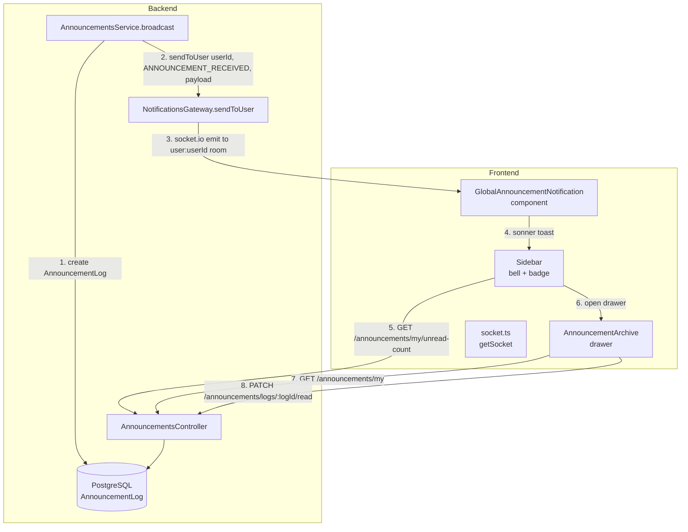

# Design Document: Announcement Notifications

## Overview

This feature extends the existing announcement broadcast pipeline to deliver real-time in-app notifications and a persistent announcement archive to customers. The current flow ends at email delivery and `AnnouncementLog` creation. We add three layers on top:

1. **Real-time toast** — `NotificationsGateway.sendToUser()` fires immediately after each `AnnouncementLog` is created during broadcast; the frontend listens and shows a sonner toast.
2. **Announcement archive** — three new REST endpoints let customers fetch their own logs, get an unread count, and mark individual logs as read.
3. **Unread badge** — the sidebar bell icon shows a live badge driven by the unread-count endpoint and updated optimistically via WebSocket events.

The system is trilingual (TR / EN / DE) and uses NestJS + Prisma on the backend and Next.js 14 App Router + shadcn/ui + sonner on the frontend.

---

## Architecture



### Circular Dependency Analysis

`AnnouncementsModule` currently imports `EmailModule`. `NotificationsModule` imports `EmailModule` via `forwardRef`. Adding `NotificationsModule` to `AnnouncementsModule`'s imports creates no cycle because `NotificationsModule` does not import `AnnouncementsModule`. The dependency graph is:

```
AnnouncementsModule → NotificationsModule → EmailModule (forwardRef)
AnnouncementsModule → EmailModule
```

No cycle. `forwardRef` is not needed here — a plain import of `NotificationsModule` into `AnnouncementsModule` is sufficient.

---

## Components and Interfaces

### Backend

#### `AnnouncementsModule` (updated)

```typescript
@Module({
  imports: [EmailModule, NotificationsModule],
  controllers: [AnnouncementsController],
  providers: [AnnouncementsService],
  exports: [AnnouncementsService],
})
export class AnnouncementsModule {}
```

#### `AnnouncementsService` (updated)

New constructor injection:
```typescript
constructor(
  private readonly prisma: PrismaService,
  private readonly emailService: EmailService,
  private readonly notificationsGateway: NotificationsGateway,
) {}
```

Change inside `broadcast()` — after `announcementLog` is created and before the email enqueue:
```typescript
const excerpt = this.generateExcerpt(announcement.contentMjml);
this.notificationsGateway.sendToUser(target.user.userId, 'ANNOUNCEMENT_RECEIVED', {
  logId: annLog.id,
  announcementId: id,
  title: announcement.title,
  excerpt,
  sentAt: new Date().toISOString(),
});
```

New private helper:
```typescript
private generateExcerpt(contentMjml: string): string {
  // Strip HTML/MJML tags, collapse whitespace, truncate to 160 chars
  const plain = contentMjml.replace(/<[^>]+>/g, ' ').replace(/\s+/g, ' ').trim();
  return plain.length <= 160 ? plain : plain.slice(0, 160);
}
```

Note: `target.user.userId` — the `CustomerProfile` includes relation `user: { select: { email: true } }`. We need to also select `id` (the `User.id`) to pass as `userId` to `sendToUser`. The query in `broadcast()` must be updated to also select `user.id`.

#### New Controller Endpoints

All three endpoints are added to `AnnouncementsController` under a separate guard block (JWT only, no RBAC admin role):

```
GET  /announcements/my                    → getMyAnnouncements(req)
GET  /announcements/my/unread-count       → getMyUnreadCount(req)
PATCH /announcements/logs/:logId/read     → markLogRead(logId, req)
```

The existing `@Roles('ADMIN')` decorator is at class level. The new customer endpoints must be placed in a separate controller or the class-level guard must be overridden per-route. The cleanest approach is a **separate `CustomerAnnouncementsController`** at the same `announcements` path prefix, with only `JwtAuthGuard` (no `RbacGuard`).

#### New Service Methods

```typescript
async getMyAnnouncements(userId: string, page = 1, limit = 20) {
  const customer = await this.prisma.customerProfile.findUnique({ where: { userId } });
  if (!customer) return { data: [], total: 0 };
  const [data, total] = await Promise.all([
    this.prisma.announcementLog.findMany({
      where: { customerId: customer.id },
      orderBy: { sentAt: 'desc' },
      skip: (page - 1) * limit,
      take: limit,
      include: { announcement: { select: { title: true, contentMjml: true } } },
    }),
    this.prisma.announcementLog.count({ where: { customerId: customer.id } }),
  ]);
  return { data, total };
}

async getMyUnreadCount(userId: string): Promise<{ count: number }> {
  const customer = await this.prisma.customerProfile.findUnique({ where: { userId } });
  if (!customer) return { count: 0 };
  const count = await this.prisma.announcementLog.count({
    where: { customerId: customer.id, readAt: null },
  });
  return { count };
}

async markLogRead(logId: string, userId: string): Promise<AnnouncementLog> {
  const customer = await this.prisma.customerProfile.findUnique({ where: { userId } });
  if (!customer) throw new ForbiddenException();
  const log = await this.prisma.announcementLog.findUnique({ where: { id: logId } });
  if (!log) throw new NotFoundException();
  if (log.customerId !== customer.id) throw new ForbiddenException();
  if (log.readAt !== null) return log; // idempotent
  return this.prisma.announcementLog.update({
    where: { id: logId },
    data: { readAt: new Date() },
  });
}
```

### Frontend

#### `GlobalAnnouncementNotification` (new component)

Mirrors `GlobalTicketNotification`. Placed in `layout.tsx` alongside it. Listens for `ANNOUNCEMENT_RECEIVED`, fires a sonner toast with a "View" action that opens the archive drawer.

```typescript
// apps/frontend/src/components/global-announcement-notification.tsx
'use client';
import { useEffect } from 'react';
import { getSocket } from '@/lib/socket';
import { toast } from 'sonner';
import { useTranslations } from 'next-intl';
import { useAnnouncementStore } from '@/stores/announcement-store';

export function GlobalAnnouncementNotification() {
  const t = useTranslations('announcements');
  const { incrementUnread, openArchive } = useAnnouncementStore();

  useEffect(() => {
    const socket = getSocket();
    socket.connect();
    const handler = (payload: AnnouncementReceivedPayload) => {
      incrementUnread();
      toast(payload.title, {
        description: payload.excerpt,
        duration: 6000,
        action: { label: t('toast_view'), onClick: () => openArchive(payload.logId) },
      });
    };
    socket.on('ANNOUNCEMENT_RECEIVED', handler);
    return () => { socket.off('ANNOUNCEMENT_RECEIVED', handler); };
  }, []);

  return null;
}
```

#### `useAnnouncementStore` (new Zustand store)

Manages unread count and archive open state. Keeps the badge and drawer in sync without prop drilling.

```typescript
interface AnnouncementStore {
  unreadCount: number;
  isArchiveOpen: boolean;
  scrollToLogId: string | null;
  setUnreadCount: (n: number) => void;
  incrementUnread: () => void;
  decrementUnread: () => void;
  openArchive: (logId?: string) => void;
  closeArchive: () => void;
}
```

The `decrementUnread` implementation floors at 0: `Math.max(0, state.unreadCount - 1)`.

#### Sidebar bell icon (updated)

Add to `CUSTOMER_NAV` a bell entry that renders with the unread badge. The `Sidebar` component fetches the initial unread count on mount (for customer role only) and reads live count from the store.

```tsx
// In Sidebar, for customer role:
const { unreadCount, openArchive } = useAnnouncementStore();

useEffect(() => {
  if (user?.role?.toUpperCase() === 'CUSTOMER') {
    api.announcements.getUnreadCount().then(r => setUnreadCount(r.count));
  }
}, [user]);
```

The bell button in the sidebar nav:
```tsx
<button onClick={() => openArchive()} className="...">
  <Bell className="h-4 w-4" />
  <span>{t('nav.announcements')}</span>
  {unreadCount > 0 && (
    <span className="badge">{unreadCount > 99 ? '99+' : unreadCount}</span>
  )}
</button>
```

#### `AnnouncementArchiveDrawer` (new component)

A shadcn `Sheet` (drawer) component. Fetches `GET /announcements/my` with pagination. On item click, calls `PATCH /announcements/logs/:logId/read` and decrements the store count if the item was unread.

---

## Data Models

### Prisma Schema Change

```prisma
model AnnouncementLog {
  id             String          @id @default(dbgenerated("gen_random_uuid()")) @db.Uuid
  announcementId String          @map("announcement_id") @db.Uuid
  customerId     String          @map("customer_id") @db.Uuid
  status         String          @default("PENDING") @db.VarChar(50)
  sentAt         DateTime?       @map("sent_at")
  readAt         DateTime?       @map("read_at")   // ← NEW
  error          String?
  emailLogId     String?         @unique @map("email_log_id") @db.Uuid
  createdAt      DateTime        @default(now()) @map("created_at")
  announcement   Announcement    @relation(fields: [announcementId], references: [id], onDelete: Cascade)
  customer       CustomerProfile @relation(fields: [customerId], references: [id], onDelete: Cascade)
  emailLog       EmailLog?       @relation(fields: [emailLogId], references: [id])

  @@index([customerId, readAt], map: "idx_announcement_logs_customer_read")
  @@map("announcement_logs")
}
```

The composite index on `(customerId, readAt)` makes both `getMyAnnouncements` and `getMyUnreadCount` efficient.

### WebSocket Payload Type

```typescript
interface AnnouncementReceivedPayload {
  logId: string;
  announcementId: string;
  title: string;
  excerpt: string;       // max 160 chars, plain text prefix of content
  sentAt: string;        // ISO 8601
}
```

### API Response Types

```typescript
// GET /announcements/my
interface MyAnnouncementsResponse {
  data: AnnouncementLogItem[];
  total: number;
}

interface AnnouncementLogItem {
  id: string;
  announcementId: string;
  sentAt: string | null;
  readAt: string | null;
  announcement: {
    title: string;
    contentMjml: string;
  };
}

// GET /announcements/my/unread-count
interface UnreadCountResponse {
  count: number;
}
```

### i18n Keys

Keys to add to `en.json`, `tr.json`, `de.json` under the `announcements` namespace:

```json
"announcements": {
  "toast_view": "View",
  "archive_title": "Announcements",
  "archive_empty": "No announcements yet.",
  "archive_unread_dot": "Unread",
  "mark_read": "Mark as read",
  "badge_overflow": "99+"
}
```

Sidebar key under `sidebar.nav`:
```json
"announcements": "Announcements"
```

---

## Correctness Properties

*A property is a characteristic or behavior that should hold true across all valid executions of a system — essentially, a formal statement about what the system should do. Properties serve as the bridge between human-readable specifications and machine-verifiable correctness guarantees.*

### Property 1: New logs have null readAt

*For any* broadcast to any set of customers, every `AnnouncementLog` record created during that broadcast SHALL have `readAt = null` immediately after creation.

**Validates: Requirements 1.2**

---

### Property 2: markRead is idempotent

*For any* `AnnouncementLog` record, calling `markLogRead` N times (N ≥ 1) SHALL produce the same `readAt` value as calling it once — the first call sets `readAt`, subsequent calls leave it unchanged.

**Validates: Requirements 1.4, 6.2**

---

### Property 3: readAt temporal ordering invariant

*For any* `AnnouncementLog` record where `readAt` is non-null, `readAt` SHALL be greater than or equal to `sentAt`.

**Validates: Requirements 1.6**

---

### Property 4: ANNOUNCEMENT_RECEIVED payload completeness

*For any* valid announcement (any title, any content string), the `generatePayload` function SHALL produce an object containing all five required fields: `logId` (string), `announcementId` (string), `title` (string), `excerpt` (string), and `sentAt` (ISO 8601 string).

**Validates: Requirements 2.2**

---

### Property 5: One sendToUser call per customer in broadcast batch

*For any* list of N distinct target customers, `broadcast()` SHALL call `NotificationsGateway.sendToUser` exactly N times, each with a distinct `userId` matching one of the N customers.

**Validates: Requirements 2.8**

---

### Property 6: GET /announcements/my returns records in descending sentAt order

*For any* customer with any number of `AnnouncementLog` records, `GET /announcements/my` SHALL return records such that for any two adjacent records `a` and `b` in the response, `a.sentAt >= b.sentAt`.

**Validates: Requirements 3.1, 6.7**

---

### Property 7: GET /announcements/my enforces customer data isolation

*For any* two distinct customers A and B, the response of `GET /announcements/my` for customer A SHALL contain no records whose `customerId` matches customer B's profile ID.

**Validates: Requirements 3.2, 5.4**

---

### Property 8: Unread count equals count of null-readAt records

*For any* customer with any list of `AnnouncementLog` records (with arbitrary `readAt` values), `GET /announcements/my/unread-count` SHALL return `{ count: K }` where K is exactly the number of records where `readAt IS NULL`.

**Validates: Requirements 4.1, 6.1**

---

### Property 9: Local unread count state machine — increment and floor

*For any* non-negative integer N representing the current local unread count:
- Receiving `ANNOUNCEMENT_RECEIVED` SHALL produce count N+1.
- Calling `decrementUnread` SHALL produce `max(0, N-1)` — the count SHALL never go below 0.

**Validates: Requirements 4.4, 4.5, 6.6**

---

### Property 10: Badge display caps at 99+

*For any* non-negative integer count, the badge display function SHALL return `"99+"` if `count > 99`, and the string representation of `count` otherwise.

**Validates: Requirements 4.6**

---

### Property 11: Excerpt is a bounded prefix of original plain text

*For any* string `content` of any length, `generateExcerpt(content)` SHALL produce a string `excerpt` such that:
- `excerpt.length <= 160`
- The original plain-text (tags stripped) starts with `excerpt` (prefix invariant)

**Validates: Requirements 6.3, 6.4**

---

### Property 12: Count convergence after full markRead sweep

*For any* customer with N unread `AnnouncementLog` records, after applying `markLogRead` to all N distinct records, `getMyUnreadCount` SHALL return `{ count: 0 }`.

**Validates: Requirements 6.5**

---

## Error Handling

| Scenario | Backend Response | Frontend Behavior |
|---|---|---|
| `markLogRead` called for a log belonging to another customer | HTTP 403 Forbidden | Toast error, count unchanged |
| `markLogRead` called for non-existent logId | HTTP 404 Not Found | Toast error |
| `GET /announcements/my` called by non-customer (no profile) | Returns `{ data: [], total: 0 }` | Empty state shown |
| `NotificationsGateway.sendToUser` called for offline user | No-op (socket.io handles gracefully) | User sees announcement in archive on next login |
| `broadcast()` fails mid-loop | Per-log error recorded in `AnnouncementLog.error`; announcement rolls back to DRAFT on catastrophic failure | N/A |
| Frontend WebSocket disconnects | Reconnect handled by socket.io auto-reconnect; missed events not replayed (archive is source of truth) | Badge refreshed on reconnect via REST |

---

## Testing Strategy

### Unit Tests (example-based)

- `generateExcerpt`: empty string, string < 160 chars, string exactly 160 chars, string > 160 chars, HTML-heavy MJML content
- `markLogRead`: already-read log returns unchanged, missing log throws 404, wrong customer throws 403
- `getMyUnreadCount`: customer with no logs, all read, all unread, mixed
- Badge display: count = 0, count = 1, count = 99, count = 100, count = 999
- `GlobalAnnouncementNotification`: socket event triggers toast with correct title/excerpt

### Property-Based Tests

Use **fast-check** (TypeScript) for backend pure functions and store logic. Minimum 100 iterations per property.

Each test is tagged: `// Feature: announcement-notifications, Property N: <property_text>`

| Property | What to generate | What to assert |
|---|---|---|
| P1: New logs null readAt | Random announcement + customer list | All created logs have `readAt = null` |
| P2: markRead idempotent | Random log + N in [1..10] | `readAt` after N calls equals `readAt` after 1 call |
| P3: readAt >= sentAt | Random `sentAt` datetime | `readAt` set by `markLogRead` >= `sentAt` |
| P4: Payload completeness | Random title + content strings | Payload has all 5 fields with correct types |
| P5: One call per customer | Random list of 1..50 customers | `sendToUser` called exactly N times with distinct userIds |
| P6: Descending sentAt order | Random list of logs with random sentAt | Adjacent pairs satisfy `a.sentAt >= b.sentAt` |
| P7: Data isolation | Two random customer IDs + mixed logs | Response for A contains no B's logs |
| P8: Unread count accuracy | Random list of logs with random readAt (null or date) | Count equals `filter(l => l.readAt == null).length` |
| P9: Count state machine | Random N >= 0, random sequence of inc/dec ops | Count never negative; increments add 1; decrements subtract 1 floored at 0 |
| P10: Badge cap | Random integer 0..10000 | `> 99` → "99+", else string of number |
| P11: Excerpt prefix | Random strings of length 0..2000, random HTML | `length <= 160` and original plain text starts with excerpt |
| P12: Count convergence | Random N unread logs | After N markRead calls, count = 0 |

### Integration Tests

- `POST /announcements/:id/broadcast` → verify `sendToUser` mock called for each target customer
- `GET /announcements/my` → verify JWT required, returns only caller's logs
- `GET /announcements/my/unread-count` → verify count matches DB state
- `PATCH /announcements/logs/:logId/read` → verify 403 for wrong customer, 200 + readAt set for correct customer
- WebSocket: connect as customer, trigger broadcast, verify `ANNOUNCEMENT_RECEIVED` event received with correct payload shape
