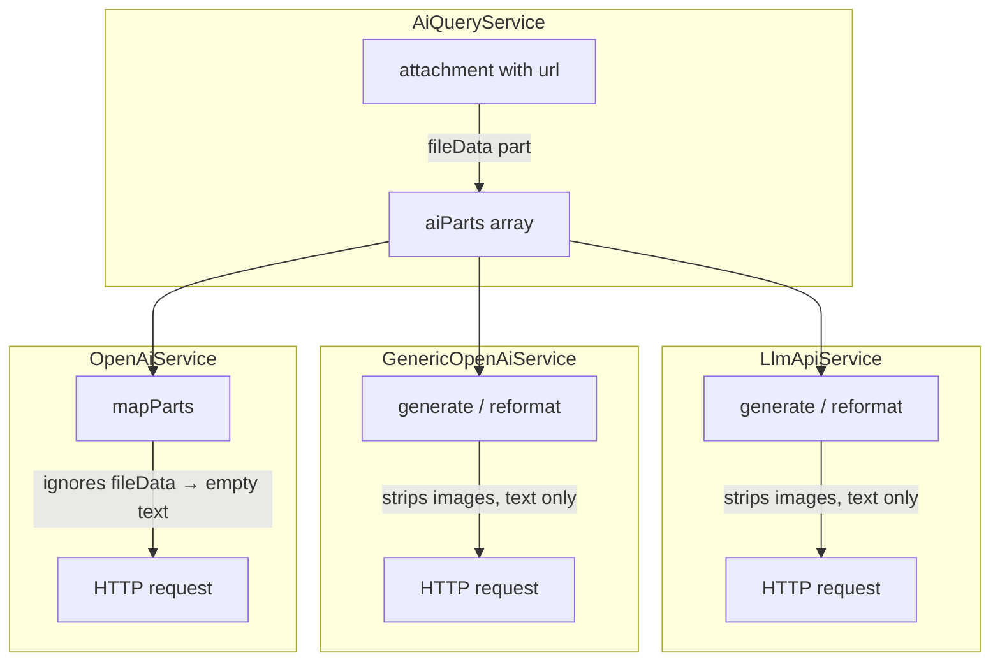

# Design Document: Attachment Vision Support

## Overview

This feature fixes a silent data-loss bug in the AI attachment pipeline. Four code paths currently discard or mishandle image `AiPart` data before it reaches the AI provider, meaning the model never sees screenshots or images that users attach to support tickets.

The fix has three coordinated parts:

1. **Shared utility** — extract `mapPartsToOpenAi()` from `OpenAiService` into a standalone module so `LlmApiService` and `GenericOpenAiService` can use the same correct implementation.
2. **URL normalization** — fix `AiQueryService` to fetch URL-based images via `StorageService` and convert them to `inlineData` before provider dispatch (matching the pattern already used by `AiCopilotService`).
3. **Graceful degradation** — add a text-only retry in `AiService` when a provider rejects a vision request, so non-vision models don't crash the pipeline.

The reference implementation (`AiCopilotService`) already handles all of this correctly. This feature brings the remaining code paths into alignment.

---

## Architecture

### Current State (broken paths)



### Target State (fixed paths)

```mermaid
flowchart TD
    subgraph AiQueryService["AiQueryService (fixed)"]
        A1[attachment with url] -->|StorageService.getFile| A2[Buffer → base64]
        A2 --> A3[inlineData AiPart]
        A4[attachment with inlineData] -->|pass-through| A3
    end

    subgraph Shared["apps/backend/src/ai/utils/map-parts-to-openai.ts"]
        U[mapPartsToOpenAi AiPart[]]
        U -->|inlineData| U1["image_url: data:{mime};base64,{data}"]
        U -->|fileData| U2["image_url: {fileUri}"]
        U -->|text| U3["text: {text}"]
    end

    subgraph OpenAiService["OpenAiService (uses shared util)"]
        O[generate / reformat / streamGenerate]
    end
    subgraph LlmApiService["LlmApiService (uses shared util)"]
        L[generate / reformat]
    end
    subgraph GenericOpenAiService["GenericOpenAiService (uses shared util)"]
        G[generate / reformat]
    end

    subgraph AiService["AiService (graceful degradation)"]
        D1[call provider with full parts]
        D2{null result?}
        D3[retry with text-only parts]
        D4[return null + log ERROR]
        D1 --> D2
        D2 -->|yes| D3
        D3 -->|still null| D4
    end

    A3 --> D1
    D1 --> O
    D1 --> L
    D1 --> G
    O --> U
    L --> U
    G --> U
```

---

## Components and Interfaces

### 1. New Shared Utility: `map-parts-to-openai.ts`

**File:** `apps/backend/src/ai/utils/map-parts-to-openai.ts`

This is the single source of truth for converting `AiPart[]` to OpenAI-compatible content blocks. All three provider services import and call this function.

```typescript
/** Represents one content block in an OpenAI chat message. */
export type OpenAiContentBlock =
  | { type: 'text'; text: string }
  | { type: 'image_url'; image_url: { url: string } };

/**
 * Converts an array of AiParts into OpenAI-compatible content blocks.
 *
 * Mapping rules:
 *  - `inlineData`  → `image_url` with a `data:{mimeType};base64,{data}` URL
 *  - `fileData`    → `image_url` with the `fileUri` as the URL
 *  - `text`        → `text` block
 *  - both `inlineData` and `fileData` present → prefer `inlineData`, log DEBUG warning
 *  - no recognized field → skip the part, log WARN
 *
 * The output array has the same length as the input (one block per part,
 * except unrecognized parts which are skipped with a warning).
 *
 * @param parts - The AiPart array to convert.
 * @param logger - Optional NestJS Logger for diagnostic output.
 * @returns An array of OpenAI content blocks.
 */
export function mapPartsToOpenAi(
  parts: AiPart[],
  logger?: Logger,
): OpenAiContentBlock[];
```

**Disambiguation rule (Req 6.5):** When a part has both `inlineData` and `fileData`, `inlineData` wins and a DEBUG log is emitted.

**String shortcut:** When the entire `AiPart[]` contains only `text` parts, callers may pass the result directly as a string by joining — but `mapPartsToOpenAi` itself always returns an array. The text-only string optimization is handled at the call site in `LlmApiService` (Req 3.3).

---

### 2. Updated `AiProvider` Interface

**File:** `apps/backend/src/ai/interfaces/ai-provider.interface.ts`

Add JSDoc to the interface documenting the `AiPart` contract (Req 6.1, 6.2):

```typescript
/**
 * Represents one content part in a multimodal AI prompt.
 *
 * Variants (mutually exclusive; prefer `inlineData` over `fileData` if both present):
 *  - `text`       — plain text content
 *  - `inlineData` — base64-encoded binary (image) with MIME type; supported by all providers
 *  - `fileData`   — remote URL reference; natively supported only by Vertex/Gemini;
 *                   must be converted to `inlineData` before sending to OpenAI-compatible providers
 */
export interface AiPart { ... }

/**
 * Contract for all AI provider implementations.
 *
 * Implementors MUST:
 *  - Accept `AiPart[]` in `generate()` and `reformat()`
 *  - Handle `text` and `inlineData` variants without throwing
 *  - Map `inlineData` parts to provider-native image blocks
 *  - Return `null` (not throw) when the provider rejects a vision request (HTTP 400)
 */
export interface AiProvider { ... }
```

---

### 3. Updated `AiQueryService`

**File:** `apps/backend/src/ai/ai-query.service.ts`

Inject `StorageService` and replace the current `fileData` push with a fetch-and-convert loop (Req 1, 7).

The normalization logic is extracted into a private helper `normalizeImageAttachments()` shared by `queryInternal()` and `streamQuery()`:

```typescript
/**
 * Fetches URL-based image attachments via StorageService and converts them
 * to inlineData AiParts. Already-inlineData parts are passed through unchanged.
 * Failed fetches are skipped with a WARN log.
 *
 * @param attachments - Raw attachment records from the ticket.
 * @returns Array of inlineData AiParts (zero fileData parts).
 */
private async normalizeImageAttachments(
  attachments: Array<{ mimeType?: string; url?: string; data?: string; fileName?: string }>,
): Promise<AiPart[]>
```

**Key behavior changes in `queryInternal()` and `streamQuery()`:**

Before (broken):
```typescript
if (att.url) {
  aiParts.push({ fileData: { mimeType: att.mimeType || 'image/png', fileUri: att.url } });
}
```

After (fixed):
```typescript
// Delegated to normalizeImageAttachments() — see below
```

**`normalizeImageAttachments()` algorithm:**
1. For each attachment where `mimeType` starts with `image/`:
   - If `inlineData` is already present → push as-is (pass-through, Req 1.3)
   - Else if `url` is set → call `StorageService.getFile(url)`
     - On success: push `{ inlineData: { mimeType, data: buffer.toString('base64') } }` and emit DEBUG log (Req 8.1)
     - On failure (throws or returns null): emit WARN log (Req 8.4), skip (Req 1.2)
2. Never push a `fileData` part (Req 1.4, 7.4)

---

### 4. Updated `OpenAiService`

**File:** `apps/backend/src/ai/openai.service.ts`

Replace the private `mapParts()` method with a call to the shared `mapPartsToOpenAi()` utility. Apply it consistently in `generate()`, `reformat()`, and `streamGenerate()` (Req 2.5).

```typescript
// Before
private mapParts(prompt: string | AiPart[]): any {
  if (typeof prompt === 'string') return prompt;
  return prompt.map(p => {
    if (p.inlineData) { ... }
    return { type: 'text', text: p.text || '' };  // ← drops fileData silently
  });
}

// After
import { mapPartsToOpenAi } from './utils/map-parts-to-openai';

private mapParts(prompt: string | AiPart[]): string | OpenAiContentBlock[] {
  if (typeof prompt === 'string') return prompt;
  return mapPartsToOpenAi(prompt, this.logger);
}
```

---

### 5. Updated `LlmApiService`

**File:** `apps/backend/src/ai/llm-api.service.ts`

Replace the text-only extraction in `generate()` and `reformat()` with `mapPartsToOpenAi()` (Req 3).

**`generate()` — text-only shortcut preserved (Req 3.3):**
```typescript
// If all parts are text, collapse to a plain string for providers that prefer it
const allText = parts.every(p => p.text && !p.inlineData && !p.fileData);
const content = allText
  ? parts.map(p => p.text).join('\n')
  : mapPartsToOpenAi(parts, this.logger);
```

**`reformat()` — attachments mapped to content array:**
```typescript
// Before (broken)
const attachmentStrings = attachments?.map(p => p.text).filter(Boolean).join('\n') || '';

// After (fixed)
const attachmentBlocks = attachments && attachments.length > 0
  ? mapPartsToOpenAi(attachments, this.logger)
  : [];
// attachmentBlocks is spread into the user message content array
```

---

### 6. Updated `GenericOpenAiService`

**File:** `apps/backend/src/ai/generic-openai.service.ts`

Same changes as `LlmApiService` — replace text-only extraction with `mapPartsToOpenAi()` in both `generate()` and `reformat()` (Req 4).

**Non-vision provider warning (Req 4.5):**
```typescript
const NON_VISION_HOSTS = ['deepseek.com', 'groq.com'];
const hasImages = parts.some(p => p.inlineData || p.fileData);
if (hasImages && NON_VISION_HOSTS.some(h => baseUrl.includes(h))) {
  this.logger.warn(
    `⚠️ [${this.getName()}] Image parts included but model may not support vision (baseUrl: ${baseUrl})`
  );
}
```

---

### 7. Updated `AiService` (Graceful Degradation)

**File:** `apps/backend/src/ai/ai.service.ts`

Add vision-failure detection and text-only retry in `reformat()` (Req 5.2, 5.3, 5.5).

The existing `executeWithFallback` handles provider-level fallback. The new logic adds a **within-provider** retry that strips image parts:

```typescript
async reformat(
  systemPrompt: string,
  userQuery: string,
  sourceContext: string,
  attachments?: AiPart[],
  task = 'reformatting',
): Promise<ChatResult | null> {
  return this.executeWithFallback('chat', task, async (provider) => {
    // First attempt: full parts including images
    const result = await provider.reformat(systemPrompt, userQuery, sourceContext, attachments);
    if (result?.response) return result;

    // If null and there were image parts, retry with text-only
    const imageParts = attachments?.filter(p => p.inlineData || p.fileData) ?? [];
    if (imageParts.length > 0) {
      const textOnlyAttachments = attachments?.filter(p => !p.inlineData && !p.fileData);
      this.logger.log(
        `ℹ️ Vision degradation: provider=${provider.getName()}, droppedImageCount=${imageParts.length}, retryWithTextOnly=true`
      );
      const retryResult = await provider.reformat(
        systemPrompt, userQuery, sourceContext, textOnlyAttachments
      );
      if (retryResult?.response) return retryResult;
    }

    return null;
  });
}
```

---

## Data Models

### `AiPart` (unchanged shape, updated JSDoc)

```typescript
export interface AiPart {
  /** Plain text content. */
  text?: string;
  /**
   * Base64-encoded binary payload with MIME type.
   * Supported by all OpenAI-compatible providers.
   * Preferred over `fileData` when both are present.
   */
  inlineData?: {
    mimeType: string;
    data: string; // base64
  };
  /**
   * Remote URL reference with MIME type.
   * Natively supported only by Vertex/Gemini.
   * Must be converted to `inlineData` before sending to OpenAI-compatible providers.
   */
  fileData?: {
    mimeType: string;
    fileUri: string;
  };
  /** @deprecated Use fileData.fileUri instead. */
  fileUri?: string;
}
```

### `OpenAiContentBlock` (new, in shared utility)

```typescript
export type OpenAiContentBlock =
  | { type: 'text'; text: string }
  | { type: 'image_url'; image_url: { url: string } };
```

### Attachment record shape (from `AiQueryService` perspective)

```typescript
interface AttachmentRecord {
  mimeType?: string;
  url?: string;       // storage key / path — passed to StorageService.getFile()
  data?: string;      // base64 payload (already inline)
  fileName?: string;
}
```

---

## Correctness Properties

*A property is a characteristic or behavior that should hold true across all valid executions of a system — essentially, a formal statement about what the system should do. Properties serve as the bridge between human-readable specifications and machine-verifiable correctness guarantees.*

### Property 1: mapPartsToOpenAi preserves array length

*For any* valid `AiPart[]` where every part has at least one recognized field (`text`, `inlineData`, or `fileData`), calling `mapPartsToOpenAi(parts)` SHALL return an array of the same length as the input.

**Validates: Requirements 6.4**

---

### Property 2: mapPartsToOpenAi preserves structural type order

*For any* valid `AiPart[]`, the sequence of content block types in the output of `mapPartsToOpenAi(parts)` SHALL match the sequence of part types in the input — `inlineData`/`fileData` parts map to `image_url` blocks, `text` parts map to `text` blocks, in the same order.

**Validates: Requirements 2.6, 6.4**

---

### Property 3: inlineData parts produce correct data URIs

*For any* `AiPart` with an `inlineData` field, `mapPartsToOpenAi([part])` SHALL return a single `image_url` block whose URL matches the pattern `data:{mimeType};base64,{data}` exactly.

**Validates: Requirements 2.1, 3.1, 4.1**

---

### Property 4: fileData parts produce image_url blocks with the fileUri

*For any* `AiPart` with a `fileData` field (and no `inlineData`), `mapPartsToOpenAi([part])` SHALL return a single `image_url` block whose URL equals `part.fileData.fileUri`.

**Validates: Requirements 2.2, 3.4, 4.3**

---

### Property 5: text parts produce text blocks with identical content

*For any* `AiPart` with only a `text` field, `mapPartsToOpenAi([part])` SHALL return a single `text` block whose `text` value equals `part.text`.

**Validates: Requirements 2.3, 3.3**

---

### Property 6: inlineData preferred over fileData when both present

*For any* `AiPart` with both `inlineData` and `fileData` set, `mapPartsToOpenAi([part])` SHALL return an `image_url` block using the `data:` URI format (from `inlineData`), not the `fileUri`.

**Validates: Requirements 6.5**

---

### Property 7: AiQueryService normalization produces zero fileData parts

*For any* array of attachment records (mix of url-based, inlineData, and non-image), the `aiParts` array produced by `AiQueryService.normalizeImageAttachments()` SHALL contain zero parts with a `fileData` field.

**Validates: Requirements 1.4, 7.4**

---

### Property 8: AiQueryService inlineData count equals successful fetches

*For any* array of image attachment records where a subset of `StorageService.getFile()` calls succeed, the `aiParts` array produced by `normalizeImageAttachments()` SHALL contain exactly one `inlineData` part per successfully fetched attachment and zero parts for failed fetches.

**Validates: Requirements 7.5, 1.1, 1.2**

---

### Property 9: Already-inlineData attachments pass through unchanged

*For any* attachment record that already has an `inlineData` field, `normalizeImageAttachments()` SHALL include that part in the output with the same `mimeType` and `data` values, and SHALL NOT call `StorageService.getFile()` for that attachment.

**Validates: Requirements 1.3**

---

### Property 10: Pipeline does not throw on attachment failures

*For any* combination of attachment fetch failures (StorageService throws, returns null, or returns empty buffer), the `AiQueryService` query pipeline SHALL complete without throwing an unhandled exception to the caller.

**Validates: Requirements 1.5, 5.4**

---

## Error Handling

### StorageService fetch failure (Req 1.2, 8.4)

```
WARN [AiQueryService] Failed to fetch image attachment: url="{url truncated to 100 chars}", error="{message}"
```

The attachment is skipped. The `aiParts` array is shorter by one. The query continues with remaining context.

### Unrecognized AiPart variant (Req 2.4, 8.2)

```
WARN [mapPartsToOpenAi] Unrecognized AiPart — skipping. Provider: {name}, keys present: {keys}
```

The part is omitted from the output array. This is the only case where output length < input length.

### Vision-related HTTP 400 from provider (Req 5.1)

Each provider's `generate()` / `reformat()` catches HTTP errors and returns `null` rather than throwing. The error is logged at WARN:

```
WARN [OpenAiService] generate failed: OpenAI HTTP 400
```

### Vision degradation retry (Req 5.2, 5.5, 8.3)

When `AiService.reformat()` receives `null` from a provider and image parts were present, it retries with text-only parts and emits:

```
INFO [AiService] { provider: "openai", droppedImageCount: 2, retryWithTextOnly: true }
```

### Double failure (Req 5.3)

If the text-only retry also returns `null`, `AiService` returns `null` to the caller and logs at ERROR:

```
ERROR [AiService] All AI providers failed for task (reformatting).
```

---

## Testing Strategy

### Unit Tests

Focus on specific examples, edge cases, and error conditions. Use Jest (already in the project).

**`map-parts-to-openai.spec.ts`**
- Text part → text block
- inlineData part → correct data URI
- fileData part → image_url with fileUri
- Both inlineData and fileData → prefers inlineData
- Unrecognized part → skipped, returns shorter array
- Empty array → empty array

**`ai-query.service.spec.ts` (attachment normalization)**
- URL-based image → fetches via StorageService, produces inlineData
- StorageService throws → attachment skipped, no exception
- StorageService returns null → attachment skipped
- Already-inlineData attachment → pass-through, no fetch
- Mixed array → correct inlineData count, zero fileData

**`ai.service.spec.ts` (graceful degradation)**
- Provider returns null with image parts → retry called with text-only parts
- Both calls return null → returns null, logs ERROR
- Provider returns result on first try → no retry

**`openai.service.spec.ts`**
- `generate()` with AiPart[] → mapPartsToOpenAi called
- `reformat()` with attachments → mapPartsToOpenAi called
- `streamGenerate()` with AiPart[] → mapPartsToOpenAi called

### Property-Based Tests

Use **fast-check** (install as dev dependency: `npm install --save-dev fast-check`). Each property test runs a minimum of 100 iterations.

**`map-parts-to-openai.property.spec.ts`**

```typescript
// Feature: attachment-vision-support, Property 1: mapPartsToOpenAi preserves array length
it('output length equals input length for valid parts', () => {
  fc.assert(fc.property(fc.array(validAiPartArbitrary()), (parts) => {
    expect(mapPartsToOpenAi(parts)).toHaveLength(parts.length);
  }), { numRuns: 100 });
});

// Feature: attachment-vision-support, Property 2: structural type order preserved
it('output type sequence matches input part type sequence', () => {
  fc.assert(fc.property(fc.array(validAiPartArbitrary()), (parts) => {
    const output = mapPartsToOpenAi(parts);
    parts.forEach((part, i) => {
      if (part.inlineData || part.fileData) {
        expect(output[i].type).toBe('image_url');
      } else {
        expect(output[i].type).toBe('text');
      }
    });
  }), { numRuns: 100 });
});

// Feature: attachment-vision-support, Property 3: inlineData produces correct data URI
it('inlineData part produces data: URI', () => {
  fc.assert(fc.property(inlineDataPartArbitrary(), (part) => {
    const [block] = mapPartsToOpenAi([part]);
    expect(block.type).toBe('image_url');
    expect((block as any).image_url.url).toBe(
      `data:${part.inlineData!.mimeType};base64,${part.inlineData!.data}`
    );
  }), { numRuns: 100 });
});

// Feature: attachment-vision-support, Property 4: fileData produces image_url with fileUri
it('fileData part produces image_url with fileUri', () => {
  fc.assert(fc.property(fileDataPartArbitrary(), (part) => {
    const [block] = mapPartsToOpenAi([part]);
    expect(block.type).toBe('image_url');
    expect((block as any).image_url.url).toBe(part.fileData!.fileUri);
  }), { numRuns: 100 });
});

// Feature: attachment-vision-support, Property 5: text part produces text block with same content
it('text part produces text block with identical content', () => {
  fc.assert(fc.property(fc.string({ minLength: 1 }), (text) => {
    const [block] = mapPartsToOpenAi([{ text }]);
    expect(block.type).toBe('text');
    expect((block as any).text).toBe(text);
  }), { numRuns: 100 });
});

// Feature: attachment-vision-support, Property 6: inlineData preferred over fileData
it('prefers inlineData when both fields present', () => {
  fc.assert(fc.property(ambiguousPartArbitrary(), (part) => {
    const [block] = mapPartsToOpenAi([part]);
    expect(block.type).toBe('image_url');
    expect((block as any).image_url.url).toMatch(/^data:/);
  }), { numRuns: 100 });
});
```

**`ai-query.service.property.spec.ts`**

```typescript
// Feature: attachment-vision-support, Property 7: zero fileData parts in output
it('normalizeImageAttachments produces zero fileData parts', () => {
  fc.assert(fc.property(fc.array(attachmentRecordArbitrary()), async (attachments) => {
    mockStorage.getFile.mockResolvedValue(Buffer.from('fake'));
    const parts = await service.normalizeImageAttachments(attachments);
    expect(parts.every(p => !p.fileData)).toBe(true);
  }), { numRuns: 100 });
});

// Feature: attachment-vision-support, Property 8: inlineData count equals successful fetches
it('inlineData count equals number of successfully fetched image attachments', () => {
  fc.assert(fc.property(
    fc.array(imageAttachmentWithUrlArbitrary()),
    fc.array(fc.boolean()),
    async (attachments, successFlags) => {
      const flags = successFlags.slice(0, attachments.length);
      attachments.forEach((_, i) => {
        if (flags[i] ?? true) {
          mockStorage.getFile.mockResolvedValueOnce(Buffer.from('data'));
        } else {
          mockStorage.getFile.mockResolvedValueOnce(null);
        }
      });
      const parts = await service.normalizeImageAttachments(attachments);
      const expectedCount = flags.filter(Boolean).length;
      expect(parts.filter(p => p.inlineData).length).toBe(expectedCount);
    }
  ), { numRuns: 100 });
});

// Feature: attachment-vision-support, Property 9: already-inlineData passes through unchanged
it('inlineData attachments pass through without calling StorageService', () => {
  fc.assert(fc.property(fc.array(inlineDataAttachmentArbitrary()), async (attachments) => {
    const parts = await service.normalizeImageAttachments(attachments);
    expect(mockStorage.getFile).not.toHaveBeenCalled();
    parts.forEach((p, i) => {
      expect(p.inlineData).toEqual(attachments[i].inlineData);
    });
  }), { numRuns: 100 });
});

// Feature: attachment-vision-support, Property 10: pipeline does not throw on failures
it('pipeline completes without throwing when all fetches fail', () => {
  fc.assert(fc.property(fc.array(imageAttachmentWithUrlArbitrary(), { minLength: 1 }), async (attachments) => {
    mockStorage.getFile.mockRejectedValue(new Error('S3 error'));
    await expect(service.normalizeImageAttachments(attachments)).resolves.toEqual([]);
  }), { numRuns: 100 });
});
```

### Integration Tests

- End-to-end: submit a ticket query with a mock image attachment, verify the HTTP request body sent to the OpenAI API contains an `image_url` block (use `nock` or `msw` to intercept).
- Vision degradation: mock the provider to return HTTP 400 on the first call, verify the second call omits image blocks.

### Test Configuration

- Property tests: minimum 100 iterations (`numRuns: 100`)
- Tag format: `// Feature: attachment-vision-support, Property {N}: {property_text}`
- Each correctness property maps to exactly one property-based test
