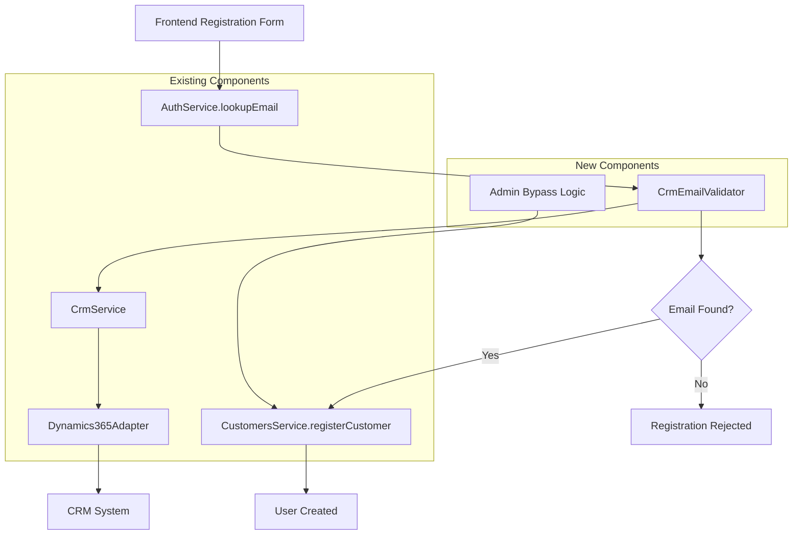

# Technical Design Document: CRM-Only Registration

## Overview

This design document outlines the technical implementation for restricting user registration to only those email addresses that exist in the CRM system (Dynamics 365). The feature integrates with the existing registration workflow by adding a CRM email validation layer before user creation, ensuring only legitimate customers can access the platform.

The solution leverages the existing CRM infrastructure (CrmService, Dynamics365Adapter) and extends the current registration flow (CustomersService.registerCustomer) with minimal disruption to the user experience.

## Architecture

### High-Level Architecture



### Integration Points

1. **AuthService.lookupEmail()** - Entry point for email validation
2. **CrmService** - Existing CRM integration service
3. **CustomersService.registerCustomer()** - Existing registration flow
4. **Dynamics365Adapter** - Existing CRM adapter for contact queries

## Components and Interfaces

### 1. CrmEmailValidator Service

**Location**: `apps/backend/src/crm/crm-email-validator.service.ts`

```typescript
interface ICrmEmailValidator {
  validateEmailInCrm(email: string): Promise<CrmValidationResult>;
  isAdminBypass(email: string): boolean;
}

interface CrmValidationResult {
  isValid: boolean;
  contactId?: string;
  errorCode?: 'NOT_FOUND' | 'CRM_ERROR' | 'NETWORK_ERROR';
  errorMessage?: string;
}
```

**Responsibilities**:
- Query CRM system for email existence
- Handle admin bypass logic
- Implement caching for performance
- Manage error handling and retry logic

### 2. Enhanced AuthService

**Modifications to**: `apps/backend/src/auth/auth.service.ts`

```typescript
// New method addition
async validateEmailForRegistration(email: string): Promise<EmailValidationResult> {
  // Integrate CrmEmailValidator into existing lookupEmail flow
}

interface EmailValidationResult extends ExistingLookupResult {
  crmValidation?: CrmValidationResult;
}
```

### 3. Enhanced CustomersService

**Modifications to**: `apps/backend/src/customers/customers.service.ts`

```typescript
// Enhanced registerCustomer method
async registerCustomer(dto: RegisterCustomerDto) {
  // Add CRM validation before existing logic
  const crmValidation = await this.crmEmailValidator.validateEmailInCrm(dto.email);
  
  if (!crmValidation.isValid && !this.crmEmailValidator.isAdminBypass(dto.email)) {
    throw new BadRequestException('Bu e-posta adresi CRM sisteminde bulunamadı.');
  }
  
  // Continue with existing registration flow...
}
```

### 4. CRM Contact Query Extension

**Enhancement to**: `apps/backend/src/crm/crm.service.ts`

```typescript
// New method addition
async findContactByEmail(email: string): Promise<CrmContact | null> {
  // Leverage existing Dynamics365Adapter for contact lookup
}

interface CrmContact {
  contactId: string;
  emailAddress: string;
  firstName?: string;
  lastName?: string;
  companyName?: string;
}
```

## Data Models

### Database Schema Changes

**No database schema changes required** - the feature uses existing CRM integration and user tables.

### Configuration Settings

**New settings in `settings` table**:

```typescript
interface CrmValidationSettings {
  'crm.email_validation.enabled': boolean;
  'crm.email_validation.cache_ttl_seconds': number;
  'crm.email_validation.retry_attempts': number;
  'crm.email_validation.timeout_ms': number;
  'crm.email_validation.admin_bypass_emails': string[]; // JSON array
}
```

### Cache Structure

**Redis cache keys**:
- `crm:email:valid:{email}` - Valid email cache (TTL: 1 hour)
- `crm:email:invalid:{email}` - Invalid email cache (TTL: 15 minutes)

## Error Handling

### Error Classification

1. **CRM_NOT_FOUND** - Email not found in CRM contacts
   - User message: "Bu e-posta adresi sistemimizde kayıtlı değil. Lütfen CRM'de kayıtlı e-posta adresinizi kullanın."
   - HTTP Status: 400 Bad Request

2. **CRM_SYSTEM_ERROR** - CRM system unavailable or error
   - User message: "Sistem geçici olarak kullanılamıyor. Lütfen daha sonra tekrar deneyin."
   - HTTP Status: 503 Service Unavailable

3. **NETWORK_TIMEOUT** - CRM query timeout
   - User message: "İşlem zaman aşımına uğradı. Lütfen tekrar deneyin."
   - HTTP Status: 408 Request Timeout

### Retry Strategy

```typescript
interface RetryConfig {
  maxAttempts: 3;
  backoffMs: [1000, 2000, 4000]; // Exponential backoff
  retryableErrors: ['NETWORK_ERROR', 'TIMEOUT'];
}
```

### Fallback Behavior

When CRM system is completely unavailable:
- Log critical error
- Allow admin bypass emails to proceed
- Reject all other registrations with service unavailable message
- Send alert to system administrators

## Testing Strategy

### Unit Tests

**CrmEmailValidator Service Tests**:
- Email validation with valid CRM contact
- Email validation with invalid email
- Admin bypass functionality
- Cache hit/miss scenarios
- Error handling and retry logic
- Timeout handling

**AuthService Integration Tests**:
- Enhanced lookupEmail with CRM validation
- Error propagation from CRM validator
- Performance with caching

**CustomersService Integration Tests**:
- Registration flow with valid CRM email
- Registration rejection with invalid email
- Admin bypass registration
- Error handling during CRM validation

### Integration Tests

**CRM System Integration**:
- Real Dynamics 365 contact lookup
- Network error simulation
- Timeout scenario testing
- Large dataset performance

**End-to-End Tests**:
- Complete registration flow with CRM validation
- Frontend error message display
- Admin bypass workflow
- Performance under load

### Performance Tests

**Load Testing Scenarios**:
- 100 concurrent registration attempts
- Cache effectiveness measurement
- CRM system response time monitoring
- Memory usage with caching

**Benchmarks**:
- Target: < 2 seconds for CRM validation
- Cache hit ratio: > 80%
- System availability: > 99.5%

## Performance Optimization

### Caching Strategy

**Multi-level Caching**:

1. **Application Cache** (Redis)
   - Valid emails: 1 hour TTL
   - Invalid emails: 15 minutes TTL
   - Cache warming for frequent domains

2. **Request Deduplication**
   - Prevent multiple simultaneous CRM queries for same email
   - Use in-memory locks with 30-second timeout

### Database Optimization

**Existing Optimizations Leveraged**:
- CRM contact sync maintains local cache
- Indexed email lookups in customerProfile table
- Connection pooling for CRM queries

### Monitoring and Metrics

**Key Performance Indicators**:
- CRM validation response time (P95, P99)
- Cache hit ratio
- CRM system availability
- Registration success/failure rates
- Error distribution by type

**Alerting Thresholds**:
- CRM response time > 5 seconds
- Cache hit ratio < 70%
- Error rate > 5%
- CRM system unavailable > 2 minutes

## Security Considerations

### Input Validation

```typescript
// Email format validation before CRM query
const emailRegex = /^[^\s@]+@[^\s@]+\.[^\s@]+$/;
if (!emailRegex.test(email)) {
  throw new BadRequestException('Geçersiz e-posta formatı');
}
```

### Rate Limiting

**Per-IP Rate Limits**:
- 10 registration attempts per minute
- 100 email validations per hour
- Exponential backoff for repeated failures

### Data Protection

**Sensitive Data Handling**:
- No CRM contact data stored in application logs
- Email addresses hashed in cache keys
- Encrypted CRM API communications (existing)
- Audit logging for all validation attempts

### Admin Bypass Security

**Admin Email Configuration**:
- Stored in encrypted settings table
- Configurable only by super admin role
- Audit logged when bypass is used
- Limited to specific email addresses (no wildcards)

## Deployment Strategy

### Feature Flags

```typescript
interface FeatureFlags {
  'crm_email_validation_enabled': boolean;
  'crm_validation_strict_mode': boolean; // Fail closed vs open
  'admin_bypass_enabled': boolean;
}
```

### Rollout Plan

**Phase 1: Soft Launch (Week 1)**
- Deploy with feature flag disabled
- Monitor system performance
- Validate CRM integration

**Phase 2: Gradual Rollout (Week 2)**
- Enable for 10% of registration attempts
- Monitor error rates and performance
- Adjust cache settings based on metrics

**Phase 3: Full Deployment (Week 3)**
- Enable for all registration attempts
- Monitor business impact
- Fine-tune error messages based on user feedback

### Rollback Strategy

**Immediate Rollback Triggers**:
- CRM validation error rate > 10%
- Registration completion rate drops > 20%
- CRM system response time > 10 seconds consistently

**Rollback Process**:
1. Disable feature flag
2. Clear validation caches
3. Monitor registration recovery
4. Investigate and fix issues

## Monitoring and Observability

### Logging Strategy

**Structured Logging**:
```typescript
interface CrmValidationLog {
  timestamp: string;
  email: string; // hashed
  result: 'valid' | 'invalid' | 'error';
  responseTime: number;
  cacheHit: boolean;
  errorCode?: string;
  crmContactId?: string;
}
```

### Metrics Collection

**Business Metrics**:
- Registration attempt rate
- Registration success rate
- CRM validation success rate
- Admin bypass usage rate

**Technical Metrics**:
- CRM API response times
- Cache performance
- Error distribution
- System resource usage

### Dashboards

**Operations Dashboard**:
- Real-time registration flow health
- CRM system status
- Error rate trends
- Performance metrics

**Business Dashboard**:
- Registration conversion rates
- CRM validation impact
- User experience metrics
- Admin bypass analytics

## Configuration Management

### Environment Variables

```typescript
interface CrmValidationConfig {
  CRM_VALIDATION_ENABLED: boolean;
  CRM_VALIDATION_CACHE_TTL: number;
  CRM_VALIDATION_TIMEOUT: number;
  CRM_VALIDATION_RETRY_ATTEMPTS: number;
  ADMIN_BYPASS_EMAILS: string; // JSON array
}
```

### Runtime Configuration

**Dynamic Settings** (via settings table):
- Cache TTL adjustments
- Timeout configurations
- Retry attempt limits
- Admin bypass email list

### Configuration Validation

**Startup Checks**:
- CRM connection validation
- Cache system availability
- Configuration parameter validation
- Admin bypass email format validation

## Future Enhancements

### Planned Improvements

1. **Intelligent Caching**
   - Machine learning-based cache warming
   - Predictive email validation
   - Domain-based caching strategies

2. **Enhanced Error Recovery**
   - Automatic CRM failover
   - Graceful degradation modes
   - Self-healing cache mechanisms

3. **Advanced Analytics**
   - Registration pattern analysis
   - CRM data quality insights
   - Predictive registration success modeling

### Scalability Considerations

**Horizontal Scaling**:
- Stateless validation service design
- Distributed cache support
- Load balancer compatibility

**Performance Optimization**:
- Batch email validation API
- Asynchronous validation options
- Edge caching for global deployment

## Correctness Properties

*A property is a characteristic or behavior that should hold true across all valid executions of a system-essentially, a formal statement about what the system should do. Properties serve as the bridge between human-readable specifications and machine-verifiable correctness guarantees.*

### Property 1: Email Validation Consistency

*For any* email address input to the registration system, the Email_Validator SHALL return a consistent boolean result structure indicating CRM contact existence, and SHALL trigger appropriate CRM lookup operations.

**Validates: Requirements 1.1, 1.5**

### Property 2: CRM Contact Validation Success Path

*For any* email address that exists in CRM contacts (emailaddress1 field), the Registration_Service SHALL allow the registration to proceed with the existing registration flow.

**Validates: Requirements 1.2**

### Property 3: CRM Contact Validation Failure Path

*For any* email address that does not exist in CRM contacts, the Registration_Service SHALL reject the registration with an appropriate error message.

**Validates: Requirements 1.3**

### Property 4: Admin Bypass Audit Logging

*For any* registration attempt using admin bypass functionality, the system SHALL create audit log entries for security and compliance tracking.

**Validates: Requirements 2.3**

### Property 5: Error Message Security

*For any* CRM validation failure due to system errors, the Registration_Service SHALL return generic error messages without exposing technical details or sensitive information.

**Validates: Requirements 3.2**

### Property 6: Registration Flow Continuity

*For any* successful CRM validation, the Registration_Service SHALL proceed with the existing registration flow without additional user interaction or modification to the user experience.

**Validates: Requirements 3.4**

### Property 7: CRM Service Error Isolation

*For any* CRM contact synchronization errors, the Email_Validator SHALL continue to operate normally without blocking registration validation operations.

**Validates: Requirements 4.3**

### Property 8: Cache Performance Optimization

*For any* repeated CRM contact lookup requests, the Email_Validator SHALL utilize caching mechanisms while maintaining data freshness according to configured TTL policies.

**Validates: Requirements 4.4**

### Property 9: Backward Compatibility Preservation

*For any* existing registration data structure or validation rule, the enhanced Registration_Service SHALL maintain full backward compatibility while adding CRM email validation.

**Validates: Requirements 5.2, 5.3, 5.4**

### Property 10: Retry Logic Consistency

*For any* transient CRM connection failure, the Email_Validator SHALL implement consistent retry logic with exponential backoff according to configured retry policies.

**Validates: Requirements 6.3**

### Property 11: Comprehensive Operation Logging

*For any* CRM validation operation (success, failure, or error), the system SHALL log appropriate metrics and events for monitoring, debugging, and audit purposes.

**Validates: Requirements 2.3, 3.3, 6.4**

### Property 12: Data Protection Compliance

*For any* CRM validation process, the Registration_Service SHALL exclude sensitive CRM data from application logs and storage to maintain data protection compliance.

**Validates: Requirements 7.2**

### Property 13: Input Validation Security

*For any* email input to the validation system, the Email_Validator SHALL perform format validation before querying CRM to prevent injection attacks and ensure input safety.

**Validates: Requirements 7.3**

### Property 14: Rate Limiting Protection

*For any* sequence of CRM validation requests exceeding configured rate limits, the Registration_Service SHALL implement consistent rate limiting to prevent system abuse.

**Validates: Requirements 7.4**

## Conclusion

This design provides a robust, scalable solution for CRM-only registration that integrates seamlessly with the existing system architecture. The implementation prioritizes performance, reliability, and user experience while maintaining security and operational excellence.

The phased rollout approach ensures minimal risk during deployment, while comprehensive monitoring and observability enable rapid issue detection and resolution. The design is future-ready with clear extension points for additional features and optimizations.