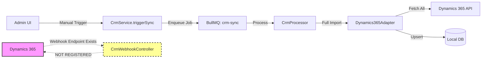
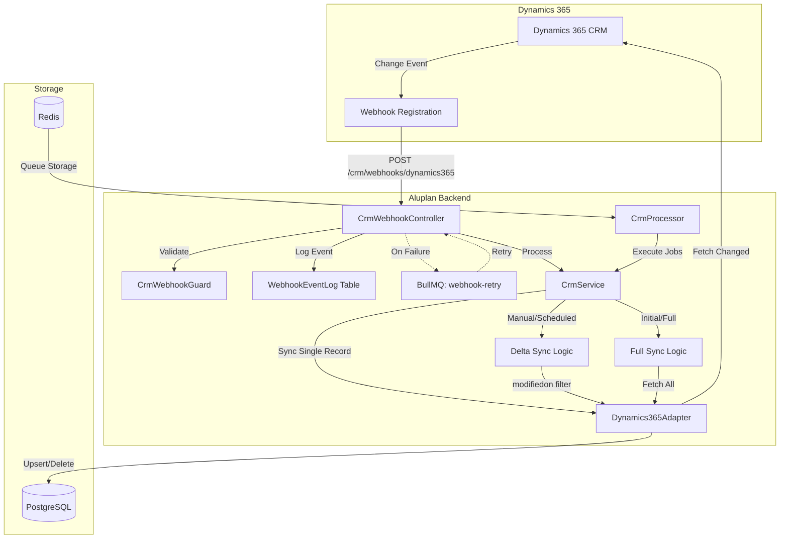
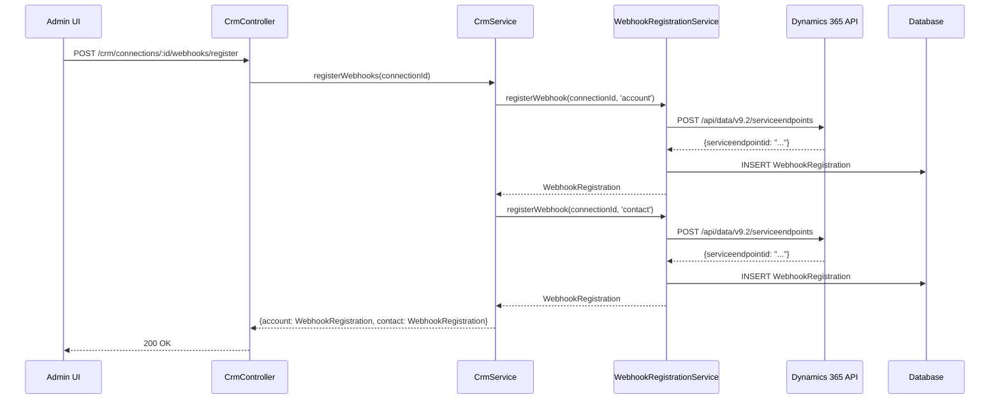
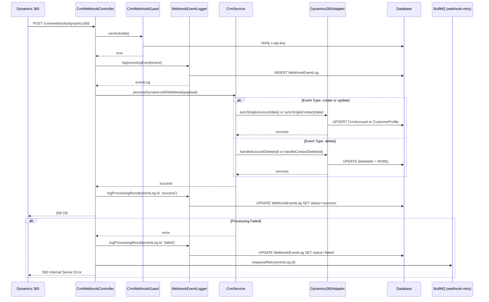
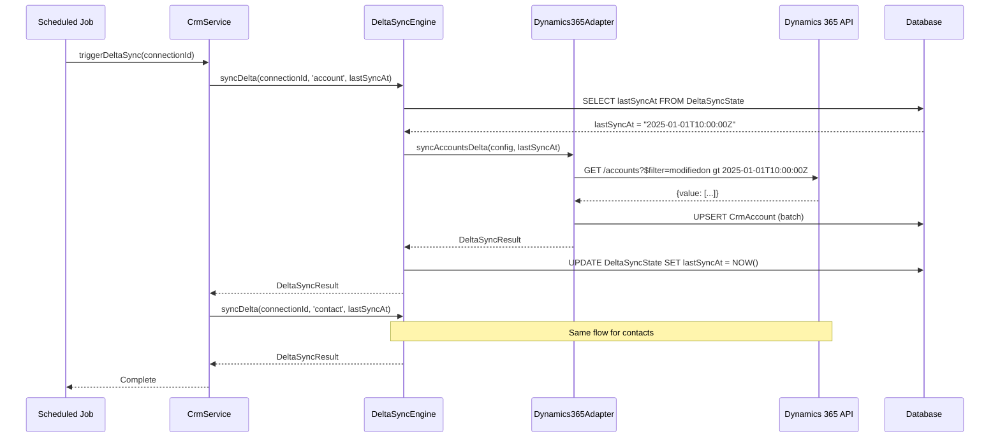

# Design Document: CRM Real-Time Sync

## Overview

Bu tasarım, mevcut tek yönlü manuel CRM senkronizasyon sistemini (Dynamics 365 → local DB), event-driven, real-time, bidirectional sync mimarisine dönüştürür. Microsoft Dynamics 365'te bir contact veya account değiştiğinde, sistem otomatik olarak webhook ile bilgilendirilir ve yerel veritabanı güncellenir. Ayrıca delta sync (sadece değişen kayıtları çekme), webhook retry queue (webhook kaybını önleme), event logging (audit trail) ve delete/deactivate handling (silme/devre dışı bırakma) özellikleri eklenir.

## Architecture

### Current State (Baseline)



**Sorunlar:**
- Webhook endpoint var ama Dynamics 365 tarafında kayıtlı değil
- Full import her seferinde tüm kayıtları çeker (inefficient)
- Webhook kaybı durumunda retry yok
- Silinen/devre dışı bırakılan kayıtlar senkronize edilmiyor
- Audit trail yok (hangi webhook ne zaman geldi?)
- Bidirectional sync yok (local → Dynamics)

### Target State (Event-Driven Real-Time)



## Components and Interfaces

### 1. Webhook Registration Service

**Purpose:** Dynamics 365'e webhook kaydı yapar ve yönetir.

**Interface:**
```typescript
interface IWebhookRegistrationService {
  registerWebhook(connectionId: string, entityType: 'account' | 'contact'): Promise<WebhookRegistration>;
  unregisterWebhook(connectionId: string, webhookId: string): Promise<void>;
  listWebhooks(connectionId: string): Promise<WebhookRegistration[]>;
  verifyWebhookHealth(connectionId: string, webhookId: string): Promise<boolean>;
}

interface WebhookRegistration {
  id: string;
  connectionId: string;
  entityType: 'account' | 'contact';
  webhookUrl: string;
  externalWebhookId: string; // Dynamics 365'teki webhook ID
  status: 'active' | 'inactive' | 'failed';
  createdAt: Date;
  lastVerifiedAt: Date | null;
}
```

**Responsibilities:**
- Dynamics 365 Service Endpoint API kullanarak webhook kaydı
- Webhook sağlık kontrolü (health check)
- Webhook silme/güncelleme

### 2. Webhook Event Logger

**Purpose:** Gelen webhook eventlerini audit trail için loglar.

**Interface:**
```typescript
interface IWebhookEventLogger {
  logIncomingEvent(event: IncomingWebhookEvent): Promise<WebhookEventLog>;
  logProcessingResult(eventId: string, result: ProcessingResult): Promise<void>;
  getEventHistory(filters: EventHistoryFilters): Promise<WebhookEventLog[]>;
}

interface IncomingWebhookEvent {
  entityType: 'account' | 'contact';
  entityId: string;
  eventType: 'create' | 'update' | 'delete';
  payload: any;
  receivedAt: Date;
}

interface WebhookEventLog {
  id: string;
  connectionId: string;
  entityType: 'account' | 'contact';
  entityId: string;
  eventType: 'create' | 'update' | 'delete';
  payload: any;
  receivedAt: Date;
  processedAt: Date | null;
  status: 'pending' | 'success' | 'failed' | 'retrying';
  errorMessage: string | null;
  retryCount: number;
}
```

**Responsibilities:**
- Her webhook eventini veritabanına kaydet
- Processing sonucunu güncelle
- Event history sorgulama

### 3. Delta Sync Engine

**Purpose:** Son senkronizasyondan bu yana değişen kayıtları çeker.

**Interface:**
```typescript
interface IDeltaSyncEngine {
  syncDelta(connectionId: string, entityType: 'account' | 'contact', since: Date): Promise<DeltaSyncResult>;
  getLastSyncTimestamp(connectionId: string, entityType: 'account' | 'contact'): Promise<Date | null>;
  updateLastSyncTimestamp(connectionId: string, entityType: 'account' | 'contact', timestamp: Date): Promise<void>;
}

interface DeltaSyncResult {
  entityType: 'account' | 'contact';
  totalFetched: number;
  successCount: number;
  errorCount: number;
  syncedAt: Date;
  nextSyncToken: string | null; // For pagination
}
```

**Responsibilities:**
- `modifiedon` filtresi ile Dynamics 365'ten sadece değişen kayıtları çek
- Son senkronizasyon zamanını takip et
- Pagination desteği

### 4. Webhook Retry Queue Processor

**Purpose:** Webhook işleme başarısız olduğunda retry yapar.

**Interface:**
```typescript
interface IWebhookRetryProcessor {
  enqueueRetry(eventId: string, retryDelay: number): Promise<void>;
  processRetry(eventId: string): Promise<void>;
  cancelRetry(eventId: string): Promise<void>;
}
```

**Responsibilities:**
- Başarısız webhook eventlerini retry queue'ya ekle
- Exponential backoff ile retry
- Max retry count sonrası dead letter queue'ya taşı

### 5. Delete/Deactivate Handler

**Purpose:** Dynamics 365'te silinen veya devre dışı bırakılan kayıtları işler.

**Interface:**
```typescript
interface IDeleteHandler {
  handleAccountDelete(externalAccountId: string): Promise<void>;
  handleContactDelete(externalContactId: string): Promise<void>;
  handleAccountDeactivate(externalAccountId: string): Promise<void>;
  handleContactDeactivate(externalContactId: string): Promise<void>;
}
```

**Responsibilities:**
- Silinen kayıtları soft-delete yap (deletedAt set et)
- Devre dışı bırakılan kayıtları işaretle (status = 'INACTIVE')
- İlişkili kayıtları güncelle (örn: contact silinirse user'ı da deaktive et)

## Data Models

### WebhookRegistration Model

```typescript
model WebhookRegistration {
  id                  String   @id @default(cuid())
  connectionId        String
  connection          CrmConnection @relation(fields: [connectionId], references: [id], onDelete: Cascade)
  entityType          String   // 'account' | 'contact'
  webhookUrl          String
  externalWebhookId   String   // Dynamics 365 webhook ID
  status              String   @default("active") // 'active' | 'inactive' | 'failed'
  createdAt           DateTime @default(now())
  lastVerifiedAt      DateTime?
  deletedAt           DateTime?
  
  @@index([connectionId, entityType])
  @@index([status])
}
```

**Validation Rules:**
- `entityType` must be 'account' or 'contact'
- `status` must be 'active', 'inactive', or 'failed'
- `webhookUrl` must be valid HTTPS URL
- `externalWebhookId` must be unique per connection

### WebhookEventLog Model

```typescript
model WebhookEventLog {
  id            String   @id @default(cuid())
  connectionId  String
  connection    CrmConnection @relation(fields: [connectionId], references: [id], onDelete: Cascade)
  entityType    String   // 'account' | 'contact'
  entityId      String   // External ID from Dynamics 365
  eventType     String   // 'create' | 'update' | 'delete'
  payload       Json
  receivedAt    DateTime @default(now())
  processedAt   DateTime?
  status        String   @default("pending") // 'pending' | 'success' | 'failed' | 'retrying'
  errorMessage  String?
  retryCount    Int      @default(0)
  deletedAt     DateTime?
  
  @@index([connectionId, entityType])
  @@index([status, receivedAt])
  @@index([entityId])
}
```

**Validation Rules:**
- `eventType` must be 'create', 'update', or 'delete'
- `status` must be 'pending', 'success', 'failed', or 'retrying'
- `retryCount` must be >= 0 and <= 5 (max retry limit)

### DeltaSyncState Model

```typescript
model DeltaSyncState {
  id              String   @id @default(cuid())
  connectionId    String
  connection      CrmConnection @relation(fields: [connectionId], references: [id], onDelete: Cascade)
  entityType      String   // 'account' | 'contact'
  lastSyncAt      DateTime
  nextSyncToken   String?  // For pagination
  createdAt       DateTime @default(now())
  updatedAt       DateTime @updatedAt
  
  @@unique([connectionId, entityType])
  @@index([connectionId])
}
```

**Validation Rules:**
- `entityType` must be 'account' or 'contact'
- `lastSyncAt` must be in the past
- Only one record per (connectionId, entityType) pair

## Main Algorithm/Workflow

### Webhook Registration Flow



### Real-Time Webhook Processing Flow



### Delta Sync Flow




## Key Functions with Formal Specifications

### Function 1: `registerWebhook()`

```typescript
async registerWebhook(
  connectionId: string,
  entityType: 'account' | 'contact',
  webhookUrl: string
): Promise<WebhookRegistration>
```

**Preconditions:**
- `connectionId` geçerli ve aktif bir CrmConnection'a referans eder
- `entityType` 'account' veya 'contact' değerlerinden biri
- `webhookUrl` geçerli HTTPS URL formatında
- Dynamics 365 bağlantısı doğrulanmış (access token alınabilir)

**Postconditions:**
- Dynamics 365'te yeni bir service endpoint kaydı oluşturulur
- `WebhookRegistration` kaydı veritabanına eklenir
- `status = 'active'` olarak set edilir
- Hata durumunda: Dynamics 365'te oluşturulan kayıt geri alınır (rollback)

**Loop Invariants:** N/A

---

### Function 2: `processDynamics365Webhook()` (genişletilmiş)

```typescript
async processDynamics365Webhook(
  payload: Dynamics365WebhookPayload,
  eventLogId: string
): Promise<WebhookProcessingResult>
```

**Preconditions:**
- `payload.entity` 'account' veya 'contact' değerlerinden biri
- `payload.eventType` 'create', 'update', veya 'delete' değerlerinden biri
- `eventLogId` geçerli bir `WebhookEventLog` kaydına referans eder
- `CrmWebhookGuard` doğrulaması geçilmiş

**Postconditions:**
- `eventType = 'create' | 'update'` ise: İlgili kayıt upsert edilir
- `eventType = 'delete'` ise: İlgili kayıt soft-delete yapılır
- `WebhookEventLog.status` güncellenir ('success' veya 'failed')
- Hata durumunda: `WebhookEventLog.retryCount` artırılır, retry queue'ya eklenir

**Loop Invariants:** N/A

---

### Function 3: `syncAccountsDelta()`

```typescript
async syncAccountsDelta(
  config: CrmConnectionConfig,
  since: Date,
  onProgress?: (stats: SyncStats) => void
): Promise<SyncResult>
```

**Preconditions:**
- `config` geçerli ve şifresi çözülmüş CRM bağlantı bilgilerini içerir
- `since` geçmiş bir tarih (Date.now() > since)
- Dynamics 365 API erişilebilir

**Postconditions:**
- `since` tarihinden sonra `modifiedon` değeri değişen tüm account kayıtları upsert edilir
- Silinen kayıtlar (statecode = 1) soft-delete yapılır
- `DeltaSyncState.lastSyncAt` güncellenir
- Hata durumunda: Kısmi başarılar korunur, `DeltaSyncState` güncellenmez

**Loop Invariants:**
- Her sayfa işlenirken: `successCount + errorCount <= totalFetched`
- Pagination döngüsünde: `nextLink` null olana kadar devam edilir

---

### Function 4: `handleContactDelete()`

```typescript
async handleContactDelete(
  externalContactId: string,
  tx?: PrismaTransaction
): Promise<void>
```

**Preconditions:**
- `externalContactId` geçerli bir Dynamics 365 contact ID
- İlgili `CustomerProfile` veritabanında mevcut

**Postconditions:**
- `CustomerProfile.deletedAt` = NOW() (soft-delete)
- İlgili `User.status` = 'INACTIVE' (eğer `passwordHash = 'CRM_SYNCED'` ise — yani sadece CRM'den gelen kullanıcılar)
- Admin veya non-CRM kullanıcılar etkilenmez (`ADMIN_BYPASS_EMAILS` kontrolü)
- Eğer `CustomerProfile` bulunamazsa: Sessizce geç (idempotent)

**Loop Invariants:** N/A

---

### Function 5: `enqueueWebhookRetry()`

```typescript
async enqueueWebhookRetry(
  eventLogId: string,
  retryCount: number
): Promise<void>
```

**Preconditions:**
- `eventLogId` geçerli bir `WebhookEventLog` kaydına referans eder
- `retryCount < MAX_RETRY_COUNT` (5)
- `WebhookEventLog.status = 'failed'`

**Postconditions:**
- BullMQ `webhook-retry` queue'ya yeni job eklenir
- Delay: `2^retryCount * 1000ms` (exponential backoff: 1s, 2s, 4s, 8s, 16s)
- `WebhookEventLog.status = 'retrying'`
- `retryCount >= MAX_RETRY_COUNT` ise: `status = 'dead_letter'`, retry yapılmaz

**Loop Invariants:** N/A

## Algorithmic Pseudocode

### Delta Sync Algorithm

```pascal
ALGORITHM syncDelta(connectionId, entityType, since)
INPUT: connectionId: String, entityType: 'account'|'contact', since: Date
OUTPUT: result: DeltaSyncResult

BEGIN
  ASSERT connectionId IS NOT NULL
  ASSERT entityType IN ['account', 'contact']
  ASSERT since < NOW()
  
  // 1. Bağlantı bilgilerini al ve şifreyi çöz
  connection ← database.crmConnection.findFirst(connectionId)
  IF connection IS NULL THEN
    THROW NotFoundException("CRM connection not found")
  END IF
  
  config ← decryptConnectionSecrets(connection)
  token ← getAccessToken(config)
  
  // 2. Delta URL'i oluştur (modifiedon filtresi)
  sinceIso ← since.toISOString()
  baseUrl ← buildDeltaUrl(config.instanceUrl, entityType, sinceIso)
  // Örnek: /api/data/v9.2/accounts?$filter=modifiedon gt 2025-01-01T10:00:00Z
  
  // 3. Sayfalı veri çekme
  records ← []
  nextUrl ← baseUrl
  
  WHILE nextUrl IS NOT NULL DO
    ASSERT records.length <= MAX_RECORDS_LIMIT
    
    response ← httpGet(nextUrl, headers)
    records.addAll(response.data.value)
    nextUrl ← response.data['@odata.nextLink'] OR NULL
  END WHILE
  
  // 4. Her kaydı işle
  successCount ← 0
  errorCount ← 0
  
  FOR each record IN records DO
    ASSERT successCount + errorCount <= records.length
    
    TRY
      IF record.statecode = 1 THEN
        // Deaktif kayıt — soft-delete
        handleDeactivate(record.id, entityType)
      ELSE
        // Aktif kayıt — upsert
        upsertRecord(record, entityType, config.syncSettings)
      END IF
      successCount ← successCount + 1
    CATCH error
      logError(record.id, error)
      errorCount ← errorCount + 1
    END TRY
  END FOR
  
  // 5. Delta sync state'i güncelle
  database.deltaSyncState.upsert(connectionId, entityType, NOW())
  
  ASSERT successCount + errorCount = records.length
  
  RETURN DeltaSyncResult {
    entityType,
    totalFetched: records.length,
    successCount,
    errorCount,
    syncedAt: NOW()
  }
END
```

**Preconditions:**
- `connectionId` geçerli ve aktif bir CrmConnection'a referans eder
- `since` geçmiş bir tarih
- Dynamics 365 API erişilebilir

**Postconditions:**
- `since` tarihinden sonra değişen tüm kayıtlar işlenir
- `DeltaSyncState.lastSyncAt` güncellenir
- `successCount + errorCount = totalFetched`

**Loop Invariants:**
- Pagination döngüsünde: Her iterasyonda `records.length` artar veya sabit kalır
- İşleme döngüsünde: `successCount + errorCount <= records.length`

---

### Webhook Retry Algorithm

```pascal
ALGORITHM processWebhookRetry(eventLogId)
INPUT: eventLogId: String
OUTPUT: void

BEGIN
  ASSERT eventLogId IS NOT NULL
  
  // 1. Event log kaydını al
  eventLog ← database.webhookEventLog.findUnique(eventLogId)
  IF eventLog IS NULL THEN
    THROW NotFoundException("Event log not found")
  END IF
  
  IF eventLog.retryCount >= MAX_RETRY_COUNT THEN
    // Dead letter — artık retry yapma
    database.webhookEventLog.update(eventLogId, { status: 'dead_letter' })
    alertOpsTeam(eventLog)
    RETURN
  END IF
  
  // 2. Retry sayacını artır
  database.webhookEventLog.update(eventLogId, {
    status: 'retrying',
    retryCount: eventLog.retryCount + 1
  })
  
  // 3. Webhook'u yeniden işle
  TRY
    result ← processDynamics365Webhook(eventLog.payload, eventLogId)
    database.webhookEventLog.update(eventLogId, {
      status: 'success',
      processedAt: NOW()
    })
  CATCH error
    database.webhookEventLog.update(eventLogId, {
      status: 'failed',
      errorMessage: error.message
    })
    
    // Exponential backoff ile tekrar kuyruğa ekle
    delay ← POWER(2, eventLog.retryCount + 1) * 1000  // ms
    enqueueRetry(eventLogId, delay)
  END TRY
END
```

**Preconditions:**
- `eventLogId` geçerli bir `WebhookEventLog` kaydına referans eder
- `retryCount < MAX_RETRY_COUNT`

**Postconditions:**
- Başarılı ise: `status = 'success'`, `processedAt` set edilir
- Başarısız ise: `retryCount` artırılır, exponential backoff ile tekrar kuyruğa eklenir
- `retryCount >= MAX_RETRY_COUNT` ise: `status = 'dead_letter'`

**Loop Invariants:** N/A (recursive retry, not a loop)

---

### Webhook Registration Algorithm

```pascal
ALGORITHM registerWebhooksForConnection(connectionId)
INPUT: connectionId: String
OUTPUT: registrations: WebhookRegistration[]

BEGIN
  ASSERT connectionId IS NOT NULL
  
  connection ← database.crmConnection.findFirst(connectionId)
  IF connection IS NULL THEN
    THROW NotFoundException("CRM connection not found")
  END IF
  
  config ← decryptConnectionSecrets(connection)
  token ← getAccessToken(config)
  
  webhookBaseUrl ← buildWebhookUrl()
  // Örnek: https://api.aluplan.com/crm/webhooks/dynamics365
  
  registrations ← []
  
  FOR each entityType IN ['account', 'contact'] DO
    // Mevcut kaydı kontrol et
    existing ← database.webhookRegistration.findFirst(connectionId, entityType)
    
    IF existing IS NOT NULL AND existing.status = 'active' THEN
      // Zaten kayıtlı — sağlık kontrolü yap
      isHealthy ← verifyWebhookHealth(config, existing.externalWebhookId)
      IF isHealthy THEN
        registrations.add(existing)
        CONTINUE
      ELSE
        // Sağlıksız — sil ve yeniden kaydet
        deleteWebhookFromDynamics(config, existing.externalWebhookId)
        database.webhookRegistration.update(existing.id, { status: 'inactive' })
      END IF
    END IF
    
    // Dynamics 365'e yeni webhook kaydet
    TRY
      externalId ← createServiceEndpoint(config, token, entityType, webhookBaseUrl)
      
      registration ← database.webhookRegistration.create({
        connectionId,
        entityType,
        webhookUrl: webhookBaseUrl,
        externalWebhookId: externalId,
        status: 'active'
      })
      
      registrations.add(registration)
    CATCH error
      logError("Webhook registration failed", entityType, error)
      THROW error
    END TRY
  END FOR
  
  ASSERT registrations.length = 2  // account + contact
  
  RETURN registrations
END
```

**Preconditions:**
- `connectionId` geçerli ve aktif bir CrmConnection'a referans eder
- Dynamics 365 API erişilebilir
- `webhookBaseUrl` dışarıdan erişilebilir (public URL)

**Postconditions:**
- Her entity type için bir `WebhookRegistration` kaydı oluşturulur
- Dynamics 365'te service endpoint kayıtları aktif
- Mevcut sağlıklı kayıtlar yeniden oluşturulmaz (idempotent)

**Loop Invariants:**
- Her iterasyonda: `registrations.length` artar veya sabit kalır

## Example Usage

```typescript
// 1. Webhook kaydı (Admin UI'dan tetiklenir)
const registrations = await crmService.registerWebhooks(connectionId);
// Sonuç: [{entityType: 'account', status: 'active'}, {entityType: 'contact', status: 'active'}]

// 2. Gelen webhook işleme (Dynamics 365'ten otomatik gelir)
// POST /crm/webhooks/dynamics365
// Headers: { 'x-api-key': 'webhook-secret' }
// Body:
const webhookPayload = {
  entity: 'contact',
  eventType: 'update',
  data: {
    contactid: 'abc-123',
    emailaddress1: 'john@example.com',
    firstname: 'John',
    lastname: 'Doe',
    modifiedon: '2025-01-15T10:30:00Z'
  }
};

// 3. Delete event işleme
const deletePayload = {
  entity: 'contact',
  eventType: 'delete',
  data: {
    contactid: 'abc-123'
  }
};
// Sonuç: CustomerProfile soft-delete, User.status = 'INACTIVE' (CRM_SYNCED ise)

// 4. Delta sync tetikleme (scheduled job veya manual)
const deltaResult = await crmService.triggerDeltaSync(connectionId);
// Sonuç: {account: {totalFetched: 5, successCount: 5}, contact: {totalFetched: 12, successCount: 11, errorCount: 1}}

// 5. Webhook event history sorgulama
const history = await crmService.getWebhookEventHistory(connectionId, {
  entityType: 'contact',
  status: 'failed',
  from: new Date('2025-01-01'),
  limit: 50
});
```

## Error Handling

### Error Scenario 1: Webhook Delivery Failure

**Condition:** Dynamics 365 webhook gönderdiğinde sistem down veya 5xx döner
**Response:** Dynamics 365 kendi retry mekanizmasını çalıştırır (max 12 saat). Sistem ayağa kalktığında gelen retry'lar normal akışla işlenir.
**Recovery:** `WebhookEventLog` tablosunda `status = 'failed'` kayıtlar için BullMQ retry queue devreye girer. Max 5 retry, exponential backoff.

### Error Scenario 2: Dynamics 365 API Unavailable (Delta Sync)

**Condition:** Delta sync sırasında Dynamics 365 API erişilemez
**Response:** `DeltaSyncState.lastSyncAt` güncellenmez. Bir sonraki delta sync aynı `since` timestamp'i kullanır.
**Recovery:** Bir sonraki scheduled delta sync otomatik olarak aynı zaman aralığını tekrar çeker. Veri kaybı olmaz.

### Error Scenario 3: Webhook Secret Mismatch

**Condition:** Gelen webhook'ta `x-api-key` header'ı yanlış veya eksik
**Response:** `CrmWebhookGuard` 401 Unauthorized döner. Event log'a kaydedilmez.
**Recovery:** Dynamics 365 webhook konfigürasyonunda secret güncellenmeli. `CrmConnection.webhookSecret` ile senkronize edilmeli.

### Error Scenario 4: Contact Delete — User Has Active Tickets

**Condition:** Dynamics 365'te silinen contact'ın User'ına bağlı aktif destek ticketları var
**Response:** User soft-delete yapılmaz. Sadece `CustomerProfile.deletedAt` set edilir ve `User.status = 'INACTIVE'` yapılır.
**Recovery:** Aktif ticketlar korunur. Ticket sistemi `INACTIVE` kullanıcıları gösterebilir. Operatör manuel karar verir.

### Error Scenario 5: Webhook Registration Fails

**Condition:** Dynamics 365 API'ye webhook kaydı sırasında hata (yetki, network, vb.)
**Response:** `WebhookRegistration` kaydı oluşturulmaz. Hata mesajı admin'e döner.
**Recovery:** Admin UI'dan yeniden kayıt tetiklenebilir. Mevcut manual sync çalışmaya devam eder.

## Testing Strategy

### Unit Testing Approach

Her servis ve adapter için izole unit testler:
- `WebhookRegistrationService`: Dynamics 365 API mock'lanarak kayıt/silme/sağlık kontrolü
- `DeltaSyncEngine`: `modifiedon` filtresi ile doğru URL oluşturulduğunu doğrula
- `DeleteHandler`: Soft-delete mantığı, admin bypass koruması
- `WebhookRetryProcessor`: Exponential backoff hesaplaması, max retry limiti

### Property-Based Testing Approach

**Property Test Library:** fast-check (mevcut proje standardı, `*.pbt.spec.ts`)

**Önemli özellikler:**
- `retryDelay(n) = 2^n * 1000` — her retry için delay doğru hesaplanır
- `deltaSync(since)` — `since` ne olursa olsun, dönen kayıtlar `modifiedon >= since` koşulunu sağlar
- `processWebhook(payload)` — idempotent: aynı payload iki kez işlenirse sonuç değişmez
- `handleDelete(id)` — idempotent: var olmayan ID için sessizce geçer, hata fırlatmaz

### Integration Testing Approach

- Gerçek BullMQ + Redis ile retry queue testi
- Prisma transaction rollback senaryoları
- Webhook guard ile API key doğrulama

## Performance Considerations

- **Delta sync batch size:** Dynamics 365 API sayfa başına max 5000 kayıt döner. Büyük delta'larda pagination ile işlenir.
- **Webhook processing:** Her webhook event senkron işlenir (< 500ms hedef). Uzun süren işlemler için BullMQ job'a devredilir.
- **Event log retention:** `WebhookEventLog` tablosu büyüyebilir. 90 gün sonra `status = 'success'` kayıtlar arşivlenir veya silinir.
- **Delta sync frequency:** Varsayılan 15 dakikada bir. Webhook ile real-time güncelleme sağlandığı için delta sync sadece gap-fill görevi görür.

## Security Considerations

- **Webhook secret rotation:** `CrmConnection.webhookSecret` değiştirildiğinde Dynamics 365 webhook konfigürasyonu da güncellenmeli. Geçiş süreci için kısa bir overlap window desteklenir.
- **Payload validation:** Gelen webhook payload'ı şema doğrulamasından geçirilir. Beklenmedik alanlar ignore edilir.
- **Admin bypass:** `ADMIN_BYPASS_EMAILS` env var'ındaki emailler için CRM webhook hiçbir zaman user rolünü veya statusunu değiştirmez (mevcut koruma korunur).
- **Audit trail:** Tüm webhook eventleri `WebhookEventLog`'a kaydedilir. GDPR uyumu için payload'daki PII alanları maskelenerek loglanır.
- **Rate limiting:** Dynamics 365 API rate limit'lerine (429) karşı exponential backoff uygulanır.

## Dependencies

- **BullMQ** — Mevcut `crm-sync` queue'ya ek olarak `webhook-retry` queue eklenir
- **Redis** — Mevcut altyapı, ek konfigürasyon gerekmez
- **Prisma 7** — `WebhookRegistration`, `WebhookEventLog`, `DeltaSyncState` modelleri eklenir
- **Dynamics 365 Dataverse API v9.2** — Service Endpoint API (webhook registration için)
- **@nestjs/schedule** — Delta sync için cron job (mevcut projede varsa, yoksa eklenir)
- **axios** — Mevcut HTTP client, değişiklik gerekmez

## Correctness Properties

*A property is a characteristic or behavior that should hold true across all valid executions of a system — essentially, a formal statement about what the system should do. Properties serve as the bridge between human-readable specifications and machine-verifiable correctness guarantees.*

### Property 1: Webhook Registration Produces Exactly Two Records

*For any* valid CRM connection, calling `registerWebhooksForConnection` SHALL result in exactly two `WebhookRegistration` records — one for `'account'` and one for `'contact'` — each with `status = 'active'`, a non-empty `externalWebhookId`, and an HTTPS `webhookUrl`.

**Validates: Requirements 1.1, 1.2, 1.6, 1.7**

---

### Property 2: Webhook Registration Is Idempotent for Healthy Webhooks

*For any* valid CRM connection where both webhooks are already registered and healthy, calling `registerWebhooksForConnection` a second time SHALL NOT create additional `WebhookRegistration` records and SHALL return the existing records unchanged.

**Validates: Requirements 1.3**

---

### Property 3: Failed Dynamics 365 API Calls Leave No Orphan Records

*For any* Dynamics 365 API error during webhook registration, the number of `WebhookRegistration` records in the database SHALL remain unchanged after the failed call.

**Validates: Requirements 1.5**

---

### Property 4: Missing or Mismatched API Key Always Produces 401

*For any* inbound webhook request where the `x-api-key` header is absent, empty, or does not match the decrypted `webhookSecret`, the `CrmWebhookGuard` SHALL return HTTP 401 and the request SHALL NOT reach the controller.

**Validates: Requirements 2.2, 2.4, 2.5**

---

### Property 5: Every Authenticated Webhook Creates a Log Record Before Processing

*For any* authenticated webhook payload, a `WebhookEventLog` record with `status = 'pending'` and all required fields (`entityType`, `entityId`, `eventType`, `payload`, `receivedAt`) SHALL be persisted before any upsert or delete operation is attempted on `CrmAccount` or `CustomerProfile`.

**Validates: Requirements 3.1**

---

### Property 6: Log Status Reflects Final Processing Outcome

*For any* webhook event, after processing completes the `WebhookEventLog.status` SHALL be exactly `'success'` if processing succeeded, or `'failed'` with a non-null `errorMessage` if processing threw an error.

**Validates: Requirements 3.2, 3.3**

---

### Property 7: Dead-Letter State Is Terminal

*For any* `WebhookEventLog` record where `retryCount >= MAX_RETRY_COUNT (5)` and processing fails, the `status` SHALL be set to `'dead_letter'` and no further retry jobs SHALL be enqueued in the `webhook-retry` queue.

**Validates: Requirements 3.5, 6.5**

---

### Property 8: PII Fields Are Masked in All Stored Payloads

*For any* webhook payload containing PII fields (email addresses, phone numbers), the `payload` column stored in `WebhookEventLog` SHALL not contain the original unmasked values of those fields.

**Validates: Requirements 3.6, 10.1**

---

### Property 9: Account and Contact Upserts Are Idempotent

*For any* valid `create` or `update` webhook payload for an `account` or `contact` entity, processing the same payload twice SHALL produce the same final database state as processing it once (idempotent upsert).

**Validates: Requirements 4.1, 4.2**

---

### Property 10: Admin Emails Are Never Modified by Webhook Events

*For any* webhook event (create, update, or delete) where the contact email address is present in `ADMIN_BYPASS_EMAILS`, the corresponding `User` record's `role`, `status`, and `passwordHash` SHALL remain unchanged after processing.

**Validates: Requirements 4.4, 5.4, 10.2**

---

### Property 11: New CRM-Synced Users Always Have Correct Credentials and Role

*For any* contact webhook payload that results in the creation of a new `User` record, that `User` SHALL have `passwordHash = 'CRM_SYNCED'` and the `CUSTOMER` role assigned.

**Validates: Requirements 4.5**

---

### Property 12: Exponential Backoff Delay Is Correctly Computed

*For any* retry count `n` in the range `[0, 4]`, the delay enqueued for the retry job SHALL equal `2^n * 1000` milliseconds (i.e., 1000, 2000, 4000, 8000, 16000 ms respectively).

**Validates: Requirements 6.1, 6.7**

---

### Property 13: Retry Count Monotonically Increases by One Per Attempt

*For any* `WebhookEventLog` record, each retry attempt SHALL increment `retryCount` by exactly 1, and `retryCount` SHALL never exceed `MAX_RETRY_COUNT (5)`.

**Validates: Requirements 6.2, 3.7**

---

### Property 14: Delta Sync URL Contains Correct modifiedon Filter

*For any* `lastSyncAt` timestamp, the OData query URL constructed by the `Delta_Sync_Engine` SHALL contain the filter `modifiedon gt <lastSyncAt ISO string>` for the correct entity endpoint.

**Validates: Requirements 7.4**

---

### Property 15: Delta Sync Fetches All Pages

*For any* paginated Dynamics 365 response with `N` pages, the `Delta_Sync_Engine` SHALL process records from all `N` pages before completing, and `totalFetched` in the result SHALL equal the sum of records across all pages.

**Validates: Requirements 7.5**

---

### Property 16: Delta Sync Routes Records Correctly by statecode

*For any* batch of fetched records, every record with `statecode = 1` SHALL be routed to the `Delete_Handler`, and every record with `statecode = 0` SHALL be routed to the upsert path. No record SHALL be routed to both paths.

**Validates: Requirements 7.6, 7.7**

---

### Property 17: lastSyncAt Is Updated Only on Full Success

*For any* delta sync run, `DeltaSyncState.lastSyncAt` SHALL be updated to the sync start time if and only if no fatal error occurred during the run. If the Dynamics 365 API is unavailable or a fatal error is thrown, `lastSyncAt` SHALL remain at its previous value.

**Validates: Requirements 7.8, 7.9**

---

### Property 18: Soft-Delete Is Idempotent

*For any* delete event targeting a `CrmAccount` or `CustomerProfile` that does not exist in the local database, the `Delete_Handler` SHALL complete without throwing an error and the database state SHALL remain unchanged.

**Validates: Requirements 5.1, 5.2, 5.6**

---

### Property 19: Only CRM-Synced Users Are Deactivated on Contact Delete

*For any* contact delete event, the associated `User.status` SHALL be set to `'INACTIVE'` if and only if `User.passwordHash = 'CRM_SYNCED'` AND the user's email is not in `ADMIN_BYPASS_EMAILS`. All other users SHALL remain unmodified.

**Validates: Requirements 5.3, 5.4, 5.5**

---

### Property 20: Inbound Payloads with Extra Fields Do Not Cause Errors

*For any* inbound webhook payload that contains fields beyond the expected schema, the `CrmWebhookController` SHALL process the known fields normally and SHALL NOT throw an error due to the presence of unexpected fields.

**Validates: Requirements 10.5**

---

### Property 21: DeltaSyncState Unique Constraint Is Preserved

*For any* sequence of delta sync runs for the same `(connectionId, entityType)` pair, there SHALL always be exactly one `DeltaSyncState` record for that pair in the database.

**Validates: Requirements 9.9**
