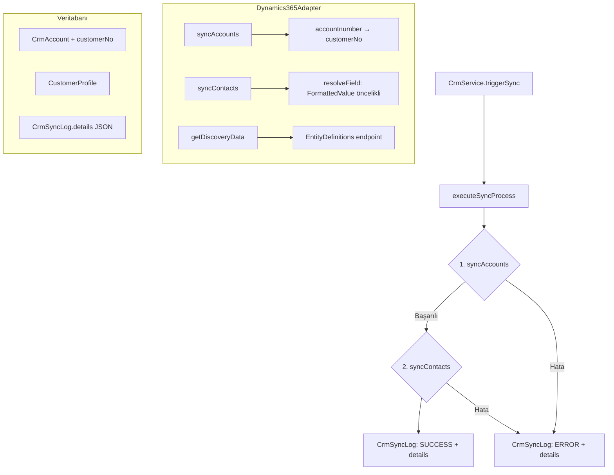

# Tasarım Belgesi: CRM Senkronizasyon İyileştirmeleri

## Genel Bakış

Bu belge, Aluplan Support Desk uygulamasındaki Microsoft Dynamics 365 CRM entegrasyonunda tespit edilen beş kritik sorunu gidermek için yapılacak teknik değişiklikleri tanımlar.

**Etkilenen Katmanlar:**
- Veritabanı: `CrmAccount` tablosuna `customerNo` alanı eklenmesi (Prisma migration)
- Backend: `Dynamics365Adapter` ve `CrmService` bileşenlerinde güncelleme
- Frontend: Senkronizasyon günlüğü tablosuna genişletilebilir hata detayı paneli eklenmesi

**Teknoloji Yığını:**
- Backend: NestJS + Prisma ORM + PostgreSQL
- Frontend: Next.js 15 + React + Tailwind CSS
- CRM: Microsoft Dynamics 365 (OData v9.2 API)
- Test: Jest (unit) + fast-check (property-based)

---

## Mimari

Mevcut mimari korunmakta; yalnızca ilgili bileşenler güncellenmektedir.



**Senkronizasyon Sırası Garantisi:**

`executeSyncProcess` içinde Account senkronizasyonu tamamlanmadan Contact senkronizasyonu başlatılmaz. Account sync hata döndürürse `throw` ile akış kesilir ve Contact sync hiç çalışmaz.

---

## Bileşenler ve Arayüzler

### 1. Prisma Şeması — `CrmAccount`

`customerNo` alanı `CrmAccount` modeline eklenir:

```prisma
model CrmAccount {
  // ... mevcut alanlar
  customerNo  String?  @map("customer_no") @db.VarChar(50)
}

### 2. Dynamics365Adapter — `syncAccounts`

`accountnumber` değeri `customerNo` olarak kaydedilir:

```typescript
await this.prisma.crmAccount.upsert({
  where: { externalAccountId: externalId },
  update: { name, website, address, industry, customerNo: account.accountnumber ?? null, crmVerified: true },
  create: { name, externalAccountId: externalId, website, address, industry, customerNo: account.accountnumber ?? null, crmVerified: true },
});
```

### 3. Dynamics365Adapter — `resolveField` (Option Set Çözümleme)

`resolveField` metodu, FormattedValue anahtarını önce kontrol edecek şekilde güncellenir:

```typescript
private resolveField(data: any, systemKey: string, mappings: Record<string, string>, defaultKey: string): any {
  const crmKey = mappings[systemKey] || defaultKey;
  // FormattedValue önceliği: ham alan adı için @OData annotation'ı kontrol et
  const formattedKey = `${crmKey}@OData.Community.Display.V1.FormattedValue`;
  if (data[formattedKey] !== undefined && data[formattedKey] !== null && data[formattedKey] !== '') {
    return data[formattedKey];
  }
  // Dot notation desteği
  if (crmKey.includes('.')) {
    const parts = crmKey.split('.');
    let val = data;
    for (const part of parts) { val = val?.[part]; }
    return val;
  }
  return data[crmKey];
}
```

### 4. Dynamics365Adapter — `fetchEntityMetadata` (EntityDefinitions Endpoint)

Metadata çekme endpoint'i `EntityDefinitions` kullanacak şekilde güncellenir:

```typescript
private async fetchEntityMetadata(instanceUrl: string, token: string, entityName: string) {
  const url = `${instanceUrl}/api/data/v9.2/EntityDefinitions(LogicalName='${entityName}')/Attributes` +
    `?$select=LogicalName,DisplayName&$filter=IsValidForRead eq true and AttributeType ne 'Virtual'`;
  // ...
}
```

### 5. CrmService — `executeSyncProcess` (Detaylı Hata Loglama)

`details` JSON alanına yapılandırılmış hata kaydı eklenir:

```typescript
interface SyncDetails {
  failedRecords: Array<{ externalId: string; entityType: 'account' | 'contact'; errorMessage: string; errorCode?: string }>;
  skippedRecords: Array<{ externalId: string; reason: string }>;
  skippedLinks: Array<{ contactExternalId: string; missingAccountExternalId: string }>;
  summary: { successCount: number; errorCount: number; skippedCount: number };
}
```

### 6. Frontend — Genişletilebilir Log Satırı

`page.tsx` içindeki senkronizasyon günlüğü tablosuna expandable row eklenir. `SyncLog` arayüzü `details` alanını içerecek şekilde genişletilir:

```typescript
interface SyncLog {
  // ... mevcut alanlar
  details: SyncDetails | null;
}
```

Her log satırında `details.failedRecords` doluysa "Detaylar" butonu gösterilir; tıklandığında alt satırda hata listesi açılır.

---

## Veri Modelleri

### CrmAccount (Güncellenmiş)

| Alan | Tip | Açıklama |
|------|-----|----------|
| `id` | UUID | Birincil anahtar |
| `name` | VARCHAR(255) | Firma adı |
| `customerNo` | VARCHAR(50)? | **YENİ** — Dynamics `accountnumber` (C300XXXXXX) |
| `industry` | VARCHAR(255)? | Sektör (FormattedValue) |
| `website` | VARCHAR(255)? | Web sitesi |
| `address` | TEXT? | Adres |
| `externalAccountId` | VARCHAR(255)? UNIQUE | Dynamics Account GUID |
| `crmVerified` | BOOLEAN | CRM doğrulaması |

### CrmSyncLog.details (JSON Yapısı)

```json
{
  "failedRecords": [
    {
      "externalId": "abc-123",
      "entityType": "contact",
      "errorMessage": "Unique constraint failed on email",
      "errorCode": "P2002"
    }
  ],
  "skippedRecords": [
    {
      "externalId": "def-456",
      "reason": "missing_email"
    }
  ],
  "skippedLinks": [
    {
      "contactExternalId": "ghi-789",
      "missingAccountExternalId": "jkl-012"
    }
  ],
  "summary": {
    "successCount": 42,
    "errorCount": 2,
    "skippedCount": 1
  }
}
```

### Discovery Yanıt Yapısı

```typescript
interface DiscoveryField {
  logicalName: string;   // Dynamics alan adı (örn. "industrycode")
  displayName: string;   // Kullanıcıya gösterilen etiket (örn. "Customer Segment")
  sampleValue: any;      // Örnek değer (null olabilir)
}

interface DiscoveryData {
  account: DiscoveryField[];
  contact: DiscoveryField[];
}
```

---

## Doğruluk Özellikleri

*Bir özellik (property), sistemin tüm geçerli çalışmalarında doğru olması gereken bir karakteristik veya davranıştır — temelde sistemin ne yapması gerektiğine dair biçimsel bir ifadedir. Özellikler, insan tarafından okunabilir spesifikasyonlar ile makine tarafından doğrulanabilir doğruluk garantileri arasındaki köprüyü oluşturur.*

### Özellik 1: Account senkronizasyonu customerNo'yu doğru kaydeder

*Herhangi bir* Dynamics Account kaydı için, `accountnumber` değeri ne olursa olsun, senkronizasyon sonrası `CrmAccount.customerNo` alanı bu değeri içermelidir. Aynı Account ikinci kez senkronize edildiğinde (farklı `accountnumber` ile), `customerNo` güncel değeri yansıtmalıdır.

**Doğrular: Gereksinim 1.2, 1.5**

### Özellik 2: Contact, customerNo'yu bağlı Account'tan miras alır

*Herhangi bir* Contact kaydı için, ilgili Account veritabanında mevcutsa, senkronizasyon sonrası `CustomerProfile.customerNo` değeri `CrmAccount.customerNo` ile eşleşmelidir.

**Doğrular: Gereksinim 1.3**

### Özellik 3: FormattedValue öncelik kuralı

*Herhangi bir* CRM veri nesnesi ve alan adı için, `{fieldName}@OData.Community.Display.V1.FormattedValue` anahtarı mevcut ve boş değilse `resolveField` bu değeri döndürmelidir; aksi hâlde ham `{fieldName}` değerini döndürmelidir.

**Doğrular: Gereksinim 3.1, 3.2, 3.3**

### Özellik 4: Discovery alanları gerekli yapıyı içerir

*Herhangi bir* Discovery yanıtındaki her alan nesnesi için, `logicalName` ve `displayName` alanları mevcut ve boş olmayan string değerler içermelidir. `DisplayName.UserLocalizedLabel.Label` boşsa `displayName`, `logicalName` değerine eşit olmalıdır.

**Doğrular: Gereksinim 2.2, 2.4**

### Özellik 5: Hata log yapısı eksiksizdir

*Herhangi bir* senkronizasyon işlemi için, başarısız olan her kayıt `CrmSyncLog.details.failedRecords` listesinde `externalId`, `entityType` ve `errorMessage` alanlarıyla yer almalıdır. Özet sayılar (`summary.errorCount`) bu listenin uzunluğuyla eşleşmelidir.

**Doğrular: Gereksinim 4.1, 4.2, 4.4**

### Özellik 6: Senkronizasyon sırası garantisi

*Herhangi bir* senkronizasyon çalışması için, Contact senkronizasyonu yalnızca Account senkronizasyonu başarıyla tamamlandıktan sonra başlamalıdır. Account sync hata döndürürse Contact sync hiç çağrılmamalıdır.

**Doğrular: Gereksinim 5.1, 5.2, 5.5**

### Özellik 7: Detaylar butonu koşullu gösterim

*Herhangi bir* log kaydı için, `details.failedRecords` listesi en az bir eleman içeriyorsa frontend "Detaylar" butonunu göstermelidir; liste boşsa veya `details` null ise buton gösterilmemelidir.

**Doğrular: Gereksinim 4.6**

---

## Hata Yönetimi

### Backend Hata Stratejisi

| Senaryo | Davranış |
|---------|----------|
| Account kaydı DB'ye yazılamazsa | `errorCount++`, `details.failedRecords`'a ekle, diğer kayıtlara devam et |
| Contact e-posta eksikse | `details.skippedRecords`'a ekle, atla |
| Contact'ın Account'u bulunamazsa | `accountId = null` ile kaydet, `details.skippedLinks`'e ekle |
| Account sync tamamen başarısızsa | `throw` ile akışı kes, Contact sync başlatma |
| Dynamics API token hatası | `SyncStatus.ERROR`, `errorMessage`'a detay yaz |

### Frontend Hata Gösterimi

- `errorCount > 0` olan log satırlarında kırmızı badge gösterilir
- `details.failedRecords` doluysa "Detaylar" butonu aktif olur
- Expandable panel açıldığında tablo formatında `externalId`, `entityType`, `errorMessage` gösterilir

---

## Test Stratejisi

### Birim Testleri (Jest)

Belirli örnekler ve edge case'ler için:

- `resolveField`: FormattedValue mevcut/eksik/boş senaryoları
- `fetchEntityMetadata`: `EntityDefinitions` endpoint URL'inin doğru oluşturulması (mock axios)
- `executeSyncProcess`: Account hata verdiğinde Contact sync'in çağrılmadığı (mock adapter)
- `mapSampleToFields`: `DisplayName` eksik alanda `logicalName` fallback'i
- Frontend `<SyncLogRow>`: `failedRecords` boşken buton gizli, doluyken görünür

### Property-Based Testler (fast-check)

Her property testi minimum 100 iterasyon çalıştırılmalıdır. Test etiketi formatı:
`// Feature: crm-sync-improvements, Property {N}: {property_text}`

**Özellik 1 — Account customerNo round-trip:**
```typescript
// Feature: crm-sync-improvements, Property 1: Account sync saves customerNo correctly
fc.assert(fc.property(
  fc.record({ accountid: fc.uuid(), name: fc.string(), accountnumber: fc.option(fc.string({ maxLength: 50 })) }),
  async (account) => {
    await adapter.syncAccounts({ ...config, value: [account] });
    const saved = await prisma.crmAccount.findUnique({ where: { externalAccountId: account.accountid } });
    return saved?.customerNo === (account.accountnumber ?? null);
  }
), { numRuns: 100 });
```

**Özellik 3 — FormattedValue önceliği:**
```typescript
// Feature: crm-sync-improvements, Property 3: FormattedValue takes priority over raw value
fc.assert(fc.property(
  fc.string(), fc.string(), fc.string(),
  (fieldName, rawValue, formattedValue) => {
    const data = { [fieldName]: rawValue, [`${fieldName}@OData.Community.Display.V1.FormattedValue`]: formattedValue };
    const result = adapter['resolveField'](data, 'key', {}, fieldName);
    return result === formattedValue;
  }
), { numRuns: 100 });
```

**Özellik 4 — Discovery alan yapısı:**
```typescript
// Feature: crm-sync-improvements, Property 4: Discovery fields have required structure
fc.assert(fc.property(
  fc.array(fc.record({ LogicalName: fc.string(), DisplayName: fc.option(fc.record({ UserLocalizedLabel: fc.record({ Label: fc.string() }) })) })),
  (fields) => {
    const result = mapSampleToFields(fields, null);
    return result.every(f => typeof f.logicalName === 'string' && typeof f.displayName === 'string' && f.displayName.length > 0);
  }
), { numRuns: 100 });
```

**Özellik 5 — Hata log yapısı:**
```typescript
// Feature: crm-sync-improvements, Property 5: Error log structure is complete
fc.assert(fc.property(
  fc.array(fc.record({ externalId: fc.uuid(), entityType: fc.constantFrom('account', 'contact'), errorMessage: fc.string() })),
  (failedRecords) => {
    const details = buildSyncDetails({ failedRecords, skippedRecords: [], skippedLinks: [] });
    return details.summary.errorCount === failedRecords.length &&
      details.failedRecords.every(r => r.externalId && r.entityType && r.errorMessage);
  }
), { numRuns: 100 });
```

**Özellik 6 — Senkronizasyon sırası:**
```typescript
// Feature: crm-sync-improvements, Property 6: Contact sync never starts if Account sync fails
fc.assert(fc.property(
  fc.string(),
  async (errorMessage) => {
    const mockAdapter = { syncAccounts: jest.fn().mockResolvedValue({ status: 'ERROR', errorMessage }), syncContacts: jest.fn() };
    await executeSyncProcess(connection, mockAdapter, logId);
    expect(mockAdapter.syncContacts).not.toHaveBeenCalled();
    return true;
  }
), { numRuns: 100 });
```

**Özellik 7 — Detaylar butonu koşullu gösterim:**
```typescript
// Feature: crm-sync-improvements, Property 7: Details button shown only when failedRecords non-empty
fc.assert(fc.property(
  fc.array(fc.record({ externalId: fc.uuid(), entityType: fc.string(), errorMessage: fc.string() })),
  (failedRecords) => {
    const { container } = render(<SyncLogRow log={{ ...baseLog, details: { failedRecords } }} />);
    const button = container.querySelector('[data-testid="details-button"]');
    return failedRecords.length > 0 ? button !== null : button === null;
  }
), { numRuns: 100 });
```
