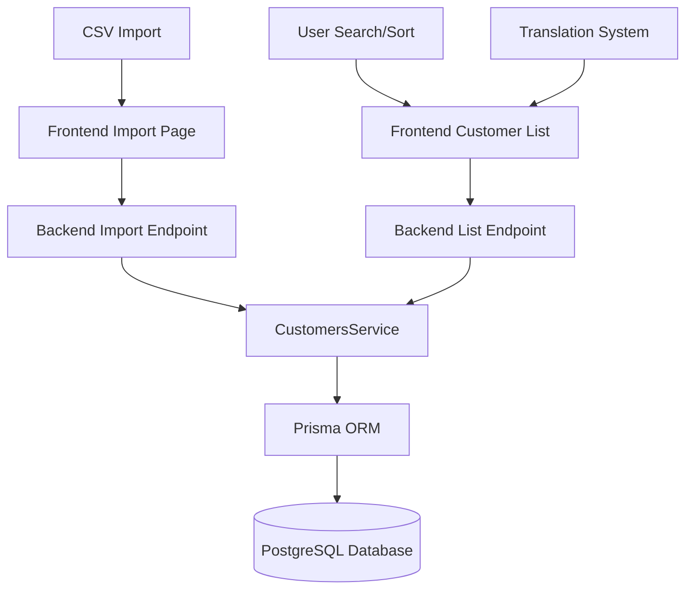

# Design Document: Customer List Missing Columns

## Overview

This design implements the addition of the `subscriptionModel` field to the customer management system and ensures both `contractStatus` and `subscriptionModel` columns are properly displayed in the frontend customer list. The implementation follows a full-stack approach:

1. Database schema update via Prisma migration
2. Backend DTO and service layer updates
3. Frontend TypeScript interface updates
4. UI table column additions with sorting and search
5. CSV import processing for both fields
6. Multi-language support (TR/EN)

The design maintains backward compatibility and follows existing patterns in the codebase for consistency.

## Architecture

### System Components



### Data Flow

1. **CSV Import Flow**:
   - User uploads CSV with `subscriptionModel` column
   - Frontend parses CSV and maps `subscriptionModel` field
   - Backend validates and saves to database via Prisma
   - Success/error feedback to user

2. **Display Flow**:
   - Frontend requests customer list from backend
   - Backend queries database including `subscriptionModel` field
   - Frontend renders table with both columns
   - User can sort/search by either field

3. **Translation Flow**:
   - Frontend uses `next-intl` for i18n
   - Column headers resolved from translation keys
   - Supports TR and EN locales

## Components and Interfaces

### Database Layer

**Prisma Schema Update** (`packages/database/prisma/schema.prisma`):

```prisma
model CustomerProfile {
  // ... existing fields ...
  contractStatus    String?           @map("contract_status") @db.VarChar(100)
  subscriptionModel String?           @map("subscription_model") @db.VarChar(100)
  // ... rest of fields ...
}
```

**Migration**:
- Migration file: `packages/database/prisma/migrations/YYYYMMDDHHMMSS_add_subscription_model/migration.sql`
- SQL: `ALTER TABLE "customer_profiles" ADD COLUMN "subscription_model" VARCHAR(100);`
- Non-destructive, allows NULL values

### Backend Layer

**Import DTO Update** (`apps/backend/src/customers/dto/import-customers.dto.ts`):

```typescript
export class ImportCustomerRecordDto {
  // ... existing fields ...
  
  @IsString()
  @IsOptional()
  contractStatus?: string;

  @IsString()
  @IsOptional()
  subscriptionModel?: string;  // NEW FIELD
  
  // ... rest of fields ...
}
```

**Update DTO Addition** (`apps/backend/src/customers/dto/update-customer-profile.dto.ts`):

```typescript
export class UpdateCustomerProfileDto {
  // ... existing fields ...
  
  @IsString()
  @IsOptional()
  contractStatus?: string;

  @IsString()
  @IsOptional()
  subscriptionModel?: string;  // NEW FIELD
  
  // ... rest of fields ...
}
```

**Service Layer Updates** (`apps/backend/src/customers/customers.service.ts`):

1. **importCustomers method**: Add `subscriptionModel` to both create and update operations
2. **updateCustomer method**: Add `subscriptionModel` to update configuration
3. **getAllCustomers method**: Already returns full customerProfile, no changes needed

### Frontend Layer

**TypeScript Interface Update** (`apps/frontend/src/app/[locale]/(dashboard)/customers/page.tsx`):

```typescript
interface CustomerItem {
  id: string;
  email: string;
  fullName: string;
  status: string;
  createdAt: string;
  customerProfile?: {
    customerNo: string;
    companyName: string;
    firstName: string;
    lastName: string;
    middleName?: string;
    jobTitle?: string;
    contractStatus?: string;
    subscriptionModel?: string;  // NEW FIELD
    industry?: string;
    phoneNumber: string | null;
    crmVerified: boolean;
    accountId?: string;
    account?: {
      id: string;
      name: string;
    };
  };
}

type SortField = 'companyName' | 'fullName' | 'jobTitle' | 'email' | 'status' 
  | 'createdAt' | 'contractStatus' | 'subscriptionModel'  // NEW FIELD
  | 'industry' | 'customerNo' | 'phoneNumber' | 'crmVerified';
```

**Table Column Additions**:

Two new sortable columns will be added to the customer list table:
- Position: After `phoneNumber` column, before `industry` column
- Both columns use the existing `SortableHeader` component
- Display "-" for null/empty values

**Search Filter Update**:

The `filteredAndSortedCustomers` useMemo hook will be updated to include both fields in search:

```typescript
result = result.filter(c =>
  c.fullName.toLowerCase().includes(lowerTerm) ||
  c.email.toLowerCase().includes(lowerTerm) ||
  (c.customerProfile?.companyName || '').toLowerCase().includes(lowerTerm) ||
  (c.customerProfile?.customerNo || '').toLowerCase().includes(lowerTerm) ||
  (c.customerProfile?.contractStatus || '').toLowerCase().includes(lowerTerm) ||  // EXISTING
  (c.customerProfile?.subscriptionModel || '').toLowerCase().includes(lowerTerm)  // NEW
);
```

**Sort Logic Update**:

Add cases to the sort switch statement:

```typescript
case 'contractStatus':
  aValue = a.customerProfile?.contractStatus || '';
  bValue = b.customerProfile?.contractStatus || '';
  break;
case 'subscriptionModel':  // NEW
  aValue = a.customerProfile?.subscriptionModel || '';
  bValue = b.customerProfile?.subscriptionModel || '';
  break;
```

**CSV Import Update** (`apps/frontend/src/app/[locale]/(dashboard)/customers/import/page.tsx`):

Add `subscriptionModel` mapping in the CSV parser:

```typescript
const mappedData = results.data.map((row: any) => ({
  // ... existing mappings ...
  contractStatus: row['Müşteri Durumu']?.trim() || undefined,
  subscriptionModel: row['Abonelik Modeli']?.trim() || undefined,  // NEW
  // ... rest of mappings ...
}));
```

### Translation Layer

**Translation Keys** (to be added to translation files):

Turkish (`messages/tr.json`):
```json
{
  "customers": {
    "table": {
      "headers": {
        "contractStatus": "Sözleşme Durumu",
        "subscriptionModel": "Abonelik Modeli"
      }
    }
  }
}
```

English (`messages/en.json`):
```json
{
  "customers": {
    "table": {
      "headers": {
        "contractStatus": "Contract Status",
        "subscriptionModel": "Subscription Model"
      }
    }
  }
}
```

## Data Models

### CustomerProfile Model

```typescript
interface CustomerProfile {
  id: string;
  userId: string;
  firstName: string;
  lastName: string;
  middleName?: string;
  customerNo: string;
  companyName: string;
  accountId?: string;
  industry?: string;
  jobTitle?: string;
  phoneNumber?: string;
  contractStatus?: string;        // EXISTING - displayed in UI
  subscriptionModel?: string;     // NEW - to be displayed in UI
  externalContactId?: string;
  crmVerified: boolean;
  hotinfoData?: any;
  hotinfoRaw?: string;
  hotinfoUpdatedAt?: Date;
  tags: string[];
  createdAt: Date;
  updatedAt: Date;
}
```

### CSV Import Schema

Expected CSV columns (case-sensitive):
- `(Do Not Modify) Contact` → externalContactId
- `Company Name` → companyName
- `Müşteri Durumu` → contractStatus (EXISTING)
- `Abonelik Modeli` → subscriptionModel (NEW)
- `Full Name` or ` Full Name` → fullName
- `First Name` → firstName
- `Middle Name` → middleName
- `Last Name` → lastName
- `Job Title` → jobTitle
- `Email` → email
- `Mobile Phone` → phone
- `Status` → status

## Correctness Properties

*A property is a characteristic or behavior that should hold true across all valid executions of a system-essentially, a formal statement about what the system should do. Properties serve as the bridge between human-readable specifications and machine-verifiable correctness guarantees.*


### Property Reflection

After analyzing all acceptance criteria, I've identified the following redundancies and consolidations:

**Redundancies Identified:**

1. **Properties 4.1-4.4 (Sort toggle behavior)**: The four properties about clicking headers and toggling can be consolidated into two comprehensive properties - one for each field - that cover both initial sort and toggle behavior.

2. **Properties 3.1 and 3.2 (Column display)**: These can be combined into a single property that both columns are displayed.

3. **Properties 3.3 and 3.4 (Null display)**: These can be combined into a single property about null value display for both fields.

4. **Properties 7.1 and 7.2 (API response structure)**: These are essentially the same property - the field should be included in responses. Can be consolidated.

5. **Properties 2.2 and 2.5 (CSV import save)**: Both test that values from CSV are saved. The distinction between create and update is implementation detail; the property is the same - CSV values should persist.

6. **Properties 5.1, 5.2, and 5.3 (Search filtering)**: These three can be consolidated into one property that search filters by both fields with OR logic.

**Consolidated Properties:**

After consolidation, we have:
- Database schema properties (1.3, 1.4)
- CSV import properties (2.1, 2.2/2.5 combined, 2.3, 2.4)
- UI display properties (3.1/3.2 combined, 3.3/3.4 combined)
- Sort properties (4.1-4.4 consolidated to 2 properties, 4.5)
- Search properties (5.1-5.3 consolidated, 5.4)
- API properties (7.1/7.2 consolidated, 7.3, 7.4)
- Example tests for specific cases (1.1, 1.2, 6.1-6.4)

### Property 1: Migration Data Integrity

*For any* existing customer data in the database, when the migration adding `subscriptionModel` is applied, all existing customer records should remain intact with no data loss in any field.

**Validates: Requirements 1.3**

### Property 2: API Response Field Inclusion

*For any* customer profile query (list or single), the API response should include the `subscriptionModel` field in the customer profile object, even when the value is null.

**Validates: Requirements 1.4, 7.1, 7.2, 7.3**

### Property 3: CSV Parsing Completeness

*For any* CSV file containing a `subscriptionModel` column (or "Abonelik Modeli"), the import parser should extract the value from each row and include it in the mapped data structure.

**Validates: Requirements 2.1**

### Property 4: CSV Import Round-Trip

*For any* customer imported from CSV with a `subscriptionModel` value, querying that customer's profile after import should return the same `subscriptionModel` value.

**Validates: Requirements 2.2, 2.5, 7.4**

### Property 5: Empty Value Normalization

*For any* CSV row where the `subscriptionModel` field is empty or contains only whitespace, the system should store the value as null in the database.

**Validates: Requirements 2.3**

### Property 6: Update Preservation

*For any* existing customer profile updated via CSV import with a new `subscriptionModel` value, the updated profile should contain the new value while preserving all other existing field values.

**Validates: Requirements 2.4**

### Property 7: Column Visibility

*For any* customer list view, the rendered table should include both `contractStatus` and `subscriptionModel` as visible columns with appropriate headers.

**Validates: Requirements 3.1, 3.2**

### Property 8: Null Value Display

*For any* customer in the list where `contractStatus` or `subscriptionModel` is null or empty, the UI should display a dash ("-") or equivalent empty indicator in that column.

**Validates: Requirements 3.3, 3.4**

### Property 9: Sort Functionality

*For any* customer list, clicking the `contractStatus` or `subscriptionModel` column header should sort the list by that field in ascending order, and clicking again should toggle to descending order.

**Validates: Requirements 4.1, 4.2, 4.3, 4.4**

### Property 10: Null Sort Consistency

*For any* customer list containing records with null values in `contractStatus` or `subscriptionModel`, when sorted by that field, all null values should appear consistently in the same position (either all at the beginning or all at the end) regardless of sort direction.

**Validates: Requirements 4.5**

### Property 11: Search Filter Inclusivity

*For any* search term entered, the filtered customer list should include all customers where either `contractStatus` or `subscriptionModel` contains the search term (case-insensitive).

**Validates: Requirements 5.1, 5.2, 5.3**

### Property 12: Search Reset

*For any* customer list with an active search filter, when the search term is cleared, the system should display all customers again (equivalent to the unfiltered state).

**Validates: Requirements 5.4**

## Error Handling

### Database Layer

**Migration Errors**:
- If migration fails, Prisma will rollback automatically
- Error logged with full stack trace
- User notified to check database connection and permissions

**Constraint Violations**:
- `subscriptionModel` is optional (nullable), so no constraint violations expected
- If database rejects the column type, migration will fail with clear error message

### Backend Layer

**CSV Import Errors**:
- Invalid CSV format: Return 400 Bad Request with error details
- Missing required fields: Skip row and log in error count
- Database write failure: Rollback transaction, return 500 with error message
- Partial success: Return success count, error count, and error details array

**Validation Errors**:
- `subscriptionModel` accepts any string up to 100 characters
- No specific validation rules (free-text field)
- If exceeds length, truncate with warning log

**API Errors**:
- Customer not found: Return 404 Not Found
- Database connection failure: Return 503 Service Unavailable
- Unexpected errors: Log full error, return 500 with generic message

### Frontend Layer

**Display Errors**:
- Missing `subscriptionModel` in API response: Display "-" (graceful degradation)
- Null/undefined values: Display "-" consistently
- Translation key missing: Fall back to English or field name

**Sort/Search Errors**:
- Invalid sort field: Ignore and maintain current sort
- Search with special characters: Escape and search normally
- Empty result set: Display "No customers found" message

**CSV Import Errors**:
- File read error: Display error toast with file permission message
- Parse error: Display error toast with CSV format guidance
- Network error: Display error toast with retry option
- Partial import: Display summary with success/error counts

## Testing Strategy

### Unit Tests

**Backend Unit Tests** (NestJS + Jest):

1. **DTO Validation Tests**:
   - Test `ImportCustomerRecordDto` accepts `subscriptionModel`
   - Test `UpdateCustomerProfileDto` accepts `subscriptionModel`
   - Test validation passes for valid strings
   - Test validation passes for null/undefined

2. **Service Layer Tests**:
   - Test `importCustomers` saves `subscriptionModel` on create
   - Test `importCustomers` updates `subscriptionModel` on update
   - Test `updateCustomer` updates `subscriptionModel`
   - Test `getAllCustomers` includes `subscriptionModel` in response
   - Test empty string is converted to null

3. **Edge Case Tests**:
   - Test very long `subscriptionModel` values (100+ chars)
   - Test special characters in `subscriptionModel`
   - Test Unicode characters (Turkish: ğ, ü, ş, ı, ö, ç)

**Frontend Unit Tests** (React Testing Library + Jest):

1. **Component Rendering Tests**:
   - Test customer list renders `contractStatus` column
   - Test customer list renders `subscriptionModel` column
   - Test null values display as "-"
   - Test populated values display correctly

2. **Sort Tests**:
   - Test clicking `contractStatus` header sorts ascending
   - Test clicking again toggles to descending
   - Test clicking `subscriptionModel` header sorts ascending
   - Test clicking again toggles to descending
   - Test null values sort consistently

3. **Search Tests**:
   - Test search filters by `contractStatus`
   - Test search filters by `subscriptionModel`
   - Test search is case-insensitive
   - Test clearing search shows all customers

4. **CSV Import Tests**:
   - Test CSV parser extracts `subscriptionModel`
   - Test empty values are handled
   - Test mapping to API format includes field

5. **Translation Tests**:
   - Test Turkish locale shows "Sözleşme Durumu"
   - Test Turkish locale shows "Abonelik Modeli"
   - Test English locale shows "Contract Status"
   - Test English locale shows "Subscription Model"

### Property-Based Tests

Property-based tests will use **fast-check** library for TypeScript/JavaScript. Each test will run a minimum of 100 iterations with randomized inputs.

**Property Test 1: Migration Data Integrity**
```typescript
// Feature: customer-list-missing-columns, Property 1: For any existing customer data, migration preserves all fields
fc.assert(
  fc.property(
    fc.array(customerProfileArbitrary),
    async (existingCustomers) => {
      // Setup: Insert existing customers
      await insertCustomers(existingCustomers);
      
      // Action: Run migration
      await runMigration('add_subscription_model');
      
      // Assert: All customers still exist with same data
      const afterMigration = await getAllCustomers();
      expect(afterMigration).toHaveLength(existingCustomers.length);
      
      existingCustomers.forEach((original, idx) => {
        expect(afterMigration[idx]).toMatchObject(original);
      });
    }
  ),
  { numRuns: 100 }
);
```

**Property Test 2: API Response Field Inclusion**
```typescript
// Feature: customer-list-missing-columns, Property 2: For any customer query, subscriptionModel field is included
fc.assert(
  fc.property(
    fc.array(customerProfileArbitrary),
    async (customers) => {
      await insertCustomers(customers);
      
      // Test list endpoint
      const listResponse = await api.customers.list();
      listResponse.forEach(customer => {
        expect(customer.customerProfile).toHaveProperty('subscriptionModel');
      });
      
      // Test single customer endpoint
      for (const customer of customers) {
        const singleResponse = await api.customers.getById(customer.id);
        expect(singleResponse.customerProfile).toHaveProperty('subscriptionModel');
      }
    }
  ),
  { numRuns: 100 }
);
```

**Property Test 3: CSV Import Round-Trip**
```typescript
// Feature: customer-list-missing-columns, Property 4: For any CSV import with subscriptionModel, value persists
fc.assert(
  fc.property(
    fc.array(csvRowArbitrary),
    async (csvRows) => {
      // Generate CSV content
      const csvContent = generateCSV(csvRows);
      
      // Import
      await api.customers.import(csvContent);
      
      // Verify each row
      for (const row of csvRows) {
        const customer = await findCustomerByEmail(row.email);
        expect(customer.customerProfile.subscriptionModel).toBe(row.subscriptionModel);
      }
    }
  ),
  { numRuns: 100 }
);
```

**Property Test 4: Empty Value Normalization**
```typescript
// Feature: customer-list-missing-columns, Property 5: For any empty subscriptionModel, stored as null
fc.assert(
  fc.property(
    fc.array(csvRowWithEmptySubscriptionArbitrary),
    async (csvRows) => {
      const csvContent = generateCSV(csvRows);
      await api.customers.import(csvContent);
      
      for (const row of csvRows) {
        const customer = await findCustomerByEmail(row.email);
        expect(customer.customerProfile.subscriptionModel).toBeNull();
      }
    }
  ),
  { numRuns: 100 }
);
```

**Property Test 5: Sort Functionality**
```typescript
// Feature: customer-list-missing-columns, Property 9: For any customer list, sorting works correctly
fc.assert(
  fc.property(
    fc.array(customerProfileArbitrary),
    async (customers) => {
      render(<CustomersPage initialCustomers={customers} />);
      
      // Test contractStatus sort
      const contractHeader = screen.getByText('Contract Status');
      fireEvent.click(contractHeader);
      
      const sortedAsc = screen.getAllByRole('row').slice(1); // Skip header
      expect(sortedAsc).toBeSorted((a, b) => 
        (a.contractStatus || '').localeCompare(b.contractStatus || '')
      );
      
      // Click again for descending
      fireEvent.click(contractHeader);
      const sortedDesc = screen.getAllByRole('row').slice(1);
      expect(sortedDesc).toBeSorted((a, b) => 
        (b.contractStatus || '').localeCompare(a.contractStatus || '')
      );
      
      // Repeat for subscriptionModel
      const subscriptionHeader = screen.getByText('Subscription Model');
      fireEvent.click(subscriptionHeader);
      // ... similar assertions
    }
  ),
  { numRuns: 100 }
);
```

**Property Test 6: Search Filter Inclusivity**
```typescript
// Feature: customer-list-missing-columns, Property 11: For any search term, filters by both fields
fc.assert(
  fc.property(
    fc.array(customerProfileArbitrary),
    fc.string(),
    async (customers, searchTerm) => {
      render(<CustomersPage initialCustomers={customers} />);
      
      const searchInput = screen.getByPlaceholderText('Search...');
      fireEvent.change(searchInput, { target: { value: searchTerm } });
      
      const visibleRows = screen.getAllByRole('row').slice(1);
      
      // All visible customers should match search term in either field
      visibleRows.forEach(row => {
        const customer = customers.find(c => row.textContent.includes(c.email));
        const matchesContract = customer.contractStatus?.toLowerCase().includes(searchTerm.toLowerCase());
        const matchesSubscription = customer.subscriptionModel?.toLowerCase().includes(searchTerm.toLowerCase());
        expect(matchesContract || matchesSubscription).toBe(true);
      });
    }
  ),
  { numRuns: 100 }
);
```

**Property Test 7: Null Sort Consistency**
```typescript
// Feature: customer-list-missing-columns, Property 10: For any list with nulls, they sort consistently
fc.assert(
  fc.property(
    fc.array(customerProfileWithNullsArbitrary),
    async (customers) => {
      render(<CustomersPage initialCustomers={customers} />);
      
      const header = screen.getByText('Subscription Model');
      fireEvent.click(header);
      
      const sortedAsc = getVisibleCustomers();
      const nullPositionsAsc = sortedAsc
        .map((c, idx) => c.subscriptionModel === null ? idx : -1)
        .filter(idx => idx !== -1);
      
      // Click again for descending
      fireEvent.click(header);
      const sortedDesc = getVisibleCustomers();
      const nullPositionsDesc = sortedDesc
        .map((c, idx) => c.subscriptionModel === null ? idx : -1)
        .filter(idx => idx !== -1);
      
      // Nulls should be consistently at start or end
      const nullsAtStart = nullPositionsAsc.every(pos => pos < customers.length / 2);
      const nullsAtEnd = nullPositionsAsc.every(pos => pos >= customers.length / 2);
      expect(nullsAtStart || nullsAtEnd).toBe(true);
      
      // Same consistency in descending
      const nullsAtStartDesc = nullPositionsDesc.every(pos => pos < customers.length / 2);
      const nullsAtEndDesc = nullPositionsDesc.every(pos => pos >= customers.length / 2);
      expect(nullsAtStartDesc || nullsAtEndDesc).toBe(true);
    }
  ),
  { numRuns: 100 }
);
```

### Integration Tests

**End-to-End CSV Import Flow**:
1. Create test CSV with `subscriptionModel` values
2. Upload via frontend import page
3. Verify success message
4. Navigate to customer list
5. Verify columns are visible
6. Verify data is displayed correctly
7. Test sorting by both fields
8. Test searching by both fields

**Database Migration Test**:
1. Seed database with test customers
2. Run migration script
3. Verify column exists in schema
4. Verify all data is intact
5. Verify new field is queryable

**API Integration Test**:
1. Create customer via API with `subscriptionModel`
2. Query customer list, verify field is present
3. Query single customer, verify field is present
4. Update customer with new `subscriptionModel`
5. Verify update persisted

### Manual Testing Checklist

- [ ] Run Prisma migration successfully
- [ ] Verify column exists in PostgreSQL
- [ ] Import CSV with both fields populated
- [ ] Import CSV with empty `subscriptionModel`
- [ ] Verify both columns appear in customer list
- [ ] Sort by `contractStatus` ascending/descending
- [ ] Sort by `subscriptionModel` ascending/descending
- [ ] Search for value in `contractStatus`
- [ ] Search for value in `subscriptionModel`
- [ ] Verify null values display as "-"
- [ ] Switch to Turkish locale, verify translations
- [ ] Switch to English locale, verify translations
- [ ] Update customer via API with `subscriptionModel`
- [ ] Verify responsive design on mobile

## Implementation Notes

### Migration Execution

```bash
# Generate migration
cd packages/database
npx prisma migrate dev --name add_subscription_model

# Apply to production
npx prisma migrate deploy
```

### Translation File Locations

- Turkish: `apps/frontend/messages/tr.json`
- English: `apps/frontend/messages/en.json`

### Column Order in Table

Recommended order (left to right):
1. Checkbox
2. Customer No
3. Full Name
4. Email
5. Company
6. Job Title
7. Phone Number
8. **Contract Status** (NEW POSITION)
9. **Subscription Model** (NEW POSITION)
10. Industry
11. Status
12. Created At
13. Actions

### Styling Consistency

Both new columns should use:
- Font: Same as other text columns (not monospace)
- Color: `text-white/60` for populated values
- Empty indicator: "-" in `text-white/40 italic text-xs`
- Padding: Consistent with other columns
- Header: Uppercase, bold, small font size

### CSV Column Name Variations

The import should accept both:
- English: "Subscription Model"
- Turkish: "Abonelik Modeli"

Map both to the same field in the parser.

## Deployment Considerations

### Database Migration

- Run migration during low-traffic period
- Migration is non-destructive (adds nullable column)
- No downtime required
- Rollback plan: Drop column if needed

### Backend Deployment

- Deploy backend changes first
- Backward compatible (field is optional)
- No breaking changes to existing API consumers

### Frontend Deployment

- Deploy frontend after backend is live
- Clear browser cache if translations don't appear
- Monitor for console errors related to missing fields

### Rollback Plan

If issues arise:
1. Revert frontend deployment (removes columns from UI)
2. Revert backend deployment (removes field from API)
3. Optionally drop database column (not required if keeping data)

## Performance Considerations

- Adding nullable column has minimal performance impact
- Sorting by new fields uses existing index on `customer_profiles` table
- Search filtering is client-side (no additional database queries)
- CSV import performance unchanged (one additional field per row)

## Security Considerations

- `subscriptionModel` is free-text, no injection risk (stored as string)
- No sensitive data in this field
- Same access control as other customer profile fields
- CSV import already has authentication/authorization checks
