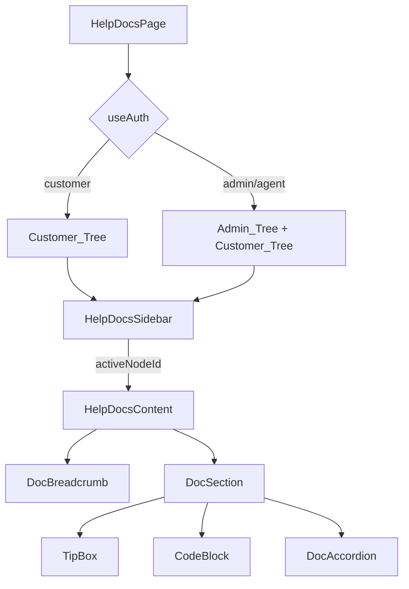

# Tasarım Belgesi: Help Docs Redesign


## Genel Bakış

Bu tasarım belgesi, Aluplan Destek platformunun `/help` sayfasını Dify docs (https://docs.dify.ai) benzeri modern bir dokümantasyon sistemine dönüştürme planını açıklar.

### Mevcut Durum

Mevcut `help/page.tsx` dosyası:
- Tek bir `Tabs` bileşeni ile müşteri / admin içeriğini ayırıyor
- 4 bölümden oluşan düz bir liste yapısı kullanıyor
- `admin_guide.guide.*` şeklinde hatalı i18n key nesting içeriyor (`guide` fazladan)
- `card2_item22`, `item2_desc3`, `card2_desc4` gibi typo'lar barındırıyor
- Tüm içerik tek dosyada, lazy loading yok
- Mobil uyumlu sidebar navigasyonu yok

### Hedef Durum

- Sol sidebar: sabit, scroll edilebilir, kategoriler + alt başlıklar
- Sağ content panel: seçili doc node'un içeriği
- Breadcrumb: üst navigasyon izi
- Rol bazlı ağaç: customer vs admin/agent
- Mobil: sidebar toggle (hamburger)
- Tip_Box: 3 varyant (tip/warning/info)
- Code_Block: inline ve block
- Accordion: uzun içerikler için
- Düzeltilmiş ve genişletilmiş i18n key yapısı


## Mimari

### Genel Sayfa Yapısı

```
/help
├── HelpDocsPage (page.tsx)          ← Server Component wrapper
│   ├── HelpDocsSidebar              ← Sol panel (sabit, scroll edilebilir)
│   │   ├── SidebarCategory          ← Kategori başlığı (tıklanabilir)
│   │   └── SidebarItem              ← Alt başlık (Doc_Node)
│   ├── HelpDocsContent              ← Sağ panel
│   │   ├── DocBreadcrumb            ← Üst navigasyon izi
│   │   ├── DocSection               ← Seçili içerik alanı
│   │   │   ├── TipBox               ← İpucu/uyarı/bilgi kutusu
│   │   │   ├── CodeBlock            ← Teknik kod/yol gösterimi
│   │   │   └── DocAccordion         ← Uzun içerik bölümleri
│   │   └── MobileSidebarToggle      ← Hamburger butonu (mobil)
│   └── HelpDocsMobileOverlay        ← Mobil sidebar overlay
```

### Durum Yönetimi

Sayfa tamamen client-side state ile yönetilir. Server component wrapper sadece locale ve auth bilgisini iletir.

```typescript
// State yapısı
interface HelpDocsState {
  activeNodeId: string;           // Seçili Doc_Node ID'si
  sidebarOpen: boolean;           // Mobil sidebar durumu
  expandedCategories: string[];   // Açık kategori listesi
}
```

### Veri Akışı

```
useAuth() → rol belirleme → ağaç seçimi (Customer/Admin)
     ↓
DOC_TREE sabiti → SidebarCategory/SidebarItem render
     ↓
activeNodeId state → Content_Panel içerik seçimi
     ↓
useTranslations('help') → i18n key çözümleme
```

### Mimari Diyagram




## Bileşenler ve Arayüzler

### 1. HelpDocsPage (`page.tsx`)

Ana sayfa bileşeni. `'use client'` direktifi ile çalışır.

```typescript
// apps/frontend/src/app/[locale]/(dashboard)/help/page.tsx
'use client';

export default function HelpDocsPage() {
  const { user } = useAuth();
  const t = useTranslations('help');
  const [activeNodeId, setActiveNodeId] = useState<string>('');
  const [sidebarOpen, setSidebarOpen] = useState(false);

  const isStaff = isAdminOrAgent(user);
  const tree = buildDocTree(isStaff, t);

  // İlk yüklemede varsayılan node seçimi
  useEffect(() => {
    const defaultNode = isStaff
      ? 'admin.tickets.overview'
      : 'customer.getting_started.dashboard';
    setActiveNodeId(defaultNode);
  }, [isStaff]);

  return (
    <div className="flex h-full">
      <HelpDocsSidebar
        tree={tree}
        activeNodeId={activeNodeId}
        onNodeSelect={setActiveNodeId}
        isOpen={sidebarOpen}
        onToggle={() => setSidebarOpen(!sidebarOpen)}
      />
      <HelpDocsContent
        tree={tree}
        activeNodeId={activeNodeId}
        onMobileMenuToggle={() => setSidebarOpen(!sidebarOpen)}
      />
    </div>
  );
}
```

---

### 2. HelpDocsSidebar

**Dosya:** `apps/frontend/src/components/help/HelpDocsSidebar.tsx`

```typescript
interface SidebarProps {
  tree: DocTree;
  activeNodeId: string;
  onNodeSelect: (id: string) => void;
  isOpen: boolean;           // Mobil görünümde açık/kapalı
  onToggle: () => void;
}
```

**Davranış:**
- Desktop (`≥ 768px`): Her zaman görünür, `w-64` sabit genişlik, `sticky top-0 h-screen overflow-y-auto`
- Mobil (`< 768px`): Varsayılan gizli, toggle ile `fixed inset-y-0 left-0 z-50` olarak açılır
- Kategori başlıkları tıklandığında alt başlıkları açar/kapatır (accordion davranışı)
- Aktif node `bg-primary/10 text-primary border-l-2 border-primary` ile vurgulanır

**Erişilebilirlik:**
- `role="navigation"` ve `aria-label="Dokümantasyon navigasyonu"`
- Her `SidebarItem` için `aria-current="page"` (aktif durumda)
- Klavye navigasyonu: `Tab` ile geçiş, `Enter`/`Space` ile seçim, `Arrow` tuşları ile gezinme

---

### 3. HelpDocsContent

**Dosya:** `apps/frontend/src/components/help/HelpDocsContent.tsx`

```typescript
interface ContentProps {
  tree: DocTree;
  activeNodeId: string;
  onMobileMenuToggle: () => void;
}
```

**Yapı:**
```
HelpDocsContent
├── MobileHeader (hamburger + başlık)
├── DocBreadcrumb (aktif node yolu)
└── DocSection (aktif node içeriği — lazy loaded)
```

---

### 4. DocBreadcrumb

**Dosya:** `apps/frontend/src/components/help/DocBreadcrumb.tsx`

```typescript
interface BreadcrumbProps {
  path: BreadcrumbItem[];  // [{ label, nodeId }]
}

interface BreadcrumbItem {
  label: string;
  nodeId?: string;  // Tıklanabilir ise
}
```

Örnek render: `Yardım > Admin Kılavuzu > Destek Talepleri > Bilet Havuzu`

---

### 5. TipBox

**Dosya:** `apps/frontend/src/components/help/TipBox.tsx`

```typescript
type TipBoxVariant = 'tip' | 'warning' | 'info';

interface TipBoxProps {
  variant: TipBoxVariant;
  title?: string;
  children: React.ReactNode;
}
```

**Varyant Stilleri:**

| Varyant | Arka Plan | Kenarlık | İkon | İkon Rengi |
|---------|-----------|----------|------|------------|
| `tip` | `amber-900/20` | `amber-500/20` | `Zap` | `text-amber-400` |
| `warning` | `red-900/20` | `red-500/20` | `AlertTriangle` | `text-red-400` |
| `info` | `blue-900/20` | `blue-500/20` | `Info` | `text-blue-400` |

---

### 6. CodeBlock

**Dosya:** `apps/frontend/src/components/help/CodeBlock.tsx`

```typescript
interface CodeBlockProps {
  code: string;
  language?: string;   // 'bash' | 'path' | 'text' (varsayılan: 'text')
  inline?: boolean;    // true: <code> etiketi, false: blok görünüm
}
```

- **Inline:** `<code className="bg-white/10 px-1.5 py-0.5 rounded text-sm font-mono">`
- **Block:** `<pre className="bg-slate-950 border border-white/10 rounded-lg p-4 overflow-x-auto">`

---

### 7. DocAccordion

**Dosya:** `apps/frontend/src/components/help/DocAccordion.tsx`

shadcn/ui `Accordion` bileşeni üzerine inşa edilir. Accordion bileşeni mevcut değilse `@radix-ui/react-accordion` ile eklenir.

```typescript
interface DocAccordionProps {
  items: AccordionItem[];
}

interface AccordionItem {
  id: string;
  title: string;
  icon?: LucideIcon;
  children: React.ReactNode;
}
```

---

### 8. MobileSidebarToggle

**Dosya:** `apps/frontend/src/components/help/MobileSidebarToggle.tsx`

```typescript
interface MobileToggleProps {
  isOpen: boolean;
  onToggle: () => void;
}
```

- `aria-expanded={isOpen}` niteliği ile erişilebilirlik sağlanır
- `aria-controls="help-sidebar"` ile sidebar ile ilişkilendirilir
- `Menu` / `X` ikonları arasında geçiş yapar


## Veri Modelleri

### DocTree — Navigasyon Ağacı

```typescript
// apps/frontend/src/components/help/types.ts

export interface DocNode {
  id: string;                    // Benzersiz ID: 'customer.getting_started.dashboard'
  labelKey: string;              // i18n key: 'help.docs.nav.customer.getting_started'
  icon?: LucideIcon;
  children?: DocNode[];          // Alt başlıklar
  contentKey?: string;           // İçerik i18n namespace: 'help.docs.customer.getting_started'
  role?: 'customer' | 'admin' | 'agent' | 'all';  // Erişim kontrolü
}

export interface DocTree {
  customer: DocNode[];
  admin: DocNode[];
}

export interface BreadcrumbItem {
  label: string;
  nodeId?: string;
}
```

### Navigasyon Ağacı Sabiti

```typescript
// apps/frontend/src/components/help/doc-tree.ts

export const CUSTOMER_TREE: DocNode[] = [
  {
    id: 'customer.getting_started',
    labelKey: 'help.docs.nav.customer.getting_started',
    icon: Home,
    children: [
      {
        id: 'customer.getting_started.dashboard',
        labelKey: 'help.docs.nav.customer.getting_started.dashboard',
        contentKey: 'help.docs.customer.getting_started',
        icon: LayoutDashboard,
      },
      {
        id: 'customer.getting_started.announcements',
        labelKey: 'help.docs.nav.customer.getting_started.announcements',
        contentKey: 'help.docs.customer.getting_started.announcements',
        icon: Megaphone,
      },
    ],
  },
  {
    id: 'customer.ai_assistant',
    labelKey: 'help.docs.nav.customer.ai_assistant',
    icon: Bot,
    children: [
      {
        id: 'customer.ai_assistant.overview',
        labelKey: 'help.docs.nav.customer.ai_assistant.overview',
        contentKey: 'help.docs.customer.ai_assistant',
        icon: Sparkles,
      },
      {
        id: 'customer.ai_assistant.tips',
        labelKey: 'help.docs.nav.customer.ai_assistant.tips',
        contentKey: 'help.docs.customer.ai_assistant.tips',
        icon: Lightbulb,
      },
    ],
  },
  {
    id: 'customer.my_tickets',
    labelKey: 'help.docs.nav.customer.my_tickets',
    icon: Ticket,
    children: [
      {
        id: 'customer.my_tickets.create',
        labelKey: 'help.docs.nav.customer.my_tickets.create',
        contentKey: 'help.docs.customer.my_tickets',
        icon: Plus,
      },
      {
        id: 'customer.my_tickets.attachments',
        labelKey: 'help.docs.nav.customer.my_tickets.attachments',
        contentKey: 'help.docs.customer.my_tickets.attachments',
        icon: Paperclip,
      },
      {
        id: 'customer.my_tickets.tracking',
        labelKey: 'help.docs.nav.customer.my_tickets.tracking',
        contentKey: 'help.docs.customer.my_tickets.tracking',
        icon: Clock,
      },
    ],
  },
  {
    id: 'customer.knowledge_base',
    labelKey: 'help.docs.nav.customer.knowledge_base',
    icon: BookOpen,
    children: [
      {
        id: 'customer.knowledge_base.overview',
        labelKey: 'help.docs.nav.customer.knowledge_base.overview',
        contentKey: 'help.docs.customer.knowledge_base',
        icon: Library,
      },
    ],
  },
  {
    id: 'customer.profile',
    labelKey: 'help.docs.nav.customer.profile',
    icon: User,
    children: [
      {
        id: 'customer.profile.settings',
        labelKey: 'help.docs.nav.customer.profile.settings',
        contentKey: 'help.docs.customer.profile',
        icon: Settings,
      },
    ],
  },
];

export const ADMIN_TREE: DocNode[] = [
  {
    id: 'admin.tickets',
    labelKey: 'help.docs.nav.admin.tickets',
    icon: ListChecks,
    children: [
      {
        id: 'admin.tickets.overview',
        labelKey: 'help.docs.nav.admin.tickets.overview',
        contentKey: 'help.docs.admin.tickets',
        icon: Inbox,
      },
      {
        id: 'admin.tickets.ai_copilot',
        labelKey: 'help.docs.nav.admin.tickets.ai_copilot',
        contentKey: 'help.docs.admin.tickets.ai_copilot',
        icon: Bot,
      },
      {
        id: 'admin.tickets.internal_notes',
        labelKey: 'help.docs.nav.admin.tickets.internal_notes',
        contentKey: 'help.docs.admin.tickets.internal_notes',
        icon: StickyNote,
      },
    ],
  },
  {
    id: 'admin.ai_knowledge',
    labelKey: 'help.docs.nav.admin.ai_knowledge',
    icon: Database,
    children: [
      {
        id: 'admin.ai_knowledge.pool',
        labelKey: 'help.docs.nav.admin.ai_knowledge.pool',
        contentKey: 'help.docs.admin.ai_knowledge',
        icon: HardDrive,
      },
      {
        id: 'admin.ai_knowledge.learning_cycle',
        labelKey: 'help.docs.nav.admin.ai_knowledge.learning_cycle',
        contentKey: 'help.docs.admin.ai_knowledge.learning_cycle',
        icon: RefreshCw,
      },
      {
        id: 'admin.ai_knowledge.approvals',
        labelKey: 'help.docs.nav.admin.ai_knowledge.approvals',
        contentKey: 'help.docs.admin.ai_knowledge.approvals',
        icon: CheckCircle,
      },
      {
        id: 'admin.ai_knowledge.faq',
        labelKey: 'help.docs.nav.admin.ai_knowledge.faq',
        contentKey: 'help.docs.admin.ai_knowledge.faq',
        icon: HelpCircle,
      },
    ],
  },
  {
    id: 'admin.crm_products',
    labelKey: 'help.docs.nav.admin.crm_products',
    icon: Layers,
    children: [
      {
        id: 'admin.crm_products.products',
        labelKey: 'help.docs.nav.admin.crm_products.products',
        contentKey: 'help.docs.admin.crm_products',
        icon: Package,
      },
      {
        id: 'admin.crm_products.taxonomy',
        labelKey: 'help.docs.nav.admin.crm_products.taxonomy',
        contentKey: 'help.docs.admin.crm_products.taxonomy',
        icon: Tag,
      },
    ],
  },
  {
    id: 'admin.team_customers',
    labelKey: 'help.docs.nav.admin.team_customers',
    icon: Users,
    children: [
      {
        id: 'admin.team_customers.customers',
        labelKey: 'help.docs.nav.admin.team_customers.customers',
        contentKey: 'help.docs.admin.team_customers',
        icon: UserCheck,
      },
      {
        id: 'admin.team_customers.teams',
        labelKey: 'help.docs.nav.admin.team_customers.teams',
        contentKey: 'help.docs.admin.team_customers.teams',
        icon: Building2,
      },
      {
        id: 'admin.team_customers.sla',
        labelKey: 'help.docs.nav.admin.team_customers.sla',
        contentKey: 'help.docs.admin.team_customers.sla',
        icon: Clock,
      },
    ],
  },
  {
    id: 'admin.announcements',
    labelKey: 'help.docs.nav.admin.announcements',
    icon: Megaphone,
    children: [
      {
        id: 'admin.announcements.overview',
        labelKey: 'help.docs.nav.admin.announcements.overview',
        contentKey: 'help.docs.admin.announcements',
        icon: Send,
      },
      {
        id: 'admin.announcements.templates',
        labelKey: 'help.docs.nav.admin.announcements.templates',
        contentKey: 'help.docs.admin.announcements.templates',
        icon: FileText,
      },
    ],
  },
  {
    id: 'admin.system_settings',
    labelKey: 'help.docs.nav.admin.system_settings',
    icon: Settings,
    children: [
      {
        id: 'admin.system_settings.topology',
        labelKey: 'help.docs.nav.admin.system_settings.topology',
        contentKey: 'help.docs.admin.system_settings',
        icon: Network,
      },
      {
        id: 'admin.system_settings.settings',
        labelKey: 'help.docs.nav.admin.system_settings.settings',
        contentKey: 'help.docs.admin.system_settings.settings',
        icon: Sliders,
      },
      {
        id: 'admin.system_settings.profile',
        labelKey: 'help.docs.nav.admin.system_settings.profile',
        contentKey: 'help.docs.admin.system_settings.profile',
        icon: UserCircle,
      },
    ],
  },
];
```

### Yardımcı Fonksiyonlar

```typescript
// Aktif node'un breadcrumb yolunu hesaplar
export function getBreadcrumbPath(
  tree: DocNode[],
  activeNodeId: string
): BreadcrumbItem[] { ... }

// Aktif node'u ağaçta bulur
export function findNode(
  tree: DocNode[],
  nodeId: string
): DocNode | null { ... }

// Kullanıcı rolüne göre ağaç oluşturur
export function buildDocTree(isStaff: boolean): DocTree { ... }

// Rol kontrolü
export function isAdminOrAgent(user: User | null): boolean { ... }
```


## i18n Key Şeması

### Mevcut Hatalı Yapı → Düzeltilmiş Yapı

```
// YANLIŞ (kaldırılacak)
help.admin_guide.guide.section1.title
help.admin_guide.guide.section1.card2_item22   ← typo
help.admin_guide.guide.section2.item2_desc3    ← typo
help.admin_guide.guide.section3.card2_desc4    ← typo

// DOĞRU (mevcut, korunacak)
help.admin_guide.section1.title
help.admin_guide.section1.card2_item2
help.admin_guide.section2.item2_desc
help.admin_guide.section3.card2_desc
```

**Not:** `en.json` ve `tr.json` dosyalarında `admin_guide` altında zaten `.guide` olmayan doğru key'ler mevcut. `page.tsx` dosyasındaki referanslar yanlış — `t('admin_guide.guide.section1.title')` yerine `t('admin_guide.section1.title')` kullanılmalı.

### Yeni Genişletilmiş i18n Yapısı

```json
{
  "help": {
    "docs": {
      "nav": {
        "customer": {
          "getting_started": "Başlarken",
          "getting_started.dashboard": "Dashboard & Genel Bakış",
          "getting_started.announcements": "Duyurular",
          "ai_assistant": "AI Asistanı",
          "ai_assistant.overview": "AI Asistanı Kullanımı",
          "ai_assistant.tips": "Etkili Soru Sorma İpuçları",
          "my_tickets": "Destek Taleplerim",
          "my_tickets.create": "Yeni Talep Oluşturma",
          "my_tickets.attachments": "Dosya Ekleri",
          "my_tickets.tracking": "Talep Takibi",
          "knowledge_base": "Bilgi Bankası",
          "knowledge_base.overview": "Bilgi Bankası Kullanımı",
          "profile": "Profil & Ayarlar",
          "profile.settings": "Profil Yönetimi"
        },
        "admin": {
          "tickets": "Destek Talepleri Yönetimi",
          "tickets.overview": "Bilet Havuzu",
          "tickets.ai_copilot": "AI Co-Pilot",
          "tickets.internal_notes": "İç Notlar & Atama",
          "ai_knowledge": "AI & Bilgi Havuzu",
          "ai_knowledge.pool": "Knowledge Pool Yönetimi",
          "ai_knowledge.learning_cycle": "Öğrenme Döngüsü",
          "ai_knowledge.approvals": "AI Onayları (KB Approvals)",
          "ai_knowledge.faq": "FAQ Yönetimi",
          "crm_products": "CRM & Ürün Yapılandırması",
          "crm_products.products": "Ürünler & Modüller",
          "crm_products.taxonomy": "Taksonomi & Anahtar Kelimeler",
          "team_customers": "Ekip & Müşteri Yönetimi",
          "team_customers.customers": "Müşteri Onaylama",
          "team_customers.teams": "Ekip Oluşturma",
          "team_customers.sla": "SLA Kural Yapılandırması",
          "announcements": "Duyuru Yönetimi",
          "announcements.overview": "Duyuru Oluşturma & Yayınlama",
          "announcements.templates": "Şablon Kütüphanesi",
          "system_settings": "Sistem & Ayarlar",
          "system_settings.topology": "Sistem Topolojisi",
          "system_settings.settings": "Genel Ayarlar",
          "system_settings.profile": "Profil Yönetimi"
        }
      },
      "customer": {
        "getting_started": {
          "title": "Dashboard & Genel Bakış",
          "desc": "...",
          "item1": "...",
          "announcements": {
            "title": "Duyurular",
            "desc": "..."
          }
        },
        "ai_assistant": {
          "title": "AI Asistanı Kullanımı",
          "desc": "...",
          "tip_rag": "...",
          "tips": {
            "title": "Etkili Soru Sorma İpuçları",
            "item1": "..."
          }
        },
        "my_tickets": {
          "title": "Yeni Destek Talebi Oluşturma",
          "step1_title": "...",
          "attachments": {
            "title": "Dosya Ekleri",
            "accepted_title": "...",
            "rejected_title": "..."
          },
          "tracking": {
            "title": "Talep Takibi",
            "desc": "..."
          }
        },
        "knowledge_base": {
          "title": "Bilgi Bankası",
          "desc": "..."
        },
        "profile": {
          "title": "Profil & Ayarlar",
          "desc": "..."
        }
      },
      "admin": {
        "tickets": {
          "title": "Bilet Havuzu",
          "desc": "...",
          "ai_copilot": {
            "title": "AI Co-Pilot",
            "desc": "..."
          },
          "internal_notes": {
            "title": "İç Notlar & Atama",
            "desc": "..."
          }
        },
        "ai_knowledge": {
          "title": "Knowledge Pool Yönetimi",
          "way1_label": "...",
          "learning_cycle": {
            "title": "Öğrenme Döngüsü",
            "desc": "..."
          },
          "approvals": {
            "title": "AI Onayları",
            "desc": "..."
          },
          "faq": {
            "title": "FAQ Yönetimi",
            "desc": "..."
          }
        },
        "crm_products": {
          "title": "Ürünler & Modüller",
          "taxonomy": {
            "title": "Taksonomi & Anahtar Kelimeler",
            "rule_label": "..."
          }
        },
        "team_customers": {
          "title": "Müşteri Onaylama",
          "teams": {
            "title": "Ekip Oluşturma",
            "desc": "..."
          },
          "sla": {
            "title": "SLA Kural Yapılandırması",
            "desc": "..."
          }
        },
        "announcements": {
          "title": "Duyuru Oluşturma & Yayınlama",
          "step1_title": "...",
          "templates": {
            "title": "Şablon Kütüphanesi",
            "desc": "..."
          }
        },
        "system_settings": {
          "title": "Sistem Topolojisi",
          "settings": {
            "title": "Genel Ayarlar",
            "desc": "..."
          },
          "profile": {
            "title": "Profil Yönetimi",
            "desc": "..."
          }
        }
      }
    }
  }
}
```

### Key Simetri Kuralı

Her `en.json` key'i için `tr.json`'da karşılığı bulunmalıdır. Eksik key durumunda `next-intl` İngilizce fallback değerini kullanır ve konsola uyarı yazar (varsayılan davranış).

### Mevcut Key'lerin Korunması

`help.customer.*` ve `help.admin_guide.*` altındaki mevcut key'ler **silinmez**, yeni `help.docs.*` namespace'i ile birlikte yaşar. Bu sayede geriye dönük uyumluluk korunur.


## Doğruluk Özellikleri (Correctness Properties)

*Bir özellik (property), sistemin tüm geçerli çalışmalarında doğru olması gereken bir karakteristik veya davranıştır — temelde sistemin ne yapması gerektiğine dair biçimsel bir ifadedir. Özellikler, insan tarafından okunabilir spesifikasyonlar ile makine tarafından doğrulanabilir doğruluk garantileri arasındaki köprüyü oluşturur.*

Bu özellik için property-based testing uygulanabilirliği değerlendirilmiştir. Özelliğin büyük bölümü UI render, i18n key yapısı ve navigasyon etkileşimlerinden oluşmaktadır. Ancak bazı kriterlerin evrensel özellik olarak test edilebileceği tespit edilmiştir.

### Özellik 1: i18n Key Simetrisi

*Herhangi bir* `help.*` namespace'i altındaki i18n key için, `en.json`'da tanımlı olan her key `tr.json`'da da tanımlı olmalıdır.

**Doğrular: Gereksinim 1.7, 7.6**

---

### Özellik 2: Doc_Node Seçimi İçerik Eşleşmesi

*Herhangi bir* geçerli `Doc_Node` ID'si için, o node seçildiğinde `Content_Panel`'in render ettiği içerik o node'un `contentKey`'ine karşılık gelen i18n değerini içermelidir.

**Doğrular: Gereksinim 2.3**

---

### Özellik 3: Breadcrumb Yol Doğruluğu

*Herhangi bir* geçerli `Doc_Node` seçildiğinde, `DocBreadcrumb` bileşeninin render ettiği yol o node'un ağaçtaki tam hiyerarşik konumunu yansıtmalıdır (kök → kategori → alt başlık sırası korunmalıdır).

**Doğrular: Gereksinim 6.7**

---

### Özellik 4: TipBox Varyant Render Tutarlılığı

*Herhangi bir* `TipBox` varyantı (`tip`, `warning`, `info`) için, bileşen o varyanta karşılık gelen CSS sınıflarını ve ikonu render etmelidir; diğer varyantların sınıfları görünmemelidir.

**Doğrular: Gereksinim 6.4**

---

### Özellik 5: Sidebar aria-expanded Durumu

*Herhangi bir* sidebar açık/kapalı durumu geçişinde, mobil toggle butonunun `aria-expanded` niteliği sidebar'ın gerçek görünürlük durumunu yansıtmalıdır (`true` açık, `false` kapalı).

**Doğrular: Gereksinim 8.5**


## Hata Yönetimi

### i18n Key Eksikliği

`next-intl` varsayılan olarak eksik key'lerde İngilizce fallback değerini kullanır ve geliştirme ortamında konsola uyarı yazar. Ek bir hata yönetimi gerekmez.

```typescript
// next-intl yapılandırması (next.config.ts)
// onError: 'warn' (varsayılan) — eksik key'lerde uyarı yaz, fallback kullan
```

### Geçersiz activeNodeId

Eğer `activeNodeId` ağaçta bulunamazsa (örn. URL manipülasyonu veya eski bir bookmark), `Content_Panel` varsayılan node içeriğini gösterir:

```typescript
const activeNode = findNode(tree, activeNodeId) ?? getDefaultNode(isStaff);
```

### Lazy Loading Hatası

`next/dynamic` ile yüklenen içerik bileşenleri için `loading` ve `error` fallback'leri tanımlanır:

```typescript
const DocSection = dynamic(() => import('./DocSection'), {
  loading: () => <DocSectionSkeleton />,
  ssr: false,
});
```

### Rol Belirsizliği

`useAuth()` hook'u `null` döndürürse (yükleniyor durumu), sidebar ve içerik alanı skeleton gösterir. Rol belirlenemezse `customer` rolü varsayılan olarak kullanılır (en kısıtlayıcı erişim).

```typescript
const isStaff = user
  ? (user.roles || []).some(r => ['admin', 'agent'].includes(r.toLowerCase()))
  : false;  // Güvenli varsayılan: customer görünümü
```


## Test Stratejisi

### Birim Testleri

Mevcut proje Vitest kullanmaktadır. Yeni bileşenler için `*.spec.tsx` dosyaları oluşturulur.

**Test edilecek birimler:**

1. **`doc-tree.ts` yardımcı fonksiyonları:**
   - `getBreadcrumbPath()`: Verilen node ID için doğru yolu döndürür
   - `findNode()`: Ağaçta node bulma
   - `buildDocTree()`: Rol bazlı ağaç oluşturma
   - `isAdminOrAgent()`: Rol kontrolü

2. **`TipBox` bileşeni:**
   - Her varyant için doğru CSS sınıfları ve ikon render edilir
   - `title` prop'u opsiyonel olarak çalışır

3. **`DocBreadcrumb` bileşeni:**
   - Verilen path array'i doğru sırada render edilir
   - Tıklanabilir öğeler `onNodeSelect` callback'ini tetikler

4. **`HelpDocsSidebar` bileşeni:**
   - `customer` rolünde Admin_Tree görünmez
   - `admin` rolünde her iki ağaç da görünür
   - Aktif node doğru `aria-current="page"` niteliğine sahip

5. **i18n key simetrisi:**
   - `en.json` ve `tr.json` dosyalarındaki `help.*` key'lerinin simetrik olduğunu doğrular

### Property-Based Testler

**Kullanılacak kütüphane:** `fast-check` (proje bağımlılıklarına eklenecek)

**Minimum iterasyon:** 100

**Property 1: i18n Key Simetrisi**
```typescript
// Feature: help-docs-redesign, Property 1: i18n key simetrisi
it.prop([fc.string()])(
  'en.json help.* key\'leri tr.json\'da da bulunmalıdır',
  (keyPath) => {
    // Tüm en.json help.* key'leri için tr.json'da karşılık var mı?
  }
);
```

**Property 2: Doc_Node Seçimi İçerik Eşleşmesi**
```typescript
// Feature: help-docs-redesign, Property 2: Doc_Node seçimi içerik eşleşmesi
it.prop([fc.constantFrom(...ALL_NODE_IDS)])(
  'Herhangi bir node seçildiğinde Content_Panel o node\'un içeriğini gösterir',
  (nodeId) => { ... }
);
```

**Property 3: Breadcrumb Yol Doğruluğu**
```typescript
// Feature: help-docs-redesign, Property 3: Breadcrumb yol doğruluğu
it.prop([fc.constantFrom(...ALL_NODE_IDS)])(
  'Herhangi bir node için breadcrumb doğru hiyerarşik yolu gösterir',
  (nodeId) => { ... }
);
```

**Property 4: TipBox Varyant Render Tutarlılığı**
```typescript
// Feature: help-docs-redesign, Property 4: TipBox varyant render tutarlılığı
it.prop([fc.constantFrom('tip', 'warning', 'info')])(
  'Her TipBox varyantı doğru CSS sınıflarını ve ikonu render eder',
  (variant) => { ... }
);
```

**Property 5: Sidebar aria-expanded Durumu**
```typescript
// Feature: help-docs-redesign, Property 5: Sidebar aria-expanded durumu
it.prop([fc.boolean()])(
  'Sidebar durumuna göre aria-expanded doğru değeri alır',
  (isOpen) => { ... }
);
```

### Entegrasyon Testleri

- Rol bazlı ağaç görünürlüğü: `customer`, `admin`, `agent` rolleri için tam sayfa render testi
- Klavye navigasyonu: `Tab`, `Enter`, `Arrow` tuşları ile sidebar gezinme
- Mobil toggle: `< 768px` viewport'ta sidebar açma/kapama

### Erişilebilirlik Testleri

- `axe-core` ile otomatik erişilebilirlik taraması (Lighthouse skoru ≥ 90 hedefi)
- `aria-label`, `aria-current`, `aria-expanded` niteliklerinin doğruluğu
- Renk kontrast oranları (WCAG AA standardı)

### Tasarım Kararları

1. **Neden `next/dynamic` ile lazy loading?** — Tüm içerik bölümleri tek seferde yüklenmez; kullanıcı yalnızca seçtiği bölümün içeriğini indirir. Bu, ilk yükleme süresini azaltır.

2. **Neden sabit `DOC_TREE` sabiti?** — İçerik statik olduğundan API çağrısı gerekmez. Ağaç yapısı derleme zamanında belirlenir, runtime maliyeti yoktur.

3. **Neden mevcut key'ler silinmez?** — `help.customer.*` ve `help.admin_guide.*` key'leri mevcut `page.tsx` tarafından kullanılmaktadır. Yeni tasarım tamamlanana kadar eski key'ler korunur; geçiş tamamlandıktan sonra temizlenir.

4. **Neden Accordion bileşeni ekleniyor?** — Mevcut `ui/` dizininde Accordion yok. `@radix-ui/react-accordion` zaten `shadcn/ui` bağımlılığı olarak mevcuttur; sadece bileşen dosyası oluşturulması yeterlidir.

5. **Neden Sheet yerine custom overlay?** — Mobil sidebar için shadcn/ui `Sheet` bileşeni kullanılabilir, ancak mevcut `ui/` dizininde Sheet yok. Basit bir `fixed overlay + translate-x` animasyonu ile aynı deneyim sağlanır, ekstra bağımlılık gerekmez.
