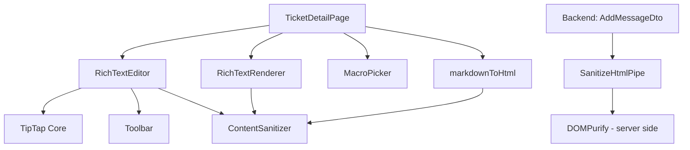
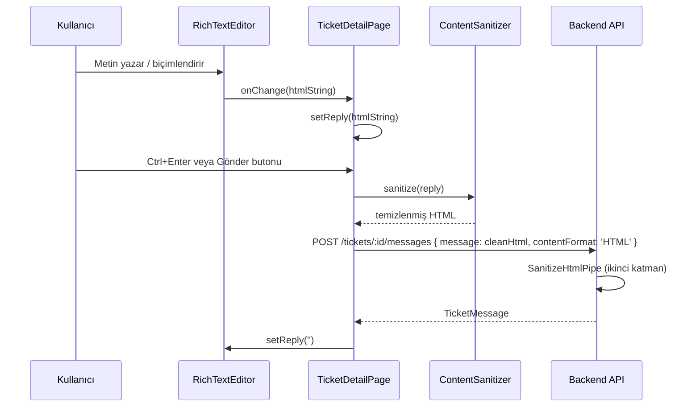
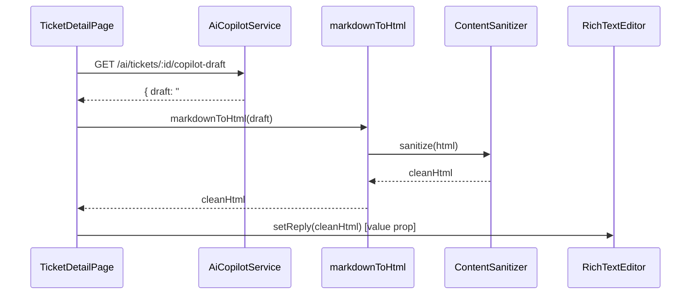

# Design Document — Rich Text Editor

## Overview

Bu tasarım belgesi, `aluplan-support-desk-v02` projesindeki ticket detay sayfalarına TipTap tabanlı rich text editör entegrasyonunu kapsar.

### Problem

Mevcut ticket detay sayfasında (`/[locale]/(dashboard)/tickets/[id]/page.tsx`) mesaj giriş alanı düz bir `<Textarea>` bileşenidir. Bu durum iki kritik soruna yol açmaktadır:

1. Kullanıcılar bold, italic, liste, başlık gibi biçimlendirme özelliklerini kullanamıyor.
2. AI Copilot (`handleDraft`) tarafından üretilen Markdown formatındaki uzun taslak metinler hiçbir biçimlendirme olmadan tek blok olarak geliyor ve okunması çok zor.

### Çözüm

TipTap kütüphanesi (`@tiptap/react ^3.20.0`) zaten `package.json`'da kurulu olduğundan sıfırdan kurulum gerekmez. `dompurify ^3.3.1` da mevcut olup XSS koruması için kullanılacaktır. Çözüm şu bileşenlerden oluşur:

- `RichTextEditor` — TipTap tabanlı controlled editör bileşeni
- `RichTextRenderer` — Güvenli salt okunur HTML render bileşeni
- `ContentSanitizer` — DOMPurify tabanlı XSS koruma modülü
- `markdownToHtml` — AI taslak metinlerini HTML'e dönüştüren yardımcı fonksiyon
- `SanitizeHtmlPipe` — Backend NestJS pipeline sanitizasyon katmanı
- Prisma migration — `TicketMessage.contentFormat` alanı eklenmesi

---

## Architecture

### Bileşen Katmanları



### Veri Akışı



### AI Taslak Akışı



---

## Components and Interfaces

### 1. `RichTextEditor` Bileşeni

**Dosya:** `apps/frontend/src/components/ui/rich-text-editor.tsx`

```typescript
interface RichTextEditorProps {
  value: string;                    // HTML içerik (controlled)
  onChange: (html: string) => void; // HTML değişim callback'i
  placeholder?: string;             // Placeholder metni (i18n'den gelir)
  disabled?: boolean;               // Devre dışı modu
  'aria-label'?: string;            // Erişilebilirlik etiketi
  className?: string;               // Ek CSS sınıfları
}
```

**TipTap Extension'ları:**
- `StarterKit` — Bold, Italic, BulletList, OrderedList, Heading (H2, H3), Paragraph, HardBreak
- `Link` — `@tiptap/extension-link` (zaten kurulu)
- `Placeholder` — `@tiptap/extension-placeholder` (zaten kurulu)

**Toolbar Butonları (sırayla):**
| Buton | TipTap Komutu | aria-label key |
|-------|--------------|----------------|
| Bold | `toggleBold()` | `richTextEditor.toolbar.bold` |
| Italic | `toggleItalic()` | `richTextEditor.toolbar.italic` |
| Bullet List | `toggleBulletList()` | `richTextEditor.toolbar.bulletList` |
| Ordered List | `toggleOrderedList()` | `richTextEditor.toolbar.orderedList` |
| H2 | `toggleHeading({ level: 2 })` | `richTextEditor.toolbar.heading2` |
| H3 | `toggleHeading({ level: 3 })` | `richTextEditor.toolbar.heading3` |

**Controlled Component Davranışı:**
- `value` prop değiştiğinde ve editörün mevcut HTML çıktısından farklıysa `editor.commands.setContent(value, false)` çağrılır.
- `false` parametresi imleç konumunu korur (emit history event yok).
- `onChange` callback'i `editor.on('update')` event'inde `editor.getHTML()` ile tetiklenir.

**Klavye Kısayolları:**
- `Enter` → Yeni paragraf (TipTap default davranışı)
- `Shift+Enter` → `<br>` (HardBreak)
- `Ctrl+Enter` / `Cmd+Enter` → `onSubmit` prop callback'i (TicketDetailPage'den gelir)

### 2. `RichTextRenderer` Bileşeni

**Dosya:** `apps/frontend/src/components/ui/rich-text-renderer.tsx`

```typescript
interface RichTextRendererProps {
  content: string | null | undefined;
  contentFormat?: 'HTML' | 'MARKDOWN' | 'PLAIN_TEXT' | null;
  className?: string;
}
```

**Render Mantığı:**
1. `content` boş/null/undefined ise `null` döndür.
2. `contentFormat === 'PLAIN_TEXT'` veya HTML tag içermiyorsa: `<p>{sanitize(content)}</p>`
3. Aksi halde: `dangerouslySetInnerHTML={{ __html: sanitize(content) }}`

**Plain Text Tespiti:**
```typescript
const HTML_TAG_PATTERN = /<(p|br|strong|em|ul|ol|li|h2|h3|a|blockquote|code|pre)\b/i;
const isPlainText = !HTML_TAG_PATTERN.test(content);
```

**Tailwind CSS Stilleri (prose-like, dark theme):**
```
.rich-text-content strong { @apply font-bold }
.rich-text-content em { @apply italic }
.rich-text-content ul { @apply list-disc ml-4 space-y-1 }
.rich-text-content ol { @apply list-decimal ml-4 space-y-1 }
.rich-text-content h2 { @apply text-lg font-semibold mt-3 mb-1 }
.rich-text-content h3 { @apply text-base font-semibold mt-2 mb-1 }
.rich-text-content p { @apply mb-2 }
.rich-text-content a { @apply text-primary underline hover:text-primary/80 }
.rich-text-content code { @apply font-mono text-xs bg-muted px-1 rounded }
.rich-text-content pre { @apply font-mono text-xs bg-muted p-2 rounded overflow-x-auto }
.rich-text-content blockquote { @apply border-l-2 border-border pl-3 italic text-muted-foreground }
```

### 3. `ContentSanitizer` Modülü

**Dosya:** `apps/frontend/src/lib/content-sanitizer.ts`

```typescript
export const ContentSanitizer = {
  sanitize(input: string | null | undefined): string;
  isEffectivelyEmpty(html: string): boolean;
};
```

**DOMPurify Konfigürasyonu:**
```typescript
const ALLOWED_TAGS = ['p', 'br', 'strong', 'em', 'ul', 'ol', 'li', 'h2', 'h3',
                      'a', 'blockquote', 'code', 'pre'];
const ALLOWED_ATTR = ['href', 'target', 'rel'];
const FORCE_BODY = true;

// a tag için özel hook: javascript: href'leri kaldır, target varsa rel ekle
DOMPurify.addHook('afterSanitizeAttributes', (node) => {
  if (node.tagName === 'A') {
    if (node.getAttribute('href')?.startsWith('javascript:')) {
      node.removeAttribute('href');
    }
    if (node.getAttribute('target')) {
      node.setAttribute('rel', 'noopener noreferrer');
    }
  }
});
```

**`isEffectivelyEmpty` Mantığı:**
```typescript
// <p></p>, <p><br></p>, <p><br/></p> gibi yapıları boş kabul eder
const EMPTY_PATTERNS = /^(<p>(<br\s*\/?>)?<\/p>|<br\s*\/?>|\s)*$/i;
```

**SSR Uyumluluğu:** DOMPurify tarayıcı ortamı gerektirir. `typeof window !== 'undefined'` kontrolü ile SSR'da güvenli fallback sağlanır.

### 4. `markdownToHtml` Yardımcı Fonksiyonu

**Dosya:** `apps/frontend/src/lib/markdown-to-html.ts`

```typescript
export function markdownToHtml(markdown: string | null | undefined): string;
```

**Dönüşüm Kuralları (sırayla uygulanır):**
1. `## başlık` → `<h2>başlık</h2>`
2. `### başlık` → `<h3>başlık</h3>`
3. `**text**` → `<strong>text</strong>`
4. `*text*` → `<em>text</em>`
5. `- item` satırları → `<ul><li>item</li>...</ul>` (ardışık satırlar gruplanır)
6. `1. item` satırları → `<ol><li>item</li>...</ol>` (ardışık satırlar gruplanır)
7. Boş satırla ayrılmış bloklar → `<p>...</p>`
8. Tek satır sonu (blok içinde) → `<br>`
9. Son adım: `ContentSanitizer.sanitize(html)` çağrısı

**Not:** Harici Markdown kütüphanesi (marked, remark vb.) kullanılmaz. Yalnızca AI Copilot çıktısının bilinen yapısını karşılayan minimal regex tabanlı dönüşüm uygulanır. Bu yaklaşım bundle boyutunu küçük tutar ve bağımlılık riskini azaltır.

### 5. `SanitizeHtmlPipe` (Backend)

**Dosya:** `apps/backend/src/common/pipes/sanitize-html.pipe.ts`

```typescript
@Injectable()
export class SanitizeHtmlPipe implements PipeTransform {
  transform(value: AddMessageDto): AddMessageDto;
}
```

**Davranış:**
- `message` alanını server-side DOMPurify (veya `sanitize-html` paketi) ile temizler.
- `message` alanı 10.000 karakteri aşıyorsa `BadRequestException` fırlatır.
- `contentFormat` alanı geçersiz değer içeriyorsa `BadRequestException` fırlatır.

**Not:** Backend'de `dompurify` yerine `sanitize-html` paketi tercih edilebilir (Node.js ortamı için daha uygun). Alternatif olarak `isomorphic-dompurify` kullanılabilir.

### 6. `AddMessageDto` Güncellemesi

**Dosya:** `apps/backend/src/tickets/dto/add-message.dto.ts`

Mevcut DTO'ya eklenen alan:
```typescript
@ApiPropertyOptional({ enum: ['HTML', 'MARKDOWN', 'PLAIN_TEXT'], default: 'PLAIN_TEXT' })
@IsEnum(['HTML', 'MARKDOWN', 'PLAIN_TEXT'])
@IsOptional()
contentFormat?: 'HTML' | 'MARKDOWN' | 'PLAIN_TEXT';
```

### 7. Prisma Migration

**Yeni alan:** `TicketMessage.contentFormat String? @map("content_format")`

```prisma
model TicketMessage {
  // ... mevcut alanlar ...
  contentFormat String? @map("content_format") @db.VarChar(20)
}
```

Migration mevcut satırları etkilemez (`null` varsayılan değer). `contentFormat = null` olan mesajlar `RichTextRenderer` tarafından `PLAIN_TEXT` olarak işlenir (geriye dönük uyumluluk).

---

## Data Models

### Frontend State (TicketDetailPage)

```typescript
// Mevcut state
const [reply, setReply] = useState<string>(''); // HTML string olarak tutulur

// Değişen davranış:
// - Textarea.value → RichTextEditor.value
// - handleTypingChange → RichTextEditor.onChange
// - reply.trim() → ContentSanitizer.isEffectivelyEmpty(reply)
```

### TicketMessage (Prisma)

```prisma
model TicketMessage {
  id            String               @id
  ticketId      String               @map("ticket_id")
  senderId      String?              @map("sender_id")
  message       String               // HTML içerik (yeni) veya plain text (eski)
  contentFormat String?              @map("content_format") // 'HTML' | 'MARKDOWN' | 'PLAIN_TEXT' | null
  isInternal    Boolean              @default(false)
  channel       CommunicationChannel @default(WEB)
  sentiment     Sentiment?
  metadata      Json?
  deletedAt     DateTime?            @map("deleted_at")
  createdAt     DateTime             @default(now())
  updatedAt     DateTime             @updatedAt
  attachments   Attachment[]
  sender        User?
  ticket        Ticket
}
```

### i18n Anahtarları

**Eklenmesi gereken anahtarlar** (`tr.json`, `en.json`, `de.json`):

```json
{
  "richTextEditor": {
    "toolbar": {
      "bold": "Kalın",
      "italic": "İtalik",
      "bulletList": "Madde İşaretli Liste",
      "orderedList": "Numaralı Liste",
      "heading2": "Başlık 2",
      "heading3": "Başlık 3"
    }
  }
}
```

---

## Correctness Properties

*A property is a characteristic or behavior that should hold true across all valid executions of a system — essentially, a formal statement about what the system should do. Properties serve as the bridge between human-readable specifications and machine-verifiable correctness guarantees.*

### Property 1: ContentSanitizer İdempotence

*For any* HTML string `x`, `sanitize(sanitize(x))` değeri `sanitize(x)` ile eşit olmalıdır.

**Validates: Requirements 4.4**

---

### Property 2: ContentSanitizer Tehlikeli Tag Kaldırma

*For any* HTML string içinde `script`, `iframe`, `object`, `embed`, `form`, `input` tagları veya `on*` event attribute'ları bulunuyorsa, `sanitize()` sonucunda bu elementler mevcut olmamalıdır.

**Validates: Requirements 4.2, 4.3**

---

### Property 3: RichTextRenderer Sanitizasyon Garantisi

*For any* HTML string `content`, `RichTextRenderer` tarafından render edilen DOM içeriği, `ContentSanitizer.sanitize(content)` çıktısıyla eşdeğer olmalıdır — yani renderer hiçbir zaman sanitize edilmemiş içerik göstermemelidir.

**Validates: Requirements 5.2**

---

### Property 4: Plain Text Sarma

*For any* string `content` ki bu string bilinen HTML taglarından (`p`, `br`, `strong`, `em`, `ul`, `ol`, `li`, `h2`, `h3`, `a`, `blockquote`, `code`, `pre`) hiçbirini içermiyorsa, `RichTextRenderer` bu içeriği `<p>` tagına sararak render etmelidir.

**Validates: Requirements 6.1, 6.5**

---

### Property 5: markdownToHtml Sanitizasyon İdempotence

*For any* Markdown string `m`, `ContentSanitizer.sanitize(markdownToHtml(m))` değeri `markdownToHtml(m)` ile eşit olmalıdır — yani `markdownToHtml` çıktısı her zaman zaten sanitize edilmiş olmalıdır.

**Validates: Requirements 7.4, 7.5**

---

### Property 6: markdownToHtml Yapısal Dönüşüm

*For any* Markdown string `m` ki bu string `## başlık` içeriyorsa, `markdownToHtml(m)` çıktısı `<h2>` elementi içermelidir; `**text**` içeriyorsa `<strong>` elementi içermelidir; `- item` içeriyorsa `<ul><li>` yapısı içermelidir.

**Validates: Requirements 7.3**

---

### Property 7: Toolbar Butonları ARIA Erişilebilirliği

*For any* render edilmiş `RichTextEditor` bileşeni, Toolbar içindeki her buton `aria-label` attribute'una sahip olmalı ve aktif biçimlendirme durumunu `aria-pressed` attribute'u ile yansıtmalıdır.

**Validates: Requirements 8.2, 8.3**

---

### Property 8: AddMessageDto contentFormat Validasyonu

*For any* string `s` ki bu string `'HTML'`, `'MARKDOWN'`, `'PLAIN_TEXT'` değerlerinden biri değilse, `AddMessageDto` ile yapılan POST isteği 400 Bad Request döndürmelidir.

**Validates: Requirements 6.3**

---

## Error Handling

### Frontend Hata Senaryoları

| Senaryo | Davranış |
|---------|----------|
| TipTap başlatma hatası | `console.error` + fallback `<Textarea>` göster |
| DOMPurify SSR ortamında çağrılması | `typeof window` kontrolü ile güvenli fallback: input'u olduğu gibi döndür |
| `markdownToHtml` null/undefined input | Boş string döndür, hata fırlatma |
| `ContentSanitizer.sanitize` null/undefined input | Boş string döndür |
| `RichTextRenderer` null/undefined content | `null` döndür (DOM elementi render etme) |
| Gönder butonuna tıklandığında içerik boş | `isEffectivelyEmpty` kontrolü ile gönderme iptal edilir, toast gösterilmez |

### Backend Hata Senaryoları

| Senaryo | HTTP Kodu | Mesaj |
|---------|-----------|-------|
| `message` 10.000 karakteri aşıyor | 400 | `message must be shorter than or equal to 10000 characters` |
| `contentFormat` geçersiz değer | 400 | `contentFormat must be one of: HTML, MARKDOWN, PLAIN_TEXT` |
| `SanitizeHtmlPipe` sanitizasyon sonrası boş mesaj | 400 | `message cannot be empty after sanitization` |

### Geriye Dönük Uyumluluk

- `contentFormat = null` olan eski mesajlar `RichTextRenderer` tarafından `PLAIN_TEXT` olarak işlenir.
- Plain text içerik `<p>` tagına sarılarak render edilir.
- Mevcut mesajlar için migration gerekmez; yeni alan `null` varsayılan değerle eklenir.

---

## Testing Strategy

### Dual Testing Yaklaşımı

Bu özellik hem unit/example testleri hem de property-based testler gerektirir. Frontend için **Vitest** + **fast-check** kullanılır (her ikisi de `package.json`'da mevcut). Backend için **Jest + @swc/jest** kullanılır.

### Property-Based Test Dosyaları

Property-based test dosyaları `*.pbt.spec.ts` uzantısıyla oluşturulur (proje kuralı).

**`content-sanitizer.pbt.spec.ts`** — Property 1, 2
```typescript
// fast-check ile rastgele HTML string'leri üretilir
// Her test minimum 100 iterasyon çalıştırılır
// Feature: rich-text-editor, Property 1: ContentSanitizer idempotence
// Feature: rich-text-editor, Property 2: Dangerous tag removal
```

**`rich-text-renderer.pbt.spec.ts`** — Property 3, 4
```typescript
// Feature: rich-text-editor, Property 3: Renderer sanitization guarantee
// Feature: rich-text-editor, Property 4: Plain text wrapping
```

**`markdown-to-html.pbt.spec.ts`** — Property 5, 6
```typescript
// Feature: rich-text-editor, Property 5: markdownToHtml sanitization idempotence
// Feature: rich-text-editor, Property 6: Structural conversion
```

**`rich-text-editor.pbt.spec.ts`** — Property 7
```typescript
// Feature: rich-text-editor, Property 7: Toolbar ARIA accessibility
```

**`add-message-dto.pbt.spec.ts`** (backend) — Property 8
```typescript
// Feature: rich-text-editor, Property 8: contentFormat validation
```

### Unit Test Dosyaları

**`rich-text-editor.spec.tsx`**
- Toolbar butonlarının render edildiğini doğrula (6 buton)
- `disabled` prop davranışı
- `placeholder` gösterimi
- `aria-label`, `role="textbox"`, `aria-multiline="true"` attribute'ları
- Unmount'ta `destroy()` çağrısı
- Ctrl+Enter ile submit tetiklenmesi

**`rich-text-renderer.spec.tsx`**
- Boş/null/undefined için `null` döndürme
- HTML içerik render
- CSS sınıflarının uygulanması

**`content-sanitizer.spec.ts`**
- Boş/null/undefined için boş string
- `isEffectivelyEmpty` edge case'leri: `<p></p>`, `<p><br></p>`

**`markdown-to-html.spec.ts`**
- Boş/null/undefined için boş string
- Bilinen AI Copilot çıktı formatı için dönüşüm örneği

### Integration Testleri

**`ticket-detail-page.spec.tsx`**
- Admin: `RichTextEditor`'ın `Textarea` yerine render edildiğini doğrula
- Customer: `isCustomer=true` durumunda editörün gösterildiğini doğrula
- Kapalı ticket: `disabled={true}` prop'unun iletildiğini doğrula
- `handleDraft` → `markdownToHtml` → editör içeriği akışı
- `MacroPicker` seçimi → editör içeriğine ekleme

**Backend Integration:**
- `SanitizeHtmlPipe` pipeline testi (1-2 örnek)
- `contentFormat` validasyonu (1-2 örnek)

### E2E Testleri (Playwright)

- Admin kullanıcı olarak ticket detay sayfasını aç, editörde bold metin yaz, gönder
- Customer kullanıcı olarak aynı akışı doğrula
- Kapalı ticket'ta editörün disabled olduğunu doğrula
- AI taslak butonuna tıkla, editörde biçimlendirilmiş içerik göründüğünü doğrula

### Erişilebilirlik Testleri

`@axe-core/playwright` (zaten `devDependencies`'de mevcut) ile E2E testlerde otomatik WCAG 2.1 AA taraması yapılır.

### Test Konfigürasyonu

```typescript
// fast-check konfigürasyonu
fc.configureGlobal({ numRuns: 100 }); // Minimum 100 iterasyon

// Her property test tag formatı:
// Feature: rich-text-editor, Property {N}: {property_text}
```

---

## Design Decisions

### Neden Harici Markdown Kütüphanesi Kullanılmıyor?

`marked`, `remark` veya `markdown-it` gibi tam özellikli Markdown kütüphaneleri yerine minimal regex tabanlı `markdownToHtml` tercih edildi. Gerekçe:
- AI Copilot çıktısının yapısı belirli ve sınırlı (`##`, `###`, `**`, `*`, `-`, `1.`)
- Bundle boyutu artışı önlenir
- Ek bağımlılık riski azaltılır
- Dönüşüm sonucu her zaman `ContentSanitizer` ile temizlendiğinden güvenlik garantisi korunur

### Neden `editor.commands.setContent(value, false)`?

TipTap'ın `setContent` metodunun ikinci parametresi `emitUpdate` flag'idir. `false` geçilmesi:
- `onChange` callback'inin tekrar tetiklenmesini önler (sonsuz döngü riski)
- History stack'e gereksiz entry eklenmesini önler
- İmleç konumunu mümkün olduğunca korur

### Neden `isEffectivelyEmpty` Ayrı Bir Fonksiyon?

TipTap boş editör için `<p></p>` veya `<p><br></p>` üretir. `reply.trim() === ''` kontrolü bu durumları yakalamaz. `isEffectivelyEmpty` fonksiyonu bu edge case'leri doğru şekilde ele alır ve gönder butonunun disabled durumunu doğru yönetir.

### Neden İki Katmanlı Sanitizasyon?

Frontend `ContentSanitizer` + Backend `SanitizeHtmlPipe` kombinasyonu:
- Frontend: UX için anlık geri bildirim, boş içerik tespiti
- Backend: Güvenlik garantisi (frontend bypass edilebilir)
- Defense in depth prensibi

### TipTap v3 Uyumluluğu

Proje `@tiptap/react ^3.20.0` kullanıyor. TipTap v3'te `useEditor` hook'u yerine `new Editor()` constructor'ı tercih edilebilir. `useEditor` hâlâ desteklenmektedir ancak v3'te `EditorProvider` pattern'i önerilmektedir. Bu tasarımda `useEditor` kullanılır (daha az boilerplate, mevcut proje pattern'iyle uyumlu).
