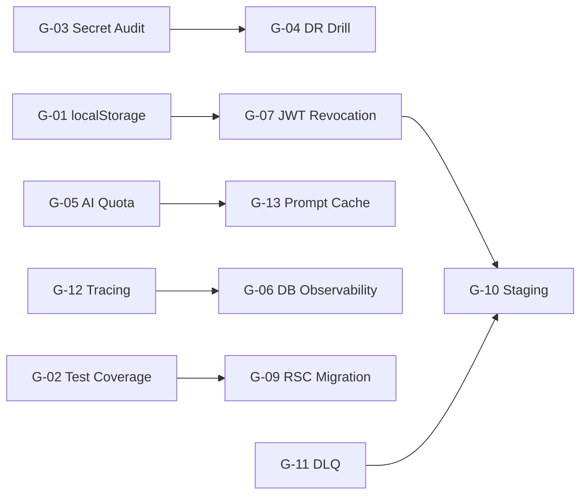

# 🚀 GAP Post-Phase4 — Execution Roadmap
### CTO-Level Prioritized Implementation Plan

**Produced:** 2026-04-23 | **Source:** `GAP_ANALYSIS_2026_POST_PHASE4.md` | **Current Score:** 74/100 → **Target:** 85+

---

## CRITICAL PATH (Dependency Order)

**Blocker Chain:** G-03 (secrets) and G-01 (localStorage) MUST complete first — every downstream task assumes a clean security baseline.

---

## QUICK WINS (< 1 day each, high impact)

| # | Task | Time | Impact | Blocks |
|---|------|------|--------|--------|
| QW-1 | Remove `*.log` + debug scripts from git | 15 min | Image -1.5MB, clean repo | — |
| QW-2 | Remove 3× `console.log` in prod code | 10 min | Log hygiene | — |
| QW-3 | `socket.ts` localStorage → `withCredentials: true` | 1 hr | **Critical XSS fix** | — |
| QW-4 | ESLint `no-restricted-globals: localStorage` | 15 min | Prevents regression | QW-3 |
| QW-5 | `pg_stat_statements` + Grafana panel | 2 hrs | DB observability unlocked | — |
| QW-6 | COOP/COEP Helmet header | 20 min | Spectre mitigation | — |
| QW-7 | `pnpm audit --prod` CI gate (fail-on-high) | 10 min | CVE blocking | — |
| QW-8 | Playwright E2E job in CI | 2 hrs | Regression gate | — |
| QW-9 | Bundle analyzer CI artifact upload | 30 min | Bundle visibility | — |
| QW-10 | JWT `jti` + Redis blacklist (force logout) | 1 day | Session termination | — |

**Total:** ~2 working days → 10 high-ROI improvements.

---

## PHASED ROADMAP

---

### Phase 1 — Critical Risk Mitigation (Week 1)

> **Goal:** Eliminate active security vulnerabilities and unknown secret exposure.

| Task | Title | Why It Matters | Effort | Dependencies | Expected Outcome |
|------|-------|----------------|--------|--------------|------------------|
| G-01 | **localStorage Eradication** | XSS can hijack WebSocket sessions and bypass role guards via exposed tokens. | 1.5 days | — | DevTools Local Storage **empty**, WS auth via cookie |
| G-03 | **Secret History Audit** | If `.env` was ever committed, all credentials are compromised to any cloner. | 1 day | — | `gitleaks detect --all` → 0 findings, all secrets rotated |
| QW-1→9 | **Quick Wins Batch** | Compound security + hygiene improvements that unlock downstream work. | 1 day | — | Clean repo, ESLint guard, CVE gate, E2E CI, COOP header |

**Phase 1 Exit Criteria:** Zero localStorage auth usage. Zero secret history findings. CI has E2E + audit gates.

---

### Phase 2 — Stability & Reliability (Weeks 2–4)

> **Goal:** Ensure the system can recover from failures and trace issues end-to-end.

| Task | Title | Why It Matters | Effort | Dependencies | Expected Outcome |
|------|-------|----------------|--------|--------------|------------------|
| G-04 | **DR Drill + WAL-G PITR** | "Backup exists" ≠ "Restore works." No proven restore = undefined recovery. | 2 sprints | G-03 done | RPO < 5min, RTO < 1hr, quarterly drill automated |
| G-07 | **JWT Revocation List** | Logout doesn't invalidate token for 15min. Admin can't force-disconnect compromised user. | 1 day | G-01 done | Redis blacklist active, force-logout endpoint live |
| G-11 | **BullMQ Dead Letter Queue** | Failed jobs (email, CRM sync, AI) are silently deleted. No post-mortem possible. | 3 days | — | DLQ per queue, Bull Board UI, failed job inspection |
| G-12 | **Distributed Tracing** | Cannot correlate a user complaint to specific request across frontend→backend→worker. | 2 days | — | `x-request-id` propagated, Loki+Tempo linked queries |

**Phase 2 Exit Criteria:** First DR drill report delivered. JWT blacklist active. Failed jobs visible in DLQ dashboard.

---

### Phase 3 — AI Cost & Performance Optimization (Weeks 5–7)

> **Goal:** Prevent runaway AI bills and cut latency/cost by 30-40%.

| Task | Title | Why It Matters | Effort | Dependencies | Expected Outcome |
|------|-------|----------------|--------|--------------|------------------|
| G-05 | **AI Quota + Budget Cap** | One abusive user or code bug can generate $10K+ OpenAI bill overnight. | 1.5 sprints | — | Per-user daily quota, global USD kill-switch, Slack alerts |
| G-13 | **Prompt/Response Cache** | 30-50% of support questions are identical. Each costs 2-4s latency + $0.01. | 4 days | G-05 done | Cache hit rate > 30%, p95 latency -40%, token bill -30% |
| — | **Model Cascading** | Route simple queries to cheap models (Haiku), complex to expensive (Sonnet). | 3 days | G-05 done | -40% average cost per query |
| — | **Embedding Batch API** | Individual embedding calls waste rate limit headroom. | 1 day | — | -20% embedding cost |

**Phase 3 Exit Criteria:** Daily token graph in Grafana. Quota exceed returns 429. Cache hit rate metric visible.

---

### Phase 4 — Scale, Architecture & Quality (Weeks 8–14)

> **Goal:** Production maturity, test confidence, and architectural readiness for growth.

| Task | Title | Why It Matters | Effort | Dependencies | Expected Outcome |
|------|-------|----------------|--------|--------------|------------------|
| G-02 | **Test Coverage Investment** | 40% backend / 5% frontend coverage means regressions ship to prod regularly. | 6 weeks | — | Backend ≥ 60%, Frontend ≥ 20 unit tests, E2E CI gate |
| G-10 | **Staging Environment** | Every deploy is a prod gamble. Schema migrations untestable. | 2 sprints | G-07, G-11 | `staging.allplan.net.tr`, PR→staging auto-deploy |
| G-06 | **DB Observability** | N+1 queries and missing indexes are invisible without monitoring. | 1 sprint | QW-5 partial | pg_stat_statements + Grafana + k6 baseline |
| G-08 | **TypeScript `any` Reduction** | 574 `any` usages across codebase erode type safety and make refactoring risky. | 5 days (phased) | — | ESLint `no-explicit-any: error`, `noImplicitAny: true` |
| G-14 | **Validation Unification (Zod)** | Two validation libraries = two error formats = developer confusion. | 2 sprints | — | Single Zod standard, shared schemas in `packages/` |
| G-09 | **Server Component Migration** | 30+ pages are fully client-rendered, hurting FCP/LCP and wasting hydration budget. | 2 sprints | G-02 | RSC for data-fetch pages, client islands for interaction |

**Phase 4 Exit Criteria:** Staging operational. Test coverage gates enforced. Type safety lint active. FCP improved.

---

### Phase 5 — Polish & Governance (Ongoing)

| Task | Title | Effort |
|------|-------|--------|
| G-15 | COOP/COEP headers | 20 min |
| G-16 | Repo hygiene (committed logs) | 15 min |
| G-17 | Accessibility (axe-core CI) | 3 days |
| G-18 | AI eval suite (ragas/promptfoo) | 1 sprint |
| G-19 | Soft-delete Prisma filter | 2 days |
| G-20 | Architecture Decision Records | Ongoing |
| — | Event-driven decoupling | 2 sprints |
| — | CQRS materialized views | 1 sprint |
| — | SSRF audit + URL allowlist | 2 days |
| — | Docker image signing (cosign) | 1 day |

---

## EXECUTION ORDER — FIRST WEEK (Day-by-Day)

| Day | Morning (4h) | Afternoon (4h) |
|-----|-------------|----------------|
| **Mon** | QW-1: Remove logs from git. QW-2: Remove console.logs. QW-6: COOP/COEP header. QW-7: `pnpm audit` CI gate. | **G-03**: Run `gitleaks detect --all`. Analyze findings. Begin secret rotation if needed. |
| **Tue** | G-03: Complete secret rotation + `git filter-repo` purge. Force-push. | **G-01**: Fix `socket.ts` (QW-3). Fix `role-guard.tsx`. Fix `products/page.tsx` + `customers/[id]/page.tsx`. |
| **Wed** | G-01: Fix `command-menu.tsx`. QW-4: Add ESLint `no-restricted-globals`. Verify zero localStorage auth. | QW-8: Add Playwright E2E CI job. QW-9: Bundle analyzer CI artifact. |
| **Thu** | **G-07**: Add `jti` to JWT. Implement Redis blacklist in `JwtAuthGuard`. | G-07: Build "admin force-logout" endpoint. Write test. |
| **Fri** | **G-12**: Add `x-request-id` middleware. Configure Pino `genReqId`. | G-12: Add `x-request-id` to frontend `api.ts`. Verify trace correlation in logs. |

**Week 1 delivers:** 9 quick wins + 3 critical GAPs resolved (G-01, G-03, G-07) + distributed tracing (G-12).

---

## BLOCKERS (Must Complete Before Others Can Start)

| Blocker | What It Unlocks |
|---------|-----------------|
| G-03 (Secret Audit) | G-04 (DR Drill) — no point drilling backup if current secrets are compromised |
| G-01 (localStorage) | G-07 (JWT Revocation) — revocation only works if all auth flows use cookies |
| G-07 (JWT Revocation) | G-10 (Staging) — staging needs proper session management |
| G-05 (AI Quota) | G-13 (Cache) — cache reduces cost but quota prevents catastrophe |
| G-02 (Test Coverage) | G-09 (RSC Migration) — can't safely refactor 30 pages without test safety net |

---

## RISK SUMMARY

| Risk | Probability | Impact | Mitigation |
|------|-------------|--------|------------|
| Secret in git history | Unknown | **Critical** | G-03 Day 1 scan |
| Runaway AI bill | Medium | **Critical** | G-05 hard cap + kill switch |
| Prod data loss | Low | **Critical** | G-04 quarterly drill |
| XSS → full session hijack | Medium | **High** | G-01 localStorage removal |
| Deploy breaks prod | Medium | **High** | G-10 staging + G-02 test gates |

---

**Bottom line:** Weeks 1-2 eliminate financial and security existential risks. Weeks 3-7 build the reliability and cost control infrastructure. Weeks 8-14 invest in sustainable quality. Score projection: **74 → 85+ within 3 months.**
